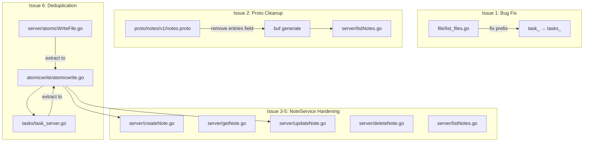

# Design Document: API Hardening & Cleanup

## Overview

This design addresses six issues found during code review, all aimed at hardening the NoteService API surface and aligning it with the patterns already established in the TaskService. The changes are:

1. **Bug fix**: `file/list_files.go` filters on `task_` prefix instead of the correct `tasks_` prefix, causing task list files to be excluded from directory listings.
2. **Proto cleanup**: Remove the `entries` field from `ListNotesResponse` in `notes.proto`, moving directory browsing responsibility entirely to the FileService.
3. **Path traversal protection**: Add `pathutil.ValidatePath`/`IsSubPath` calls to all NoteService handlers, matching the TaskService pattern.
4. **Connect error codes**: Replace raw Go errors with structured Connect error codes (`CodeNotFound`, `CodeInternal`, `CodeInvalidArgument`) in all NoteService handlers.
5. **Input validation**: Add empty-title and path-separator validation to `CreateNote`, matching `CreateTaskList`.
6. **Code deduplication**: Extract the duplicate `atomicWriteFile` function from `server/` and `tasks/` into a shared package.

All changes are localized refactors with no new services, no new storage mechanisms, and no behavioral changes beyond the bug fix and stricter validation.

## Architecture

The overall architecture remains unchanged:

```
Client → Connect/gRPC → NoteService handlers → File system (markdown files)
Client → Connect/gRPC → FileService handlers → File system (directory listing)
Client → Connect/gRPC → TaskService handlers → File system (markdown files)
```

### Change Scope



## Components and Interfaces

### Issue 1: Fix File Listing Task File Filter

In `file/list_files.go`, the filter currently checks for `task_` prefix. Task list files are named `tasks_<name>.md`. The fix is a single-character change:

```go
// Before:
} else if !strings.HasPrefix(name, "note_") && !strings.HasPrefix(name, "task_") {

// After:
} else if !strings.HasPrefix(name, "note_") && !strings.HasPrefix(name, "tasks_") {
```

### Issue 2: Remove `entries` Field from ListNotesResponse

Remove field 2 from `ListNotesResponse` in `proto/notes/v1/notes.proto`:

```protobuf
// Before:
message ListNotesResponse {
  repeated Note notes = 1;
  repeated string entries = 2;
}

// After:
message ListNotesResponse {
  repeated Note notes = 1;
}
```

Update `server/listNotes.go` to stop building the `entries` slice and stop populating `Entries` in the response. The handler should also skip directories entirely (only iterate note files).

### Issue 3: Path Traversal Protection for NoteService

Add `pathutil.ValidatePath` or `pathutil.IsSubPath` calls to each NoteService handler, following the exact patterns from the TaskService:

| Handler | Path field | Pattern to follow |
|---|---|---|
| `CreateNote` | `req.Path` (directory) | `CreateTaskList` — use `IsSubPath` for directory validation |
| `GetNote` | `req.FilePath` | `GetTaskList` — use `ValidatePath` |
| `UpdateNote` | `req.FilePath` | `UpdateTaskList` — use `ValidatePath` |
| `DeleteNote` | `req.FilePath` | `DeleteTaskList` — use `ValidatePath` |
| `ListNotes` | `req.Path` (directory) | `ListTaskLists` — use `IsSubPath` for directory validation |

### Issue 4: Connect Error Codes in NoteService

Replace all raw `fmt.Errorf` and direct `err` returns with structured Connect errors. The mapping follows the TaskService pattern:

| Condition | Connect Code | Example from TaskService |
|---|---|---|
| File not found (`os.ErrNotExist`) | `CodeNotFound` | `GetTaskList`, `DeleteTaskList` |
| File system read/write failure | `CodeInternal` | All TaskService handlers |
| Invalid input | `CodeInvalidArgument` | `CreateTaskList` validation |

Specific changes per handler:

- **GetNote**: `os.Stat` error → check `os.ErrNotExist` for `CodeNotFound`, else `CodeInternal`. `os.ReadFile` error → `CodeInternal`.
- **DeleteNote**: `os.Remove` error → check `os.ErrNotExist` for `CodeNotFound`, else `CodeInternal`.
- **UpdateNote**: Already uses `fmt.Errorf` wrapping — upgrade to `connect.NewError` with `CodeInternal`.
- **CreateNote**: Already uses `fmt.Errorf` — upgrade to `connect.NewError` with `CodeInternal`.
- **ListNotes**: Already uses `fmt.Errorf` — upgrade to `connect.NewError` with `CodeInternal`.

### Issue 5: Input Validation for CreateNote

Add validation at the top of `CreateNote`, before any file system operations, matching `CreateTaskList`:

```go
title := req.GetTitle()
if title == "" {
    return nil, connect.NewError(connect.CodeInvalidArgument, fmt.Errorf("title must not be empty"))
}
if strings.ContainsAny(title, "/\\") {
    return nil, connect.NewError(connect.CodeInvalidArgument, fmt.Errorf("title must not contain path separators"))
}
```

### Issue 6: Extract Shared `atomicWriteFile`

Create a new package `atomicwrite` with a single exported function:

```go
// atomicwrite/atomicwrite.go
package atomicwrite

func File(path string, data []byte) error { ... }
```

- Remove `server/atomicWriteFile.go` and the `atomicWriteFile` function from `tasks/task_server.go`
- Update `server/createNote.go`, `server/updateNote.go` to call `atomicwrite.File(...)`
- Update `tasks/create_task_list.go`, `tasks/update_task_list.go` to call `atomicwrite.File(...)`
- Move `server/atomicWriteFile_test.go` to `atomicwrite/atomicwrite_test.go`

## Data Models

### Proto Changes

Only one proto change is required — removing the `entries` field from `ListNotesResponse`:

```protobuf
message ListNotesResponse {
  repeated Note notes = 1;
  // Field 2 (entries) removed — directory browsing is handled by FileService
}
```

All other messages in `notes.proto` remain unchanged. No new messages are introduced.

### New Package

```
atomicwrite/
  atomicwrite.go      // File(path string, data []byte) error
  atomicwrite_test.go  // Moved from server/atomicWriteFile_test.go
```

### No Storage Changes

File naming conventions (`note_<title>.md`, `tasks_<name>.md`) and directory structure remain unchanged. The bug fix in `list_files.go` corrects the filter to match the existing `tasks_` naming convention.

## Correctness Properties

*A property is a characteristic or behavior that should hold true across all valid executions of a system — essentially, a formal statement about what the system should do. Properties serve as the bridge between human-readable specifications and machine-verifiable correctness guarantees.*

Several acceptance criteria are structural (proto field removal, code deduplication, compile-time checks) and are not testable as runtime properties. The testable criteria consolidate into 5 properties after eliminating redundancy.

### Property 1: ListFiles filter correctness

*For any* directory containing a mix of files with `note_` prefix, `tasks_` prefix, other prefixes, and subdirectories, calling ListFiles should return exactly the `note_`-prefixed files, `tasks_`-prefixed files, and subdirectories (with trailing `/`), and exclude all other files.

**Validates: Requirements 1.1, 1.2, 1.3**

### Property 2: ListNotes returns only notes, no directory entries

*For any* directory containing a mix of note files and subdirectories, calling ListNotes should return only `Note` objects corresponding to note files, and should not include any subdirectory entries in the response.

**Validates: Requirements 2.2, 2.3**

### Property 3: Path traversal rejection across NoteService

*For any* path that resolves outside the data directory (e.g., containing `..` segments), all NoteService handlers (CreateNote, GetNote, UpdateNote, DeleteNote, ListNotes) should return a Connect error with code `CodeInvalidArgument`.

**Validates: Requirements 3.1, 3.2, 3.3, 3.4**

### Property 4: Non-existent file returns CodeNotFound

*For any* file path that does not exist on disk, calling GetNote or DeleteNote should return a Connect error with code `CodeNotFound`.

**Validates: Requirements 4.1, 4.2**

### Property 5: Titles containing path separators are rejected

*For any* title string containing `/` or `\` characters, calling CreateNote should return a Connect error with code `CodeInvalidArgument`.

**Validates: Requirements 5.2**

## Error Handling

All NoteService handlers will follow the same error handling pattern established in the TaskService:

| Condition | Connect Code | Message Pattern |
|---|---|---|
| Path escapes data directory | `CodeInvalidArgument` | "path escapes data directory" |
| Empty title | `CodeInvalidArgument` | "title must not be empty" |
| Title contains path separators | `CodeInvalidArgument` | "title must not contain path separators" |
| File not found (`os.ErrNotExist`) | `CodeNotFound` | "note not found" |
| File system read failure | `CodeInternal` | "failed to read note: ..." |
| File system write failure | `CodeInternal` | "failed to write note: ..." |
| Directory creation failure | `CodeInternal` | "failed to create directory: ..." |

Raw Go errors (from `os.Stat`, `os.ReadFile`, `os.Remove`, etc.) must never be returned directly. All errors must be wrapped in `connect.NewError(...)`.

## Testing Strategy

### Property-Based Tests

Use the `pgregory.net/rapid` library (already used in the project) with a minimum of 100 iterations per property.

Each correctness property maps to a single property-based test:

1. **Property 1** → `TestProperty_ListFilesFilterCorrectness` in `file/list_files_property_test.go`
   - Generate random directory contents with files of various prefixes and subdirectories. Call ListFiles and verify the result contains exactly the expected entries.
   - Tag: `Feature: api-hardening-cleanup, Property 1: ListFiles filter correctness`

2. **Property 2** → `TestProperty_ListNotesExcludesDirectories` in `server/listNotes_property_test.go`
   - Generate random directories with note files and subdirectories. Call ListNotes and verify only Note objects are returned, no directory entries.
   - Tag: `Feature: api-hardening-cleanup, Property 2: ListNotes returns only notes, no directory entries`

3. **Property 3** → `TestProperty_PathTraversalRejection` in `server/pathTraversal_property_test.go`
   - Generate random path traversal strings (containing `..` segments). Call each NoteService handler and verify all return `CodeInvalidArgument`.
   - Tag: `Feature: api-hardening-cleanup, Property 3: Path traversal rejection across NoteService`

4. **Property 4** → `TestProperty_NotFoundReturnsCodeNotFound` in `server/notFound_property_test.go`
   - Generate random non-existent file paths. Call GetNote and DeleteNote and verify both return `CodeNotFound`.
   - Tag: `Feature: api-hardening-cleanup, Property 4: Non-existent file returns CodeNotFound`

5. **Property 5** → `TestProperty_TitleWithPathSeparatorsRejected` in `server/createNote_property_test.go`
   - Generate random title strings containing `/` or `\`. Call CreateNote and verify it returns `CodeInvalidArgument`.
   - Tag: `Feature: api-hardening-cleanup, Property 5: Titles containing path separators are rejected`

### Unit Tests

Unit tests should focus on specific examples and edge cases not covered by property tests:

- **Empty title rejection** (Req 5.1): Call CreateNote with empty title, verify `CodeInvalidArgument`
- **File system error wrapping** (Req 4.3, 4.4): Verify that I/O errors produce `CodeInternal` (not raw errors)
- **atomicWriteFile extraction** (Req 6.4): Existing tests for both NoteService and TaskService should pass after the refactor
- **ListNotes after entries removal**: Verify the handler compiles and returns correct results without the `entries` field

### Existing Test Updates

- `server/listNotes_test.go` and `server/listNotes_property_test.go`: Remove any references to `Entries` field
- `server/atomicWriteFile_test.go`: Move to `atomicwrite/atomicwrite_test.go` and update package/import
- All NoteService tests: May need updates if error assertions change from raw errors to Connect errors
