# Design Document: Code Review Hardening

## Overview

This design addresses 18 findings from a code review, organized into four categories:

1. **Security fixes** (Req 1–7): Path traversal in CreateNote, panic-able title extraction, silent file creation on UpdateNote, missing duplicate detection in CreateNote, null byte injection, token type confusion between access/refresh tokens, and refresh endpoint accepting access tokens.
2. **API consistency** (Req 8–10): Rename `path` to `parent_dir` in NoteService proto (and `parent_path` to `parent_dir` in FileService proto), fix RefreshToken error message, replace German log message.
3. **Code deduplication** (Req 11–13): Extract shared title extraction, consolidate path validation boilerplate, extract shared task validation.
4. **Operational improvements** (Req 14–18): Remove no-op assignments, graceful shutdown, request size limits, fsync in atomicwrite, prevent username enumeration.

All changes are localized refactors and hardening. No new services, storage mechanisms, or external dependencies are introduced (except `http.MaxBytesReader` from the standard library for request size limits).

## Architecture

The overall architecture remains unchanged:

```
Client → Connect/gRPC → AuthInterceptor → Service handlers → File system
```



```mermaid
graph TD
    subgraph "Security Fixes"
        S1[CreateNote path traversal fix] --> CN[server/createNote.go]
        S2[Title extraction safety] --> TE[server/title.go - new shared helper]
        S3[UpdateNote existence check] --> UN[server/updateNote.go]
        S4[CreateNote duplicate detection] --> CN
        S5[Null byte validation] --> CN
        S6[Token type claims] --> TS[auth/token_service.go]
        S7[RefreshToken type check] --> AS[auth/auth_server.go]
        S6 --> AI[auth/interceptor.go]
    end

    subgraph "API Consistency"
        A1[Rename path → parent_dir] --> NP[proto/notes/v1/notes.proto]
        A2[Fix RefreshToken error msg] --> AS
        A3[German → English log] --> MG[main.go]
    end

    subgraph "Code Deduplication"
        D1[Shared title extraction] --> TE
        D2[Consolidate path validation] --> PU[pathutil/pathutil.go]
        D3[Shared task validation] --> TV[tasks/validate.go - new]
    end

    subgraph "Operational"
        O1[Remove no-op assignments] --> GN[server/getNote.go]
        O1 --> UN
        O2[Graceful shutdown] --> MG
        O3[Request size limits] --> MG
        O4[fsync in atomicwrite] --> AW[atomicwrite/atomicwrite.go]
        O5[Username enumeration] --> US[auth/user_store.go]
    end
```

### Change Scope by File

| File | Requirements |
|---|---|
| `server/createNote.go` | 1, 4, 5, 12 |
| `server/getNote.go` | 2, 11, 14 |
| `server/updateNote.go` | 2, 3, 11, 14 |
| `server/listNotes.go` | 11, 12 |
| `server/title.go` (new) | 2, 11 |
| `proto/notes/v1/notes.proto` | 8 |
| `auth/token_service.go` | 6 |
| `auth/interceptor.go` | 6 |
| `auth/auth_server.go` | 7, 9 |
| `auth/user_store.go` | 18 |
| `tasks/validate.go` (new) | 13 |
| `tasks/create_task_list.go` | 12, 13 |
| `tasks/update_task_list.go` | 13 |
| `file/create_folder.go` | 12 |
| `file/list_files.go` | 12 |
| `atomicwrite/atomicwrite.go` | 17 |
| `main.go` | 10, 15, 16 |

## Components and Interfaces

### Req 1: Fix Path Traversal in CreateNote

Currently `CreateNote` validates `dirPath` using `pathutil.IsSubPath` but then uses the raw `req.Path` for `os.MkdirAll` and file path construction:

```go
// Current (vulnerable):
dirPath := filepath.Clean(filepath.Join(s.dataDir, req.GetPath()))
if dirPath != s.dataDir && !pathutil.IsSubPath(s.dataDir, dirPath) { ... }
destination := filepath.Join(s.dataDir, req.Path)  // uses raw req.Path!
```

Fix: use the validated `dirPath` for all subsequent operations:

```go
dirPath, err := pathutil.ValidatePath(s.dataDir, req.GetPath())
if err != nil { return nil, err }
// Use dirPath for MkdirAll and file path construction
```

### Req 2 & 11: Shared Title Extraction

Create `server/title.go` with a safe extraction function:

```go
// ExtractNoteTitle extracts the title from a note filename.
// Returns an error if the filename is too short or doesn't match the expected pattern.
func ExtractNoteTitle(filename string) (string, error) {
    const prefix = "note_"
    const suffix = ".md"
    if len(filename) < len(prefix)+len(suffix)+1 {
        return "", fmt.Errorf("filename too short to extract title: %q", filename)
    }
    if !strings.HasPrefix(filename, prefix) || !strings.HasSuffix(filename, suffix) {
        return "", fmt.Errorf("filename does not match note pattern: %q", filename)
    }
    return filename[len(prefix) : len(filename)-len(suffix)], nil
}
```

Replace inline `strings.TrimPrefix(info.Name()[:len(info.Name())-3], "note_")` in GetNote, UpdateNote, and ListNotes with calls to `ExtractNoteTitle`.

### Req 3: Reject Updates to Non-Existent Notes

Add an existence check in `UpdateNote` before writing:

```go
if _, err := os.Stat(absPath); err != nil {
    if errors.Is(err, os.ErrNotExist) {
        return nil, connect.NewError(connect.CodeNotFound, fmt.Errorf("note not found"))
    }
    return nil, connect.NewError(connect.CodeInternal, fmt.Errorf("failed to stat note: %w", err))
}
```

### Req 4: Duplicate Detection in CreateNote

After building the absolute file path, check if the file already exists before writing, matching the `CreateTaskList` pattern:

```go
if _, err := os.Stat(absoluteFilePath); err == nil {
    return nil, connect.NewError(connect.CodeAlreadyExists, fmt.Errorf("note already exists"))
}
```

### Req 5: Null Byte Validation in CreateNote

Add null byte check to title validation, consistent with `file.validateName`:

```go
if strings.ContainsRune(title, 0) {
    return nil, connect.NewError(connect.CodeInvalidArgument, fmt.Errorf("title must not contain null bytes"))
}
```

### Req 6: Token Type Claims

Add a `TokenType` field to `TokenClaims`:

```go
type TokenClaims struct {
    Username  string `json:"username"`
    TokenType string `json:"type"`
    jwt.RegisteredClaims
}
```

Update `generateToken` to accept a token type parameter. `GenerateAccessToken` passes `"access"`, `GenerateRefreshToken` passes `"refresh"`.

### Req 6 (continued): Auth Interceptor Token Type Check

After validating the token, check the type claim:

```go
if claims.TokenType != "access" {
    return nil, connect.NewError(connect.CodeUnauthenticated, fmt.Errorf("invalid token type"))
}
```

### Req 7: RefreshToken Endpoint Type Check

In `auth_server.go`, after validating the token, check that it's a refresh token:

```go
if claims.TokenType != "refresh" {
    return nil, connect.NewError(connect.CodeUnauthenticated, fmt.Errorf("invalid or expired refresh token"))
}
```

### Req 8: Rename `path` to `parent_dir` in NoteService Proto (and `parent_path` to `parent_dir` in FileService Proto)

In `proto/notes/v1/notes.proto`:

```protobuf
message CreateNoteRequest {
  string title = 1;
  string content = 2;
  string parent_dir = 3;
}

message ListNotesRequest {
  string parent_dir = 1;
}
```

In `proto/notes/v1/notes.proto`, rename `path` to `parent_dir` in `CreateNoteRequest` and `ListNotesRequest`. In `proto/file/v1/file.proto`, rename `parent_path` to `parent_dir` in `ListFilesRequest` and `CreateFolderRequest`. In `proto/tasks/v1/tasks.proto`, rename `path` to `parent_dir` in `CreateTaskListRequest` and `ListTaskListsRequest`.

Update all handler code to use `req.GetParentDir()` instead of `req.GetPath()` or `req.GetParentPath()`.

### Req 9: Fix RefreshToken Error Message

Change the error message in `RefreshToken` from `"invalid credentials"` to `"invalid or expired refresh token"`.

### Req 10: German Log Message

Change `"ConnectRPC Server läuft auf"` to `"ConnectRPC Server listening on"` in `main.go`.

### Req 12: Consolidate Path Validation

Replace inline path validation patterns in `CreateNote`, `ListNotes`, `CreateTaskList`, and FileService handlers with calls to `pathutil.ValidatePath`. For handlers that accept a directory path (not a file path), add a `ValidateParentDir` helper to `pathutil`:

```go
// ValidateParentDir validates a directory path, allowing the data directory root itself.
func ValidateParentDir(dataDir, relativePath string) (string, error) {
    cleaned := filepath.Clean(filepath.Join(dataDir, relativePath))
    if cleaned != dataDir && !IsSubPath(dataDir, cleaned) {
        return "", connect.NewError(connect.CodeInvalidArgument, fmt.Errorf("path escapes data directory"))
    }
    return cleaned, nil
}
```

### Req 13: Shared Task Validation

Create `tasks/validate.go`:

```go
func validateTasks(tasks []MainTask) error {
    for i, t := range tasks {
        if t.DueDate != "" && t.Recurrence != "" {
            return connect.NewError(connect.CodeInvalidArgument,
                fmt.Errorf("task %d: cannot set both due_date and recurrence", i))
        }
        if t.Recurrence != "" {
            if err := ValidateRRule(t.Recurrence); err != nil {
                return connect.NewError(connect.CodeInvalidArgument, err)
            }
        }
    }
    return nil
}
```

Both `CreateTaskList` and `UpdateTaskList` call `validateTasks` instead of duplicating the logic.

### Req 14: Remove No-Op Assignments

In `getNote.go` and `updateNote.go`, remove `fullPath := absPath` and use `absPath` directly.

### Req 15: Graceful Shutdown

Replace `log.Fatal(http.ListenAndServe(...))` with:

```go
srv := &http.Server{
    Addr:    address,
    Handler: h2c.NewHandler(mux, &http2.Server{}),
}

go func() {
    sigCh := make(chan os.Signal, 1)
    signal.Notify(sigCh, syscall.SIGINT, syscall.SIGTERM)
    <-sigCh
    log.Println("Shutting down server...")
    ctx, cancel := context.WithTimeout(context.Background(), shutdownTimeout)
    defer cancel()
    srv.Shutdown(ctx)
}()

log.Fatal(srv.ListenAndServe())
```

The shutdown timeout is configurable via `SHUTDOWN_TIMEOUT_SECONDS` env var (default: 30s).

### Req 16: Request Size Limits

Add a middleware wrapper around the mux that limits request body size:

```go
func maxBytesMiddleware(maxBytes int64, next http.Handler) http.Handler {
    return http.HandlerFunc(func(w http.ResponseWriter, r *http.Request) {
        r.Body = http.MaxBytesReader(w, r.Body, maxBytes)
        next.ServeHTTP(w, r)
    })
}
```

The max size is configurable via `MAX_REQUEST_BODY_BYTES` env var (default: 4MB).

### Req 17: fsync in atomicwrite

Update `atomicwrite.File` to call `Sync()` before `Close()`:

```go
func File(path string, data []byte) error {
    dir := filepath.Dir(path)
    tmp, err := os.CreateTemp(dir, ".tmp-*")
    if err != nil { return err }
    defer os.Remove(tmp.Name())

    if _, err := tmp.Write(data); err != nil {
        tmp.Close()
        return err
    }
    if err := tmp.Sync(); err != nil {
        tmp.Close()
        return err
    }
    if err := tmp.Close(); err != nil {
        return err
    }
    return os.Rename(tmp.Name(), path)
}
```

### Req 18: Prevent Username Enumeration

Change `getUser` to return a generic error instead of including the username:

```go
func (s *UserStore) getUser(username string) (*User, error) {
    s.mu.RLock()
    defer s.mu.RUnlock()
    for _, u := range s.users {
        if u.Username == username {
            return &u, nil
        }
    }
    return nil, fmt.Errorf("invalid credentials")
}
```

Both "user not found" and "wrong password" paths now return `"invalid credentials"`.

## Data Models

### Proto Changes

Rename `path` to `parent_dir` in two messages in `proto/notes/v1/notes.proto`, and `parent_path` to `parent_dir` in `proto/file/v1/file.proto`:

```protobuf
// notes.proto
message CreateNoteRequest {
  string title = 1;
  string content = 2;
  string parent_dir = 3;  // was: path
}

message ListNotesRequest {
  string parent_dir = 1;  // was: path
}

// file.proto
message CreateFolderRequest {
  string parent_dir = 1;  // was: parent_path
  string name = 2;
}

message ListFilesRequest {
  string parent_dir = 1;  // was: parent_path
}

// tasks.proto
message CreateTaskListRequest {
  string name = 1;
  string parent_dir = 2;  // was: path
  repeated MainTask tasks = 3;
}

message ListTaskListsRequest {
  string parent_dir = 1;  // was: path
}
```

### New Token Claims Structure

```go
type TokenClaims struct {
    Username  string `json:"username"`
    TokenType string `json:"type"`  // "access" or "refresh"
    jwt.RegisteredClaims
}
```

### New Files

| File | Purpose |
|---|---|
| `server/title.go` | Shared `ExtractNoteTitle` function |
| `tasks/validate.go` | Shared `validateTasks` function |

### No Storage Changes

File naming conventions (`note_<title>.md`, `tasks_<name>.md`) and directory structure remain unchanged.


## Correctness Properties

*A property is a characteristic or behavior that should hold true across all valid executions of a system — essentially, a formal statement about what the system should do. Properties serve as the bridge between human-readable specifications and machine-verifiable correctness guarantees.*

Many acceptance criteria in this spec are structural (code deduplication, variable renaming, proto field renaming, log message changes) and are verified at compile time or by running existing tests. The testable criteria consolidate into 10 properties after eliminating redundancy.

### Property 1: CreateNote path canonicalization

*For any* valid directory path and any equivalent unclean form of that path (e.g., `foo/../bar` vs `bar`), calling CreateNote with either form should produce a file at the same absolute location and return the same relative file path.

**Validates: Requirements 1.1, 1.3**

### Property 2: Title extraction never panics

*For any* string of any length (including empty strings, single characters, and strings without the expected prefix/suffix), calling `ExtractNoteTitle` should either return a valid title or an error, and should never cause a runtime panic.

**Validates: Requirements 2.1, 2.2, 2.3**

### Property 3: Title extraction round-trip

*For any* valid note title (non-empty, no path separators, no null bytes), constructing the filename as `"note_" + title + ".md"` and then calling `ExtractNoteTitle` on it should return the original title.

**Validates: Requirements 11.4**

### Property 4: UpdateNote rejects non-existent files

*For any* file path that does not exist on disk, calling UpdateNote should return a Connect error with code `CodeNotFound` and should not create any new file.

**Validates: Requirements 3.1, 3.2**

### Property 5: CreateNote duplicate detection

*For any* valid note title, calling CreateNote twice with the same title in the same directory should succeed the first time and return `CodeAlreadyExists` the second time, with the original file content unchanged.

**Validates: Requirements 4.1, 4.2**

### Property 6: Null byte titles are rejected

*For any* string containing one or more null bytes, calling CreateNote with that string as the title should return a Connect error with code `CodeInvalidArgument`.

**Validates: Requirements 5.1**

### Property 7: Token type round-trip

*For any* username, generating an access token and parsing it should yield `type = "access"`, and generating a refresh token and parsing it should yield `type = "refresh"`.

**Validates: Requirements 6.1, 6.2, 6.4**

### Property 8: Auth interceptor rejects non-access tokens

*For any* valid refresh token, using it as the Authorization bearer token for a protected endpoint should result in a `CodeUnauthenticated` error from the auth interceptor.

**Validates: Requirements 6.3**

### Property 9: RefreshToken endpoint enforces token type

*For any* valid access token, calling the RefreshToken endpoint with it should return `CodeUnauthenticated`. *For any* valid refresh token, calling the RefreshToken endpoint with it should return a new access token.

**Validates: Requirements 7.1, 7.2**

### Property 10: Authentication error uniformity

*For any* username/password pair that fails authentication (whether due to non-existent username or incorrect password), the error message returned by `UserStore.Authenticate` should be identical and should not contain the attempted username.

**Validates: Requirements 18.1, 18.2, 18.3**

## Error Handling

All handlers follow the established Connect error code pattern:

| Condition | Connect Code | Message |
|---|---|---|
| Path escapes data directory | `CodeInvalidArgument` | "path escapes data directory" |
| Empty title | `CodeInvalidArgument` | "title must not be empty" |
| Title contains path separators | `CodeInvalidArgument` | "title must not contain path separators" |
| Title contains null bytes | `CodeInvalidArgument` | "title must not contain null bytes" |
| Task has both due_date and recurrence | `CodeInvalidArgument` | "task N: cannot set both due_date and recurrence" |
| File/note not found | `CodeNotFound` | "note not found" / "task list not found" |
| Note already exists | `CodeAlreadyExists` | "note already exists" |
| File system I/O failure | `CodeInternal` | "failed to read/write/stat ..." |
| Filename too short for title extraction | `CodeInternal` | "filename too short to extract title" |
| Invalid/expired token | `CodeUnauthenticated` | "invalid token" / "token expired" |
| Wrong token type for endpoint | `CodeUnauthenticated` | "invalid token type" / "invalid or expired refresh token" |
| Invalid credentials (any cause) | `CodeUnauthenticated` | "invalid credentials" |
| Request body too large | HTTP 413 | Handled by `http.MaxBytesReader` |

## Testing Strategy

### Property-Based Tests

Use the `pgregory.net/rapid` library (already used in the project) with a minimum of 100 iterations per property.

Each correctness property maps to a single property-based test:

1. **Property 1** → `TestProperty_CreateNotePathCanonicalization` in `server/createNote_property_test.go`
   - Generate random valid directory paths, add redundant `./` or `foo/../` segments, call CreateNote with both forms, verify identical outcomes.
   - Tag: `Feature: code-review-hardening, Property 1: CreateNote path canonicalization`

2. **Property 2** → `TestProperty_ExtractNoteTitleNeverPanics` in `server/title_test.go`
   - Generate random strings of all lengths (including empty). Call `ExtractNoteTitle` and verify no panic.
   - Tag: `Feature: code-review-hardening, Property 2: Title extraction never panics`

3. **Property 3** → `TestProperty_TitleExtractionRoundTrip` in `server/title_test.go`
   - Generate random valid titles (non-empty, no `/\`, no null bytes). Build filename, extract title, verify round-trip.
   - Tag: `Feature: code-review-hardening, Property 3: Title extraction round-trip`

4. **Property 4** → `TestProperty_UpdateNoteRejectsNonExistent` in `server/updateNote_property_test.go`
   - Generate random non-existent file paths. Call UpdateNote, verify `CodeNotFound` and no file created.
   - Tag: `Feature: code-review-hardening, Property 4: UpdateNote rejects non-existent files`

5. **Property 5** → `TestProperty_CreateNoteDuplicateDetection` in `server/createNote_property_test.go`
   - Generate random valid titles. Call CreateNote twice, verify first succeeds and second returns `CodeAlreadyExists`.
   - Tag: `Feature: code-review-hardening, Property 5: CreateNote duplicate detection`

6. **Property 6** → `TestProperty_NullByteTitlesRejected` in `server/createNote_property_test.go`
   - Generate random strings with null bytes injected. Call CreateNote, verify `CodeInvalidArgument`.
   - Tag: `Feature: code-review-hardening, Property 6: Null byte titles are rejected`

7. **Property 7** → `TestProperty_TokenTypeRoundTrip` in `auth/token_service_test.go`
   - Generate random usernames. Generate access and refresh tokens, parse them, verify type claims.
   - Tag: `Feature: code-review-hardening, Property 7: Token type round-trip`

8. **Property 8** → `TestProperty_InterceptorRejectsRefreshTokens` in `auth/interceptor_test.go`
   - Generate random usernames. Generate refresh tokens, use as bearer token, verify `CodeUnauthenticated`.
   - Tag: `Feature: code-review-hardening, Property 8: Auth interceptor rejects non-access tokens`

9. **Property 9** → `TestProperty_RefreshEndpointEnforcesTokenType` in `auth/auth_server_test.go`
   - Generate random usernames. Generate access tokens, call RefreshToken, verify rejection. Generate refresh tokens, call RefreshToken, verify success.
   - Tag: `Feature: code-review-hardening, Property 9: RefreshToken endpoint enforces token type`

10. **Property 10** → `TestProperty_AuthErrorUniformity` in `auth/user_store_test.go`
    - Generate random username/password pairs. Authenticate with non-existent users and wrong passwords. Verify all error messages are identical and contain no username.
    - Tag: `Feature: code-review-hardening, Property 10: Authentication error uniformity`

### Unit Tests

Unit tests complement property tests for specific examples and edge cases:

- **Expired refresh token rejection** (Req 7.3): Call RefreshToken with an expired token, verify `CodeUnauthenticated`
- **RefreshToken error message** (Req 9.1): Verify error contains "invalid or expired refresh token"
- **Request size limit** (Req 16.1, 16.2): Send an oversized request body, verify rejection
- **Regression tests**: All existing tests for affected handlers must continue to pass after refactoring
