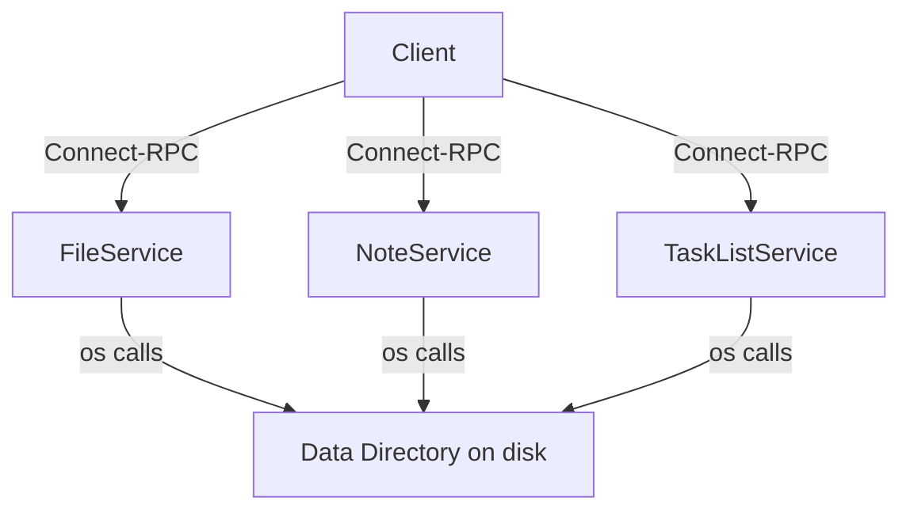

# Design Document: File Service Refactor

## Overview

This design covers the refactoring of the existing `FolderService` Connect-RPC service into a general-purpose `FileService`. The key changes are:

1. Rename the service, proto package, generated code, and Go implementation package from `folder` to `file`.
2. Remove the `GetFolder` RPC (redundant — clients already know the path they're querying).
3. Replace `ListFolders` with a new `ListFiles` RPC that returns both files and folders as string entries (folders suffixed with `/`).
4. Migrate `CreateFolder`, `UpdateFolder`, and `DeleteFolder` with updated imports only — no logic changes.
5. Leave `NoteService` and `TaskListService` untouched.

The refactor is purely structural. No new business logic is introduced for the migrated RPCs. The only new logic is in `ListFiles`, which extends the old `ListFolders` to include file entries.

## Architecture

The system follows a straightforward Connect-RPC service pattern:



The `FileService` is a stateless Go struct (`FileServer`) that receives a `dataDir` root path at construction time. All path arguments from clients are resolved relative to this root, with path-traversal guards via `pathutil.IsSubPath`.

### Migration Strategy

The migration is a direct rename with no intermediate compatibility layer:

| Before | After |
|---|---|
| `proto/folder/v1/folder.proto` | `proto/file/v1/file.proto` |
| `proto/gen/folder/v1/` | `proto/gen/file/v1/` |
| `proto/gen/folder/v1/folderv1connect/` | `proto/gen/file/v1/filev1connect/` |
| `folder/` Go package | `file/` Go package |
| `FolderServer` struct | `FileServer` struct |
| `FolderService` proto service | `FileService` proto service |
| `folder.v1` proto package | `file.v1` proto package |

The old `folder/`, `proto/folder/`, and `proto/gen/folder/` directories are removed after migration.

## Components and Interfaces

### Proto Definition (`proto/file/v1/file.proto`)

```protobuf
syntax = "proto3";

package file.v1;

option go_package = "gen/file;file";

service FileService {
  rpc CreateFolder (CreateFolderRequest) returns (CreateFolderResponse);
  rpc ListFiles (ListFilesRequest) returns (ListFilesResponse);
  rpc UpdateFolder (UpdateFolderRequest) returns (UpdateFolderResponse);
  rpc DeleteFolder (DeleteFolderRequest) returns (DeleteFolderResponse);
}

message Folder {
  string path = 1;
  string name = 2;
}

message CreateFolderRequest {
  string parent_path = 1;
  string name = 2;
}

message CreateFolderResponse {
  Folder folder = 1;
}

message ListFilesRequest {
  string parent_path = 1;
}

message ListFilesResponse {
  repeated string entries = 1;
}

message UpdateFolderRequest {
  string folder_path = 1;
  string new_name = 2;
}

message UpdateFolderResponse {
  Folder folder = 1;
}

message DeleteFolderRequest {
  string folder_path = 1;
}

message DeleteFolderResponse {}
```

Key changes from the old proto:
- Service renamed from `FolderService` to `FileService`, package from `folder.v1` to `file.v1`.
- `GetFolder` RPC removed entirely.
- `ListFolders` replaced by `ListFiles` — returns `repeated string entries` instead of `repeated Folder folders`.
- `CreateFolder`, `UpdateFolder`, `DeleteFolder` messages are unchanged.

### Go Implementation (`file/` package)

| File | Description |
|---|---|
| `file/file_server.go` | `FileServer` struct, constructor, `validateName` helper. Embeds `filev1connect.UnimplementedFileServiceHandler`. |
| `file/create_folder.go` | `CreateFolder` RPC — migrated from `folder/create_folder.go` with import path updates only. |
| `file/update_folder.go` | `UpdateFolder` RPC — migrated from `folder/update_folder.go` with import path updates only. |
| `file/delete_folder.go` | `DeleteFolder` RPC — migrated from `folder/delete_folder.go` with import path updates only. |
| `file/list_files.go` | `ListFiles` RPC — new implementation based on `folder/list_folders.go`, extended to include both files and directories. |

### `main.go` Wiring Changes

```go
// Before
import "echolist-backend/folder"
import folderv1connect "echolist-backend/proto/gen/folder/v1/folderv1connect"

folderPath, folderHandler := folderv1connect.NewFolderServiceHandler(
    folder.NewFolderServer(dataDir), interceptors,
)
mux.Handle(folderPath, folderHandler)

// After
import "echolist-backend/file"
import filev1connect "echolist-backend/proto/gen/file/v1/filev1connect"

filePath, fileHandler := filev1connect.NewFileServiceHandler(
    file.NewFileServer(dataDir), interceptors,
)
mux.Handle(filePath, fileHandler)
```

The gRPC reflection service name changes from `"folder.v1.FolderService"` to `"file.v1.FileService"`.

## Data Models

### On-Disk Model

There is no database. The data model is the filesystem itself under `dataDir`:

```
dataDir/
├── notes/           # managed by NoteService
├── tasks/           # managed by TaskListService
├── folder-a/        # managed by FileService
│   ├── subfolder/
│   ├── note.md
│   └── tasks.json
└── file.txt
```

All paths in RPC requests are relative to `dataDir`. The `pathutil.IsSubPath` guard prevents any path from escaping this root.

### Proto Message Models

| Message | Fields | Notes |
|---|---|---|
| `Folder` | `path` (string), `name` (string) | Used by Create/Update/Delete responses. `path` is relative to dataDir with trailing `/`. |
| `ListFilesResponse` | `entries` (repeated string) | Each entry is a filename. Directories have trailing `/`, files do not. |

### ListFiles Entry Format

The `ListFiles` RPC returns a flat list of strings. The trailing `/` convention distinguishes directories from files:

| Entry | Type |
|---|---|
| `"subfolder/"` | Directory |
| `"note.md"` | File |
| `"tasks.json"` | File |

This is a deliberate simplification over the old `ListFolders` which returned structured `Folder` messages but only for directories. The new format is lighter and covers both file types.

## Correctness Properties

*A property is a characteristic or behavior that should hold true across all valid executions of a system — essentially, a formal statement about what the system should do. Properties serve as the bridge between human-readable specifications and machine-verifiable correctness guarantees.*

Most requirements in this refactor are structural (file locations, package names, removed RPCs) and are not amenable to property-based testing. The testable properties focus on the new `ListFiles` RPC, which is the only RPC with new runtime behavior. The migrated RPCs (`CreateFolder`, `UpdateFolder`, `DeleteFolder`) retain their existing behavior and are validated by migrating the existing property test suite to the new `file/` package.

### Property 1: ListFiles returns immediate children with correct entry format

*For any* directory structure under the data directory containing an arbitrary mix of files and subdirectories, calling `ListFiles` with that directory's path SHALL return a list of strings where: (a) every immediate child is represented exactly once, (b) directory entries end with `/`, (c) file entries do not end with `/`, and (d) no entries from deeper levels are included.

**Validates: Requirements 3.1, 3.2, 3.3, 3.4**

### Property 2: ListFiles on non-existent path returns NotFound

*For any* parent path string that does not correspond to an existing filesystem entry under the data directory, calling `ListFiles` SHALL return a Connect error with code `NotFound`.

**Validates: Requirements 3.5**

### Property 3: ListFiles on file path returns NotFound

*For any* path that refers to a regular file (not a directory) under the data directory, calling `ListFiles` with that path SHALL return a Connect error with code `NotFound` and a message indicating the path is not a directory.

**Validates: Requirements 3.6**

### Property 4: ListFiles on path-traversal returns InvalidArgument

*For any* parent path that, after resolution, escapes the data directory root (e.g., paths containing `../` sequences that resolve above `dataDir`), calling `ListFiles` SHALL return a Connect error with code `InvalidArgument`.

**Validates: Requirements 3.7**

## Error Handling

All error handling follows the existing patterns established in the `folder/` package, using Connect-RPC error codes:

| Condition | Error Code | Message |
|---|---|---|
| Path escapes data directory | `InvalidArgument` | "parent path escapes data directory" |
| Parent path does not exist | `NotFound` | "parent directory does not exist" |
| Parent path is a file, not a directory | `NotFound` | "parent path is not a directory" |
| Failed to read directory entries | `Internal` | "failed to read directory: ..." |
| Empty folder name (Create/Update) | `InvalidArgument` | "name must not be empty" |
| Name contains path separators | `InvalidArgument` | "name must not contain path separators" |
| Case-insensitive duplicate on create/rename | `AlreadyExists` | "a folder or file with that name already exists (case-insensitive)" |
| Folder does not exist (Update/Delete) | `NotFound` | "folder does not exist" |
| Empty folder_path on delete | `InvalidArgument` | "folder_path must not be empty" |

No new error codes or patterns are introduced. The `ListFiles` RPC reuses the same path validation and error handling as the existing `ListFolders` implementation, extended to also handle the case where the path points to a file.

## Testing Strategy

### Dual Testing Approach

Testing uses both unit tests and property-based tests:

- **Property-based tests** (using [`pgregory.net/rapid`](https://github.com/flyingmutant/rapid)) verify universal properties across randomly generated inputs. Each property test runs a minimum of 100 iterations.
- **Unit tests** cover specific examples, edge cases, and error conditions that are better expressed as concrete scenarios.

### Property-Based Tests

Each correctness property maps to a single property-based test function. Tests are tagged with comments referencing the design property.

| Test Function | Design Property | Description |
|---|---|---|
| `TestProperty1_ListFilesReturnsImmediateChildren` | Property 1 | Generates random directory trees with files and subdirs, calls ListFiles, verifies completeness and entry format. |
| `TestProperty2_ListFilesNonExistentPathNotFound` | Property 2 | Generates random non-existent path strings, verifies NotFound error. |
| `TestProperty3_ListFilesFilePathNotFound` | Property 3 | Creates random files, calls ListFiles with file paths, verifies NotFound error with correct message. |
| `TestProperty4_ListFilesPathTraversalInvalidArgument` | Property 4 | Generates path-traversal strings, verifies InvalidArgument error. |

Tag format: `// Feature: file-service-refactor, Property N: <property text>`

### Migrated Tests

The existing property tests from `folder/` are migrated to `file/` with updated imports:

- `TestProperty1_CreateFolderRoundTrip` — validates CreateFolder still works.
- `TestProperty2_CaseInsensitiveDuplicateRejection` — validates case-insensitive duplicate detection.
- `TestProperty3_InvalidNameRejection` — validates name validation.
- `TestProperty4_RenamePreservesContents` — validates UpdateFolder preserves children.
- `TestProperty5_CaseInsensitiveDuplicateRejectionOnRename` — validates rename conflict detection.
- `TestProperty6_DeleteRemovesFolderAndContents` — validates DeleteFolder removes everything.

These migrated tests validate Requirement 4.1 (behavioral equivalence after migration).

### Unit Tests

Unit tests cover error conditions and edge cases:

- `TestListFiles_EmptyDirectory` — ListFiles on an empty directory returns empty entries list.
- `TestListFiles_RootPath` — ListFiles with empty parent_path returns data directory children.
- Error condition tests migrated from `folder/error_conditions_test.go` with updated imports.

### Test Configuration

- Library: `pgregory.net/rapid` (already used in the project)
- Minimum iterations: 100 per property test (rapid's default)
- Test package: `file` (internal tests, same pattern as existing `folder` package)
- Each property-based test MUST reference its design document property in a comment
