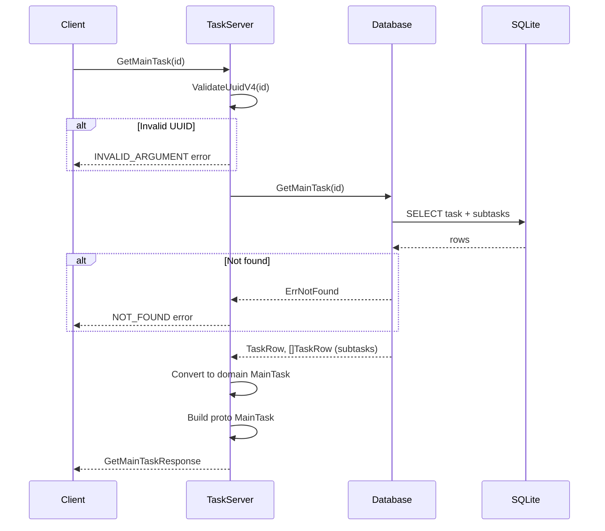

# Design Document: GetMainTask RPC

## Overview

This feature adds a `GetMainTask` RPC endpoint to the existing `TaskListService`. The endpoint allows clients to fetch a single `MainTask` (with its subtasks) by ID, without loading the entire parent `TaskList`. This supports the mobile client's task settings screen where only the `mainTaskId` is available from the navigation route.

The implementation follows the same patterns established by the existing `GetTaskList` RPC: UUID validation, database lookup, domain conversion, and proto response building.

## Architecture

The feature integrates into the existing layered architecture:



**Key design decisions:**

1. **Single database query**: The database method fetches the main task row and its subtask rows in a single query (using `OR parent_task_id = ?`), avoiding N+1 queries.
2. **Reuse existing conversion functions**: `taskRowsToMainTasks` already handles converting `TaskRow` slices into domain `MainTask` structs with subtasks attached. However, since we're fetching a single main task, we'll use a simpler conversion path.
3. **Authentication via existing interceptor**: The auth interceptor already protects all RPCs on the service, so no additional auth logic is needed in the handler.

## Components and Interfaces

### Proto Changes (`proto/tasks/v1/tasks.proto`)

Add to the `TaskListService`:
```protobuf
rpc GetMainTask (GetMainTaskRequest) returns (GetMainTaskResponse);
```

New messages:
```protobuf
message GetMainTaskRequest {
  string id = 1;
}

message GetMainTaskResponse {
  MainTask main_task = 1;
}
```

### Database Layer (`database/task_lists.go`)

New method:
```go
func (d *Database) GetMainTask(id string) (TaskRow, []TaskRow, error)
```

- Returns the main task row and its subtask rows ordered by position.
- Returns `ErrNotFound` if the ID doesn't exist or isn't a main task (i.e., `task_list_id` is NULL).

### RPC Handler (`tasks/get_main_task.go`)

New file implementing:
```go
func (s *TaskServer) GetMainTask(ctx context.Context, req *pb.GetMainTaskRequest) (*pb.GetMainTaskResponse, error)
```

Flow:
1. Validate UUID format via `common.ValidateUuidV4`
2. Call `s.db.GetMainTask(id)`
3. Handle `ErrNotFound` → `connect.CodeNotFound`
4. Convert `TaskRow` + subtask `[]TaskRow` → domain `MainTask`
5. Convert domain `MainTask` → proto `*pb.MainTask`
6. Return `GetMainTaskResponse`

### Helper Function

A small helper to convert a single main task row + subtask rows into a domain `MainTask`:
```go
func singleTaskRowToMainTask(mainRow database.TaskRow, subRows []database.TaskRow) MainTask
```

This is simpler than `taskRowsToMainTasks` since we already know which row is the main task.

## Data Models

No new tables or schema changes are required. The existing `tasks` table already supports the query:

```sql
-- Fetch main task
SELECT id, task_list_id, parent_task_id, position, description, is_done, due_date, recurrence
FROM tasks WHERE id = ? AND task_list_id IS NOT NULL

-- Fetch subtasks
SELECT id, task_list_id, parent_task_id, position, description, is_done, due_date, recurrence
FROM tasks WHERE parent_task_id = ? ORDER BY position
```

The distinction between main tasks and subtasks is:
- **Main task**: `task_list_id IS NOT NULL`, `parent_task_id IS NULL`
- **Subtask**: `task_list_id IS NULL`, `parent_task_id IS NOT NULL`

## Correctness Properties

*A property is a characteristic or behavior that should hold true across all valid executions of a system — essentially, a formal statement about what the system should do. Properties serve as the bridge between human-readable specifications and machine-verifiable correctness guarantees.*

### Property 1: Create-then-GetMainTask round trip

*For any* valid task list with arbitrary main tasks (each with varying descriptions, is_done states, due_date, recurrence, and 0–N subtasks), after creating the task list, calling GetMainTask with any main task's ID SHALL return a MainTask whose id, description, is_done, due_date, recurrence, and subtasks (with correct id, description, is_done, and position ordering) all match the originally created data.

**Validates: Requirements 1.1, 4.1, 4.2, 4.3**

### Property 2: Non-existent ID returns NOT_FOUND

*For any* valid UUIDv4 string that does not correspond to an existing main task in the database, calling GetMainTask SHALL return a NOT_FOUND error.

**Validates: Requirements 1.2, 5.2**

### Property 3: Invalid UUID returns INVALID_ARGUMENT

*For any* string that is not a valid lowercase hyphenated UUIDv4, calling GetMainTask SHALL return an INVALID_ARGUMENT error.

**Validates: Requirements 1.3**

### Property 4: GetMainTask isolation — does not return sibling tasks

*For any* task list containing multiple main tasks, calling GetMainTask for one main task's ID SHALL return only that task and its subtasks, never including data from sibling main tasks in the same list.

**Validates: Requirements 5.1**

## Error Handling

| Condition | Error Code | Message |
|-----------|-----------|---------|
| ID fails UUIDv4 validation | `INVALID_ARGUMENT` | `invalid UUIDv4: "<id>"` |
| ID not found in tasks table as a main task | `NOT_FOUND` | `main task not found` |
| Subtask ID provided (exists but is not a main task) | `NOT_FOUND` | `main task not found` |
| Database internal error | `INTERNAL` | `failed to get main task: <err>` |
| Missing/invalid auth token | `UNAUTHENTICATED` | Handled by auth interceptor |

Error handling follows the same pattern as `GetTaskList`:
- Validation errors are returned immediately before any database access.
- `database.ErrNotFound` is mapped to `connect.CodeNotFound`.
- Unexpected database errors are logged and returned as `connect.CodeInternal`.

## Testing Strategy

### Property-Based Tests (using `pgregory.net/rapid`)

Each correctness property maps to a single property-based test with minimum 100 iterations:

1. **TestProperty_GetMainTaskRoundTrip** — Feature: get-main-task, Property 1: Create-then-GetMainTask round trip
2. **TestProperty_GetMainTaskNotFound** — Feature: get-main-task, Property 2: Non-existent ID returns NOT_FOUND
3. **TestProperty_GetMainTaskInvalidUUID** — Feature: get-main-task, Property 3: Invalid UUID returns INVALID_ARGUMENT
4. **TestProperty_GetMainTaskIsolation** — Feature: get-main-task, Property 4: GetMainTask isolation

### Unit Tests (example-based)

- `TestGetMainTask_Success` — Basic happy path with a task that has subtasks
- `TestGetMainTask_NotFound` — Specific example with a known non-existent UUID
- `TestGetMainTask_SubtaskIdReturnsNotFound` — Verifying that passing a subtask ID returns NOT_FOUND (not the parent)

### Integration Tests

- Auth interceptor rejects unauthenticated GetMainTask requests (Requirements 3.1, 3.2)

### Test Configuration

- Property tests: minimum 100 iterations (rapid default)
- Tag format: `// Feature: get-main-task, Property N: <title>`
- Test helpers reuse existing `tasks.NewTestDB(t)` and `tasks.NopLogger()` patterns

