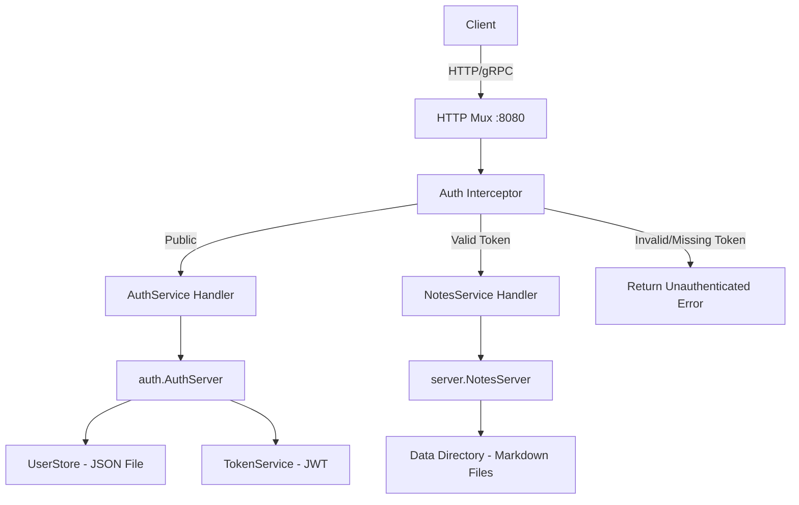

# Design Document: JWT Authentication

## Overview

This design adds JWT-based authentication to the existing ConnectRPC notes backend. A new `AuthService` protobuf service provides Login and RefreshToken RPCs. A Connect unary interceptor validates JWT tokens on all requests to the existing `NotesService`, while allowing unauthenticated access to auth endpoints. User credentials are stored in a JSON file with bcrypt-hashed passwords. All configuration is driven by environment variables.

The design prioritizes simplicity: no external dependencies beyond well-established Go libraries (`golang-jwt/jwt/v5`, `golang.org/x/crypto/bcrypt`), no database, and a single binary deployment.

## Architecture



### Request Flow

1. All HTTP requests arrive at the shared mux on `:8080`
2. The Connect interceptor inspects each request:
   - Requests to `AuthService/Login` and `AuthService/RefreshToken` pass through without token validation
   - All other requests require a valid `Bearer` token in the `Authorization` header
3. For protected requests, the interceptor validates the JWT signature and expiration, then injects the username into the request context
4. The RPC handler processes the request normally

### Package Structure

```
notes-backend/
├── main.go                          # Updated: wire auth components
├── auth/
│   ├── auth_server.go               # AuthServer struct, Login + RefreshToken handlers
│   ├── token_service.go             # JWT generation and validation
│   ├── user_store.go                # File-based user credential storage
│   ├── interceptor.go               # Connect auth interceptor
│   ├── token_service_test.go        # Tests for token service
│   └── user_store_test.go           # Tests for user store
├── proto/
│   ├── auth/v1/auth.proto           # New: AuthService protobuf definition
│   ├── gen/auth/v1/                 # New: Generated Go code
│   └── ...existing notes protos...
├── server/                          # Existing, unchanged
└── ...
```

## Components and Interfaces

### 1. UserStore (`auth/user_store.go`)

Manages file-based user credential storage.

```go
type User struct {
    Username     string `json:"username"`
    PasswordHash string `json:"password_hash"`
}

type UserStore struct {
    filePath string
    mu       sync.RWMutex
}

func NewUserStore(filePath string) *UserStore

// LoadOrInitialize reads the user store file, or creates it with a default
// admin user if it doesn't exist. Returns an error if the file exists but
// is malformed, or if the default password is empty when initialization is needed.
func (s *UserStore) LoadOrInitialize(defaultUser, defaultPassword string) error

// Authenticate checks the provided password against the stored bcrypt hash
// for the given username. Returns the User if valid, or an error.
func (s *UserStore) Authenticate(username, password string) (*User, error)

// getUser returns the user record for the given username, or an error if not found.
func (s *UserStore) getUser(username string) (*User, error)
```

**Storage format** (`users.json`):
```json
[
  {
    "username": "admin",
    "password_hash": "$2a$10$..."
  }
]
```

The file is read into memory on startup. For a small user count (1-5 users), this is sufficient.

**RWMutex usage**: The `sync.RWMutex` provides concurrent-safe access to the in-memory user list. Multiple goroutines can read simultaneously (e.g., concurrent `Authenticate` calls from different requests) using `RLock()`, but writes (e.g., `LoadOrInitialize` creating the default user) acquire an exclusive `Lock()` that blocks all readers and other writers. This prevents data races without the overhead of a full mutex on every read — important since reads (token validation on every request) vastly outnumber writes (only at startup).

### 2. TokenService (`auth/token_service.go`)

Handles JWT token generation and validation.

```go
type TokenClaims struct {
    Username string `json:"username"`
    jwt.RegisteredClaims
}

type TokenService struct {
    secret          []byte
    accessTokenTtl  time.Duration
    refreshTokenTtl time.Duration
}

func NewTokenService(secret string, accessTtl, refreshTtl time.Duration) *TokenService

// GenerateAccessToken creates a signed JWT with the username claim and
// the configured access token expiry.
func (t *TokenService) GenerateAccessToken(username string) (string, error)

// GenerateRefreshToken creates a signed JWT with the username claim and
// the configured refresh token expiry.
func (t *TokenService) GenerateRefreshToken(username string) (string, error)

// ValidateToken parses and validates a JWT string. Returns the claims if
// the token is valid (correct signature, not expired), or an error.
func (t *TokenService) ValidateToken(tokenStr string) (*TokenClaims, error)
```

**Token structure**:
- Signing method: HMAC-SHA256 (`HS256`)
- Claims: `username` (custom), `exp`, `iat`, `sub` (standard registered claims)
- `sub` is set to the username for standard JWT compatibility

### 3. Auth Interceptor (`auth/interceptor.go`)

A Connect unary interceptor that enforces authentication on protected endpoints.

```go
// publicProcedures is the set of fully-qualified procedure names that
// do not require authentication.
var publicProcedures = map[string]bool{
    "/auth.v1.AuthService/Login":        true,
    "/auth.v1.AuthService/RefreshToken": true,
}

// NewAuthInterceptor returns a connect.UnaryInterceptorFunc that validates
// JWT tokens for all non-public procedures.
func NewAuthInterceptor(tokenService *TokenService) connect.UnaryInterceptorFunc
```

**Interceptor logic**:
1. Check if `req.Spec().Procedure` is in `publicProcedures` → pass through
2. Extract `Authorization` header → return `codes.Unauthenticated` if missing
3. Strip `Bearer ` prefix → return `codes.InvalidArgument` if malformed (helps frontend devs catch syntax issues)
4. Call `tokenService.ValidateToken()` → return `codes.Unauthenticated` if invalid/expired
5. Inject username into context via `context.WithValue`
6. Call `next(ctx, req)`

### 4. AuthServer (`auth/auth_server.go`)

Implements the `AuthService` Connect handler.

```go
type AuthServer struct {
    authv1connect.UnimplementedAuthServiceHandler
    userStore    *UserStore
    tokenService *TokenService
}

func NewAuthServer(userStore *UserStore, tokenService *TokenService) *AuthServer

// Login validates credentials and returns access + refresh tokens.
func (s *AuthServer) Login(ctx context.Context, req *authv1.LoginRequest) (*authv1.LoginResponse, error)

// RefreshToken validates a refresh token and returns a new access token.
func (s *AuthServer) RefreshToken(ctx context.Context, req *authv1.RefreshTokenRequest) (*authv1.RefreshTokenResponse, error)
```

### 5. Protobuf Definition (`proto/auth/v1/auth.proto`)

```protobuf
syntax = "proto3";

package auth.v1;

option go_package = "gen/auth;auth";

service AuthService {
  rpc Login (LoginRequest) returns (LoginResponse);
  rpc RefreshToken (RefreshTokenRequest) returns (RefreshTokenResponse);
}

message LoginRequest {
  string username = 1;
  string password = 2;
}

message LoginResponse {
  string access_token = 1;
  string refresh_token = 2;
}

message RefreshTokenRequest {
  string refresh_token = 1;
}

message RefreshTokenResponse {
  string access_token = 1;
}
```

### 6. Updated `main.go` Wiring

```go
func main() {
    // ... existing DATA_DIR setup ...

    // Auth configuration
    jwtSecret := os.Getenv("JWT_SECRET")
    if jwtSecret == "" {
        log.Fatal("JWT_SECRET environment variable is required")
    }

    accessTtl := parseDurationMinutesEnv("ACCESS_TOKEN_EXPIRY_MINUTES", 15)
    refreshTtl := parseDurationMinutesEnv("REFRESH_TOKEN_EXPIRY_MINUTES", 10080) // 7 days

    // Initialize auth components
    userStore := auth.NewUserStore(filepath.Join(dataDir, "users.json"))
    err := userStore.LoadOrInitialize(
        envOrDefault("AUTH_DEFAULT_USER", "admin"),
        os.Getenv("AUTH_DEFAULT_PASSWORD"),
    )
    if err != nil {
        log.Fatalf("Failed to initialize user store: %v", err)
    }

    tokenService := auth.NewTokenService(jwtSecret, accessTtl, refreshTtl)
    authInterceptor := auth.NewAuthInterceptor(tokenService)

    // Create interceptor options
    interceptors := connect.WithInterceptors(authInterceptor)

    // Register handlers with interceptor
    mux := http.NewServeMux()

    notesPath, notesHandler := notesv1connect.NewNotesServiceHandler(
        server.NewNotesServer(dataDir),
        interceptors,
    )
    mux.Handle(notesPath, notesHandler)

    authPath, authHandler := authv1connect.NewAuthServiceHandler(
        auth.NewAuthServer(userStore, tokenService),
        interceptors,
    )
    mux.Handle(authPath, authHandler)

    // ... existing reflection + listen setup ...
    log.Printf("Authentication enabled. Access token TTL: %v, Refresh token TTL: %v", accessTtl, refreshTtl)
}
```

## Data Models

### User Store File (`users.json`)

Located at `$DATA_DIR/users.json`. Created automatically on first startup if `AUTH_DEFAULT_PASSWORD` is set.

```json
[
  {
    "username": "admin",
    "password_hash": "$2a$10$abcdef..."
  }
]
```

- Array of user objects
- `username`: unique string identifier
- `password_hash`: bcrypt hash string (always starts with `$2a$` or `$2b$`)

### JWT Token Claims

**Access Token**:
```json
{
  "username": "admin",
  "sub": "admin",
  "iat": 1700000000,
  "exp": 1700000900
}
```

**Refresh Token**:
```json
{
  "username": "admin",
  "sub": "admin",
  "iat": 1700000000,
  "exp": 1700604800
}
```

Both token types use the same claims structure. They are differentiated only by their expiry duration. The `sub` (subject) claim mirrors the `username` for JWT standard compliance.

### Environment Variables

| Variable | Required | Default | Description |
|---|---|---|---|
| `JWT_SECRET` | Yes | — | HMAC-SHA256 signing key for JWT tokens |
| `ACCESS_TOKEN_EXPIRY_MINUTES` | No | `15` | Access token lifetime in minutes |
| `REFRESH_TOKEN_EXPIRY_MINUTES` | No | `10080` | Refresh token lifetime in minutes (default: 7 days) |
| `AUTH_DEFAULT_USER` | No | `admin` | Default admin username for first-run initialization |
| `AUTH_DEFAULT_PASSWORD` | No | — | Default admin password; required for first-run user creation |
| `DATA_DIR` | No | `./data` | Existing; user store file is placed here |


## Correctness Properties

*A property is a characteristic or behavior that should hold true across all valid executions of a system — essentially, a formal statement about what the system should do. Properties serve as the bridge between human-readable specifications and machine-verifiable correctness guarantees.*

### Property 1: User store round-trip

*For any* list of users with valid usernames and bcrypt-hashed passwords, writing them to the UserStore file and then looking up each username should return the same user record (username and password hash).

**Validates: Requirements 1.1, 1.5**

### Property 2: Bcrypt hashing invariant

*For any* password string provided during user creation, the stored password_hash field must be a valid bcrypt hash with a cost factor of at least 10, and the original plaintext password must not appear anywhere in the stored data.

**Validates: Requirements 1.2, 1.4**

### Property 3: Token generation round-trip with claims

*For any* username string and JWT secret, generating an access token and then validating it with the same secret should return claims containing that exact username and a valid expiration time in the future.

**Validates: Requirements 2.5, 2.6**

### Property 4: Valid credentials produce valid tokens

*For any* user in the UserStore with a known password, calling Login with the correct username and password should return an access token and a refresh token that are both non-empty and valid (parseable with correct claims).

**Validates: Requirements 2.1**

### Property 5: Valid token passes interceptor with correct context

*For any* valid access token containing a username, when the Auth_Interceptor processes a request to a protected endpoint with that token in the Authorization header, the request should proceed and the username extracted into the context should match the username in the token.

**Validates: Requirements 3.1, 3.6**

### Property 6: Invalid tokens rejected by interceptor

*For any* random string that is not a validly signed JWT, when the Auth_Interceptor processes a request to a protected endpoint with that string as the Bearer token, the interceptor should return an unauthenticated error.

**Validates: Requirements 3.3**

### Property 7: Public endpoints bypass authentication

*For any* request to a public endpoint procedure (Login, RefreshToken), the Auth_Interceptor should allow the request to proceed regardless of whether an Authorization header is present or what value it contains.

**Validates: Requirements 3.5**

### Property 8: Valid refresh token produces new access token

*For any* valid refresh token containing a username, calling RefreshToken should return a new non-empty access token that, when validated, contains the same username.

**Validates: Requirements 4.1**

## Error Handling

### Authentication Errors

All authentication failures return Connect `codes.Unauthenticated` errors with generic messages to avoid leaking information:

| Scenario | Error Code | Message |
|---|---|---|
| Invalid username | `Unauthenticated` | `"invalid credentials"` |
| Invalid password | `Unauthenticated` | `"invalid credentials"` |
| Missing Authorization header | `Unauthenticated` | `"missing authorization header"` |
| Malformed Bearer token | `InvalidArgument` | `"malformed authorization header, expected: Bearer <token>"` |
| Expired token | `Unauthenticated` | `"token expired"` |
| Invalid/tampered token | `Unauthenticated` | `"invalid token"` |

The error messages for invalid username and invalid password are intentionally identical to prevent username enumeration attacks.

### Startup Errors

| Scenario | Behavior |
|---|---|
| `JWT_SECRET` not set | `log.Fatal` with descriptive message; process exits |
| `AUTH_DEFAULT_PASSWORD` not set and no `users.json` exists | `log.Fatal` with message explaining first-run setup requires a default password |
| `users.json` exists but is malformed JSON | `log.Fatal` with parse error details |
| Invalid duration format in `ACCESS_TOKEN_EXPIRY_MINUTES` or `REFRESH_TOKEN_EXPIRY_MINUTES` | `log.Fatal` with parse error; show expected format (integer minutes) |

### Runtime Errors

| Scenario | Behavior |
|---|---|
| `users.json` file read error during authentication | Return `codes.Internal` error |
| bcrypt comparison error (not mismatch, but actual error) | Return `codes.Internal` error |
| JWT signing failure | Return `codes.Internal` error |

## Testing Strategy

### Testing Framework

- **Unit tests**: Standard Go `testing` package
- **Property-based tests**: `pgregory.net/rapid` (Go property-based testing library)
- Minimum 100 iterations per property test

### Unit Tests

Unit tests cover specific examples, edge cases, and error conditions:

- **UserStore**: Default user creation on first run, reading existing store, handling malformed JSON
- **TokenService**: Expired token rejection, token signed with wrong secret, empty secret handling
- **Auth Interceptor**: Missing Authorization header, malformed header (no "Bearer " prefix), expired token
- **Login RPC**: Invalid username returns generic error, invalid password returns same generic error
- **RefreshToken RPC**: Expired refresh token, malformed refresh token
- **Configuration**: Missing JWT_SECRET causes fatal, duration parsing with defaults

### Property-Based Tests

Each property test references its design document property and runs a minimum of 100 iterations.

| Property | Test Description | Tag |
|---|---|---|
| Property 1 | Generate random user lists, write to store, read back by username | Feature: jwt-authentication, Property 1: User store round-trip |
| Property 2 | Generate random passwords, create users, verify stored hashes are valid bcrypt with cost >= 10 | Feature: jwt-authentication, Property 2: Bcrypt hashing invariant |
| Property 3 | Generate random usernames, create tokens, validate and check claims | Feature: jwt-authentication, Property 3: Token generation round-trip |
| Property 4 | Generate random credentials, store user, login, validate returned tokens | Feature: jwt-authentication, Property 4: Valid credentials produce valid tokens |
| Property 5 | Generate random usernames, create valid tokens, run through interceptor, check context | Feature: jwt-authentication, Property 5: Valid token passes interceptor |
| Property 6 | Generate random non-JWT strings, run through interceptor, verify rejection | Feature: jwt-authentication, Property 6: Invalid tokens rejected |
| Property 7 | Generate random auth header values (including empty), send to public endpoints, verify pass-through | Feature: jwt-authentication, Property 7: Public endpoints bypass auth |
| Property 8 | Generate random usernames, create refresh tokens, call refresh, validate new access token | Feature: jwt-authentication, Property 8: Refresh produces valid access token |

### Test Organization

Tests are co-located with their source files in the `auth/` package:
- `auth/user_store_test.go` — Properties 1, 2 + unit tests for edge cases
- `auth/token_service_test.go` — Properties 3 + unit tests for expiry/signing edge cases
- `auth/auth_server_test.go` — Properties 4, 8 + unit tests for login/refresh error cases
- `auth/interceptor_test.go` — Properties 5, 6, 7 + unit tests for header parsing edge cases
