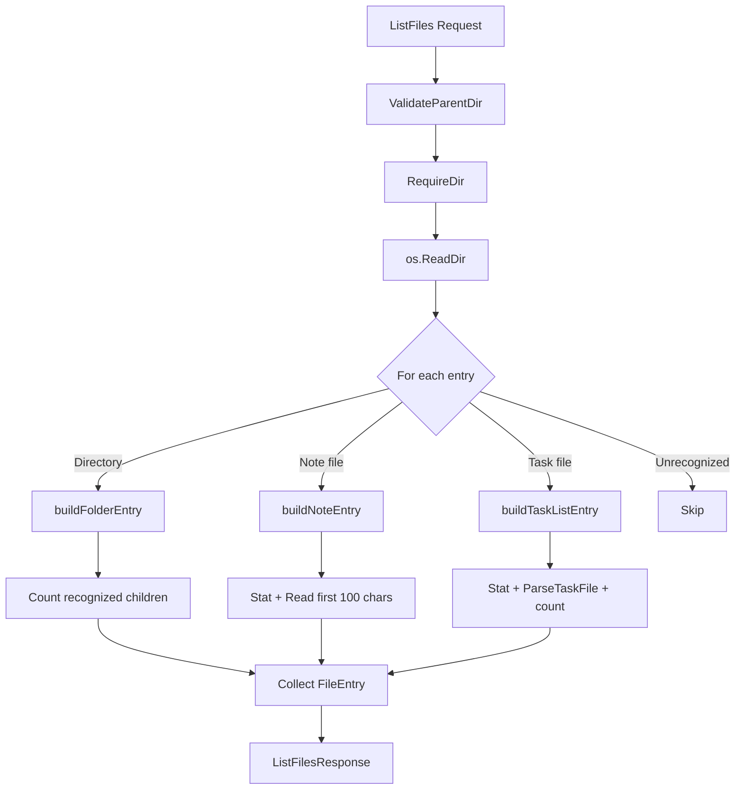

# Design Document: List Files Enrichment

## Overview

The ListFiles RPC currently returns `repeated string entries` — bare filenames with a trailing `/` convention for directories. This design replaces that with `repeated FileEntry` messages, where each entry carries a type discriminator (`FOLDER`, `NOTE`, `TASK_LIST`), a human-readable `title`, and type-specific metadata (child count for folders; preview and timestamp for notes; task counts and timestamp for task lists). The enrichment happens entirely within the existing `file` package by reading additional filesystem metadata during the directory scan. No new RPCs or services are introduced.

## Architecture

The change is scoped to two layers:

1. **Proto layer** — New messages (`FileEntry`, `FolderMetadata`, `NoteMetadata`, `TaskListMetadata`) and an `ItemType` enum are added to `proto/file/v1/file.proto`. The `ListFilesResponse` switches from `repeated string entries` to `repeated FileEntry entries`.

2. **Service layer** — `file/list_files.go` is updated. The directory scan loop now classifies each entry, reads metadata (stat for timestamps, file content for previews and task counts), and builds `FileEntry` messages. All metadata enrichment is best-effort per entry — an I/O error reading a single file's content logs a warning and falls back to zero/empty values rather than failing the entire listing.



### Design Decisions

- **Metadata in the file package, not cross-service calls**: The file service reads note content and parses task files directly using `os.ReadFile` and `tasks.ParseTaskFile`. This avoids circular dependencies and RPC overhead. The `tasks` parser is a pure function with no service dependencies, so importing it is clean.
- **Best-effort enrichment**: If reading a note's content or parsing a task file fails, the entry is still returned with zero-value metadata and a warning log. This prevents one corrupt file from breaking the entire listing.
- **`matchesFileType` moved to `common`**: The function is currently unexported in the `file` package. Since it encodes the same logic as `ValidateFileType` but for filenames only (no stat), it should be exported from `common` as `MatchesFileType` so both the file and any future package can use it without duplication.
- **`child_count` counts recognized items only**: Per user preference, `child_count` reflects the number of immediate children that are folders, notes, or task lists. Unrecognized files are excluded from the count.

## Components and Interfaces

### Proto Changes (`proto/file/v1/file.proto`)

```protobuf
enum ItemType {
  ITEM_TYPE_UNSPECIFIED = 0;
  ITEM_TYPE_FOLDER = 1;
  ITEM_TYPE_NOTE = 2;
  ITEM_TYPE_TASK_LIST = 3;
}

message FolderMetadata {
  int32 child_count = 1;
}

message NoteMetadata {
  int64 updated_at = 1;
  string preview = 2;
}

message TaskListMetadata {
  int64 updated_at = 1;
  int32 total_task_count = 2;
  int32 done_task_count = 3;
}

message FileEntry {
  string path = 1;
  string title = 2;
  ItemType item_type = 3;
  oneof metadata {
    FolderMetadata folder_metadata = 4;
    NoteMetadata note_metadata = 5;
    TaskListMetadata task_list_metadata = 6;
  }
}
```

The `ListFilesResponse` changes from:
```protobuf
message ListFilesResponse {
  repeated string entries = 1;
}
```
to:
```protobuf
message ListFilesResponse {
  repeated FileEntry entries = 1;
}
```

### Go Service Changes (`file/list_files.go`)

The `ListFiles` method is refactored. Three internal helper functions handle each item type:

| Function | Responsibility |
|---|---|
| `buildFolderEntry(parentDir, absPath, name, requestParentDir string) *filev1.FileEntry` | Reads the subdirectory with `os.ReadDir`, counts recognized children (dirs + notes + task lists), returns a `FileEntry` with `FolderMetadata`. |
| `buildNoteEntry(absPath, name, requestParentDir string) *filev1.FileEntry` | Stats the file for `updated_at`, reads up to 100 bytes of content for `preview`, extracts title via `common.ExtractTitle`. |
| `buildTaskListEntry(absPath, name, requestParentDir string) *filev1.FileEntry` | Stats the file for `updated_at`, reads and parses with `tasks.ParseTaskFile`, counts total and done `MainTask` items, extracts title via `common.ExtractTitle`. |

A shared helper `entryPath(requestParentDir, name string) string` builds the response path: if `requestParentDir` is empty, returns `name`; otherwise returns `requestParentDir + "/" + name`.

### Common Package Changes (`common/pathutil.go`)

Export the filename-matching logic:

```go
// MatchesFileType returns true if name matches the prefix/suffix convention
// of the given FileType with at least one character between them.
func MatchesFileType(name string, ft FileType) bool {
    return strings.HasPrefix(name, ft.Prefix) &&
        filepath.Ext(name) == ft.Suffix &&
        len(name) > len(ft.Prefix)+len(ft.Suffix)
}
```

The existing unexported `matchesFileType` in `file/list_files.go` is removed and all call sites switch to `common.MatchesFileType`.

## Data Models

### FileEntry (Proto → Go)

| Proto Field | Go Type | Source |
|---|---|---|
| `path` | `string` | Computed: `entryPath(requestParentDir, entry.Name())` |
| `title` | `string` | Folders: `entry.Name()`. Notes/Tasks: `common.ExtractTitle(name, ft.Prefix, ft.Suffix, ft.Label)` |
| `item_type` | `filev1.ItemType` | Determined by `entry.IsDir()` or `common.MatchesFileType(name, ft)` |
| `folder_metadata.child_count` | `int32` | `os.ReadDir` on subfolder, count recognized items |
| `note_metadata.updated_at` | `int64` | `os.Stat(absPath).ModTime().UnixMilli()` |
| `note_metadata.preview` | `string` | First 100 characters of `os.ReadFile(absPath)` content (rune-safe truncation) |
| `task_list_metadata.updated_at` | `int64` | `os.Stat(absPath).ModTime().UnixMilli()` |
| `task_list_metadata.total_task_count` | `int32` | `len(tasks.ParseTaskFile(data))` |
| `task_list_metadata.done_task_count` | `int32` | Count of `MainTask` where `Done == true` |

### Classification Logic

```
entry.IsDir()                              → FOLDER
common.MatchesFileType(name, NoteFileType) → NOTE
common.MatchesFileType(name, TaskListFileType) → TASK_LIST
otherwise                                  → skip (not included in response)
```

### Preview Truncation

The preview is truncated to 100 characters (not bytes). The implementation converts the file content to a `[]rune`, slices to `min(100, len(runes))`, and converts back to `string`. This avoids splitting multi-byte UTF-8 characters.

## Correctness Properties

*A property is a characteristic or behavior that should hold true across all valid executions of a system — essentially, a formal statement about what the system should do. Properties serve as the bridge between human-readable specifications and machine-verifiable correctness guarantees.*

### Property 1: Classification and filtering correctness

*For any* directory containing an arbitrary mix of subdirectories, note files (`note_*.md`), task list files (`tasks_*.md`), and unrecognized files, the ListFiles response SHALL contain one `FileEntry` per subdirectory (with `item_type = FOLDER`), one per note file (with `item_type = NOTE`), one per task list file (with `item_type = TASK_LIST`), and zero entries for unrecognized files.

**Validates: Requirements 2.2, 2.3, 2.4, 2.5**

### Property 2: Path construction correctness

*For any* `parent_dir` value (empty or non-empty) and any set of filesystem entries, each returned `FileEntry.path` SHALL equal `parent_dir + "/" + entry_name` when `parent_dir` is non-empty, or just `entry_name` when `parent_dir` is empty.

**Validates: Requirements 6.1, 6.2**

### Property 3: Folder metadata correctness

*For any* subdirectory entry returned as a `FOLDER` FileEntry, the `title` field SHALL equal the directory name, and the `child_count` field SHALL equal the number of immediate children of that subdirectory that are themselves directories, note files, or task list files.

**Validates: Requirements 3.1, 3.2, 3.3**

### Property 4: Note metadata correctness

*For any* note file entry returned as a `NOTE` FileEntry, the `title` field SHALL equal the filename with the `note_` prefix and `.md` suffix stripped, the `updated_at` field SHALL equal the file's modification time in Unix milliseconds, and the `preview` field SHALL equal the first 100 characters of the file content (or the full content if shorter than 100 characters).

**Validates: Requirements 4.1, 4.2, 4.3, 4.4**

### Property 5: Task list metadata correctness

*For any* task list file entry returned as a `TASK_LIST` FileEntry with valid task content, the `title` field SHALL equal the filename with the `tasks_` prefix and `.md` suffix stripped, the `updated_at` field SHALL equal the file's modification time in Unix milliseconds, the `total_task_count` field SHALL equal the number of `MainTask` items parsed from the file, and the `done_task_count` field SHALL equal the number of those `MainTask` items where `Done == true`.

**Validates: Requirements 5.1, 5.2, 5.3, 5.4**

### Property 6: Path round-trip usability

*For any* note entry returned by ListFiles, using its `path` as `file_path` in a GetNote call SHALL succeed. *For any* task list entry returned by ListFiles, using its `path` as `file_path` in a GetTaskList call SHALL succeed. *For any* folder entry returned by ListFiles, using its `path` as `parent_dir` in a nested ListFiles call SHALL succeed.

**Validates: Requirements 6.3**

### Property 7: Non-recursive listing

*For any* directory structure with nested subdirectories, the ListFiles response SHALL contain only immediate children of the requested `parent_dir` — no entry's filename portion (after stripping the `parent_dir` prefix) SHALL contain a path separator.

**Validates: Requirements 9.1, 9.2**

## Error Handling

| Condition | Error Code | Source |
|---|---|---|
| `parent_dir` contains path traversal (`../`) | `InvalidArgument` | `common.ValidateParentDir` |
| `parent_dir` does not exist | `NotFound` | `common.RequireDir` |
| `parent_dir` is a file, not a directory | `NotFound` | `common.RequireDir` |
| `os.ReadDir` fails on the parent directory | `Internal` | `ListFiles` handler |
| Reading a single note file's content fails | **No error** — entry returned with empty preview, warning logged | `buildNoteEntry` |
| Parsing a single task file fails | **No error** — entry returned with zero counts, warning logged | `buildTaskListEntry` |
| Stat on a single entry fails | **No error** — entry returned with zero `updated_at`, warning logged | `buildNoteEntry` / `buildTaskListEntry` |
| `os.ReadDir` on a subfolder fails (for child_count) | **No error** — `child_count` set to 0, warning logged | `buildFolderEntry` |

The error handling for the parent directory validation is unchanged from the current implementation. The new behavior is the best-effort enrichment: per-entry I/O errors are logged but do not fail the RPC. This ensures a single corrupt file doesn't prevent the user from browsing the directory.

## Testing Strategy

### Property-Based Testing

The project uses `pgregory.net/rapid` for property-based testing. Each property from the Correctness Properties section above maps to a single `rapid.Check` test function.

**Configuration:**
- Each property test runs with rapid's default iteration count (100+)
- Each test is tagged with a comment: `// Feature: list-files-enrichment, Property N: <title>`
- Tests create a `t.TempDir()` data directory, generate random filesystem structures using rapid generators, call `ListFiles` via the Go server directly, and verify the property against the filesystem state

**Generators needed:**
- `folderNameGen()` — already exists in the test suite
- `noteContentGen()` — generates random strings of varying length (0 to 200+ characters, including multi-byte UTF-8)
- `taskFileContentGen()` — generates valid task file content using `tasks.PrintTaskFile` with randomly generated `MainTask` slices (reuse `mainTaskGen()` and `taskListGen()` from `tasks/parser_property_test.go`)
- `mixedDirGen()` — generates a random mix of subdirectories, note files, task list files, and unrecognized files

**Property test mapping:**

| Test Function | Property | Key Assertions |
|---|---|---|
| `TestProperty1_ClassificationAndFiltering` | Property 1 | Entry count matches expected; each entry has correct `item_type`; no unrecognized files |
| `TestProperty2_PathConstruction` | Property 2 | Path format matches `parent_dir/name` or just `name` |
| `TestProperty3_FolderMetadata` | Property 3 | `title == dir name`; `child_count` matches independent count of recognized children |
| `TestProperty4_NoteMetadata` | Property 4 | Title matches extracted name; `updated_at` matches stat; `preview` matches first 100 chars |
| `TestProperty5_TaskListMetadata` | Property 5 | Title matches extracted name; `updated_at` matches stat; counts match parsed tasks |
| `TestProperty6_PathRoundTrip` | Property 6 | Returned paths work in GetNote/GetTaskList/ListFiles calls |
| `TestProperty7_NonRecursive` | Property 7 | No entry filename contains path separators |

### Unit Tests

Unit tests complement property tests for specific examples and edge cases:

- **Empty directory** — returns empty `[]FileEntry`
- **Directory with only unrecognized files** — returns empty `[]FileEntry`
- **Note with exactly 100 characters** — preview equals full content
- **Note with 101 characters** — preview is first 100 characters
- **Note with multi-byte UTF-8 content** — preview truncates at character boundary, not byte boundary
- **Task file with zero tasks (empty file)** — `total_task_count = 0`, `done_task_count = 0`
- **Task file with parse error** — entry still returned with zero counts
- **Subfolder with mixed recognized/unrecognized children** — `child_count` only counts recognized items
- **Path traversal input** — returns `InvalidArgument` (existing behavior, regression test)
- **Non-existent directory** — returns `NotFound` (existing behavior, regression test)
