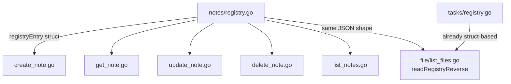

# Design Document: Note Registry Struct Refactor

## Overview

This refactor changes the notes registry (`notes/registry.go`) from `map[string]string` to `map[string]registryEntry`, where `registryEntry` is a struct with a `FilePath` field. This aligns the notes registry with the task list registry (`tasks/registry.go`) which already uses a struct-based format. The change enables a single JSON shape across both registries, which in turn lets `readRegistryReverse` in `file/list_files.go` drop its `json.RawMessage` multi-pass fallback logic in favor of a single `json.Unmarshal` into a typed map.

No backward compatibility is required — this is pre-release software.

## Architecture

The change is confined to three areas:

1. **`notes/registry.go`** — Define `registryEntry` struct, update all registry functions to use `map[string]registryEntry`.
2. **Notes callers** (`create_note.go`, `get_note.go`, `update_note.go`, `delete_note.go`, `list_notes.go`) — Adapt call sites to pass/receive `registryEntry` instead of plain strings.
3. **`file/list_files.go`** — Replace `readRegistryReverse` with a single-pass unmarshal into `map[string]struct{ FilePath string }`.



No new packages, no new files, no new dependencies. The on-disk JSON shape changes from:

```json
{"uuid": "note_MyNote.md"}
```

to:

```json
{"uuid": {"filePath": "note_MyNote.md"}}
```

## Components and Interfaces

### `notes/registry.go`

**New type:**

```go
type registryEntry struct {
    FilePath string `json:"filePath"`
}
```

**Updated function signatures:**

| Function | Current | New |
|---|---|---|
| `registryRead` | `(path) → (map[string]string, error)` | `(path) → (map[string]registryEntry, error)` |
| `registryWrite` | `(path, map[string]string) → error` | `(path, map[string]registryEntry) → error` |
| `registryLookup` | `(regPath, id) → (string, bool, error)` | `(regPath, id) → (registryEntry, bool, error)` |
| `registryAdd` | `(regPath, id, filePath string) → error` | `(regPath, id string, entry registryEntry) → error` |
| `registryRemove` | unchanged | unchanged |

### Caller changes

Each caller extracts `.FilePath` from the returned `registryEntry` where it previously used the plain string directly:

- **`CreateNote`**: `registryAdd(regPath, id, relativeFilePath)` → `registryAdd(regPath, id, registryEntry{FilePath: relativeFilePath})`
- **`GetNote`**: `filePath, found, err := registryLookup(...)` → `entry, found, err := registryLookup(...); filePath := entry.FilePath`
- **`DeleteNote`**: same pattern as GetNote
- **`UpdateNote`**: same pattern for lookup; `registryAdd(regPath, id, newFilePath)` → `registryAdd(regPath, id, registryEntry{FilePath: newFilePath})`
- **`ListNotes`**: iterate `registry` values using `.FilePath` for the reverse map key

### `file/list_files.go` — `readRegistryReverse`

Replace the entire function body. The new implementation:

```go
func readRegistryReverse(path string) map[string]string {
    data, err := os.ReadFile(path)
    if err != nil || len(data) == 0 {
        return make(map[string]string)
    }
    var raw map[string]struct {
        FilePath string `json:"filePath"`
    }
    if err := json.Unmarshal(data, &raw); err != nil {
        return make(map[string]string)
    }
    reverse := make(map[string]string, len(raw))
    for id, entry := range raw {
        if entry.FilePath != "" {
            reverse[entry.FilePath] = id
        }
    }
    return reverse
}
```

No `json.RawMessage`, no multi-pass parsing, no fallback logic.

## Data Models

### On-disk JSON format (after refactor)

**Notes registry** (`.note_id_registry.json`):

```json
{
  "550e8400-e29b-41d4-a716-446655440000": {
    "filePath": "note_Meeting.md"
  },
  "6ba7b810-9dad-11d1-80b4-00c04fd430c8": {
    "filePath": "Work/2026/note_ProjectPlan.md"
  }
}
```

**Task list registry** (`.tasklist_id_registry.json`) — unchanged, already in this shape:

```json
{
  "abc-123": {
    "filePath": "tasklist_Sprint.md",
    "isAutoDelete": false
  }
}
```

### In-memory types

```go
// notes package
type registryEntry struct {
    FilePath string `json:"filePath"`
}

// tasks package (unchanged)
type registryEntry struct {
    FilePath     string `json:"filePath"`
    IsAutoDelete bool   `json:"isAutoDelete"`
}
```

Both registries now serialize to `map[string]object` JSON, where each object has a `filePath` field. This is the invariant that `readRegistryReverse` relies on.


## Correctness Properties

*A property is a characteristic or behavior that should hold true across all valid executions of a system — essentially, a formal statement about what the system should do. Properties serve as the bridge between human-readable specifications and machine-verifiable correctness guarantees.*

### Property 1: Registry write-then-read round trip

*For any* valid `map[string]registryEntry` (where keys are non-empty strings and values have non-empty `FilePath` fields), writing it with `registryWrite` and reading it back with `registryRead` should produce an identical map.

This is a classic round-trip property testing serialization/deserialization. It validates that the JSON encoding of `registryEntry` structs is lossless.

**Validates: Requirements 2.1, 2.2, 5.4**

### Property 2: Add-then-lookup returns the entry

*For any* registry file (possibly containing existing entries) and any new `(id, registryEntry)` pair, calling `registryAdd` followed by `registryLookup` with the same `id` should return the added entry with `found=true`, and the `FilePath` field should match.

This tests the higher-level convenience functions that compose read-modify-write cycles.

**Validates: Requirements 2.3, 2.4**

### Property 3: Remove-then-lookup returns not found

*For any* registry containing at least one entry, calling `registryRemove` for a known `id` and then `registryLookup` for that same `id` should return `found=false`.

**Validates: Requirements 2.5**

### Property 4: readRegistryReverse produces correct inverse map

*For any* valid `map[string]registryEntry` written to disk by `registryWrite`, calling `readRegistryReverse` on that file should produce a map where every `(filePath, id)` pair corresponds to an `(id, entry)` pair in the original map where `entry.FilePath == filePath`.

This is a metamorphic property: the reverse map is the inverse of the forward map's id→filePath projection.

**Validates: Requirements 4.1, 5.5**

## Error Handling

| Scenario | Behavior |
|---|---|
| Registry file missing | `registryRead` returns empty map (unchanged from current behavior) |
| Registry file empty | `registryRead` returns empty map (unchanged) |
| Registry file contains invalid JSON | `registryRead` returns error; `readRegistryReverse` returns empty map |
| `registryLookup` for non-existent id | Returns zero-value `registryEntry`, `found=false`, `nil` error |
| Disk write failure in `registryWrite` | Returns error from `common.File` (atomic write) |

No new error paths are introduced. The existing error handling in all callers remains unchanged — they already handle the `error` return from registry functions and the `found=false` case from `registryLookup`.

## Testing Strategy

### Unit Tests

Update existing unit tests in `notes/registry_test.go` to use the new `registryEntry` type:

- `TestRegistryAdd_ThenLookup` — pass `registryEntry{FilePath: "note_Meeting.md"}`, assert on `.FilePath`
- `TestRegistryRemove` — same adaptation
- `TestRegistryRead_MissingFile`, `TestRegistryRead_EmptyFile` — assert returned map type is `map[string]registryEntry`
- Add a test in `file/` that writes a struct-format registry and verifies `readRegistryReverse` returns the correct inverse map

Unit tests focus on specific examples and edge cases (missing file, empty file, invalid JSON). Avoid duplicating what property tests cover.

### Property-Based Tests

Use `pgregory.net/rapid` (already a project dependency). Each property test runs a minimum of 100 iterations.

| Test | Property | Tag |
|---|---|---|
| `TestProperty_RegistryWriteReadRoundTrip` | Property 1 | `Feature: note-registry-struct-refactor, Property 1: Registry write-then-read round trip` |
| `TestProperty_RegistryAddThenLookup` | Property 2 | `Feature: note-registry-struct-refactor, Property 2: Add-then-lookup returns the entry` |
| `TestProperty_RegistryRemoveThenLookup` | Property 3 | `Feature: note-registry-struct-refactor, Property 3: Remove-then-lookup returns not found` |
| `TestProperty_ReadRegistryReverseInverse` | Property 4 | `Feature: note-registry-struct-refactor, Property 4: readRegistryReverse produces correct inverse map` |

**Generators needed:**

- UUID-like string generator: `rapid.StringMatching(`[0-9a-f]{8}-[0-9a-f]{4}-4[0-9a-f]{3}-[89ab][0-9a-f]{3}-[0-9a-f]{12}`)` 
- FilePath generator: `rapid.StringMatching(`[a-zA-Z0-9_/]{1,50}\.md`)`
- Registry map generator: `rapid.MapOf(uuidGen, entryGen)` to produce `map[string]registryEntry`

Each correctness property is implemented by a single property-based test. Each test is tagged with a comment referencing the design property using the format: `Feature: note-registry-struct-refactor, Property {number}: {property_text}`.
