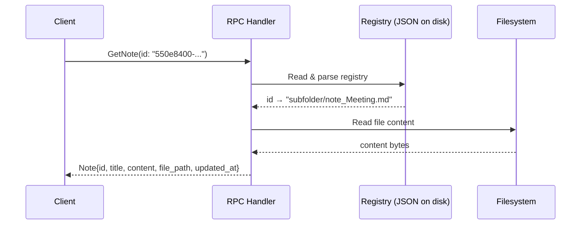
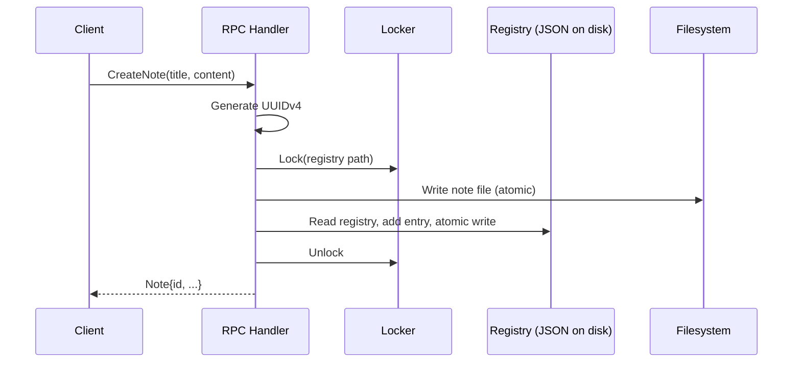

# Design Document: Note Stable IDs

## Overview

This feature introduces a stable synthetic identifier (Note_ID) for every note in the system. Currently, notes are addressed by their file path (`parent_dir + title`), which changes on rename or move. The Note_ID is a UUIDv4 assigned at creation time that remains constant for the lifetime of the note, decoupling API lookups from the mutable filesystem path.

An on-disk JSON registry (`ID_Registry`) maps each Note_ID to its current file path. The `GetNote`, `UpdateNote`, and `DeleteNote` RPCs switch from `file_path`-based lookup to `id`-based lookup. Since this is pre-release, the `file_path` field is removed from those request messages entirely — no migration or backward compatibility is needed.

## Architecture

### Design Decision: Read-Per-Request Registry

Two approaches were considered:

1. **Load-once-and-cache**: Read the registry into memory at startup, serve lookups from the in-memory map, write-through on mutations.
2. **Read-per-request**: Read the JSON file from disk on every request that needs ID resolution.

**Decision: Read-per-request.**

Rationale:
- This is a personal note app with low request volume. The registry file will be small (hundreds of entries at most). Reading a few KB of JSON per request is negligible.
- No stale-state bugs. The on-disk file is always the source of truth.
- Simpler implementation — no startup initialization, no cache invalidation, no need to handle concurrent in-memory map access separately from disk persistence.
- The existing `common.Locker` already provides per-path mutual exclusion for write operations. A dedicated registry lock path (e.g., the registry file path itself) serializes concurrent mutations.



### Mutation Flow (Create / Delete)



### Locking Strategy

- The existing `common.Locker` is used with the registry file's absolute path as the lock key for all registry mutations (Create, Delete).
- The per-note-file lock (existing pattern) continues to protect individual file writes.
- For Create: acquire the note file lock first (for `CreateExclusive`), then acquire the registry lock to add the entry. This ordering prevents deadlocks since the note file path and registry path are always distinct keys.
- For Delete: acquire the registry lock, read the registry to resolve the ID, acquire the note file lock, delete the file, update the registry, release both locks.
- Read-only operations (Get, List) do not lock the registry — they read a consistent snapshot because writes are atomic (temp file + rename).

## Components and Interfaces

### 1. Registry (`notes/registry.go`)

A new file containing the ID_Registry logic. No exported struct — just functions that operate on the registry file path.

```go
// registryPath returns the absolute path to the registry JSON file.
// Convention: <dataDir>/.note_id_registry.json
func registryPath(dataDir string) string

// registryRead reads and parses the registry from disk.
// Returns an empty map if the file is missing or empty.
func registryRead(path string) (map[string]string, error)

// registryWrite atomically writes the registry map to disk as JSON.
func registryWrite(path string, m map[string]string) error

// registryLookup reads the registry and returns the file_path for the given id.
// Returns ("", false) if not found.
func registryLookup(regPath, id string) (string, bool, error)

// registryAdd reads the registry, adds the id→filePath entry, and writes it back atomically.
func registryAdd(regPath, id, filePath string) error

// registryRemove reads the registry, removes the entry for id, and writes it back atomically.
func registryRemove(regPath, id string) error
```

The registry file is stored at `<dataDir>/.note_id_registry.json`. The leading dot keeps it hidden from `ListNotes` directory scans (it doesn't match the `note_*.md` pattern anyway, but the dot convention signals "metadata file").

### 2. UUID Validation (`notes/uuid.go`)

A small utility for validating UUIDv4 strings:

```go
// validateUuidV4 returns a connect InvalidArgument error if id is not a valid
// lowercase hyphenated UUIDv4 string.
func validateUuidV4(id string) error
```

Uses a regex or manual parse — no external dependency needed. The format is `xxxxxxxx-xxxx-4xxx-[89ab]xxx-xxxxxxxxxxxx` with lowercase hex.

### 3. Modified RPC Handlers

Each handler is updated in-place:

- **CreateNote** (`create_note.go`): After writing the file, generate a UUIDv4 via `crypto/rand`, call `registryAdd`, populate `note.Id`.
- **GetNote** (`get_note.go`): Validate the `id` field, call `registryLookup` to resolve to a file path, then proceed with existing file-read logic.
- **UpdateNote** (`update_note.go`): Same ID-resolution pattern as GetNote, then existing update logic.
- **DeleteNote** (`delete_note.go`): Resolve ID via registry, delete the file, call `registryRemove`.
- **ListNotes** (`list_notes.go`): After building the notes list from the filesystem, read the registry once and attach IDs by building a reverse map (filePath → id). Notes without a registry entry get an empty `id` field.

### 4. Protobuf Changes (`proto/notes/v1/notes.proto`)

- `Note` message: add `string id = 1;` (renumber existing fields accordingly)
- `GetNoteRequest`: replace `string file_path = 1;` with `string id = 1;`
- `UpdateNoteRequest`: replace `string file_path = 1;` with `string id = 1;`
- `DeleteNoteRequest`: replace `string file_path = 1;` with `string id = 1;`

### 5. `NotesServer` Struct Changes

The `NotesServer` struct gains a helper method or the registry path is derived from `s.dataDir` on each call. No new fields needed — `registryPath(s.dataDir)` is a pure function.

## Data Models

### ID_Registry JSON Format

```json
{
  "550e8400-e29b-41d4-a716-446655440000": "note_Meeting.md",
  "6ba7b810-9dad-11d1-80b4-00c04fd430c8": "subfolder/note_Design.md"
}
```

- Keys: UUIDv4 strings (lowercase, hyphenated)
- Values: relative file paths from the data directory root
- Stored at: `<dataDir>/.note_id_registry.json`
- Written atomically via `common.File` (temp file + rename)

### Updated Protobuf Messages

```protobuf
message Note {
  string id = 1;
  string file_path = 2;
  string title = 3;
  string content = 4;
  int64 updated_at = 5;
}

message GetNoteRequest {
  string id = 1;
}

message UpdateNoteRequest {
  string id = 1;
  string content = 2;
}

message DeleteNoteRequest {
  string id = 1;
}
```

`CreateNoteRequest` and `ListNotesRequest` are unchanged.

### UUIDv4 Format

Generated via `crypto/rand` (16 random bytes with version and variant bits set). Formatted as lowercase hyphenated: `xxxxxxxx-xxxx-4xxx-[89ab]xxx-xxxxxxxxxxxx`. Example: `550e8400-e29b-41d4-a716-446655440000`.


## Correctness Properties

*A property is a characteristic or behavior that should hold true across all valid executions of a system — essentially, a formal statement about what the system should do. Properties serve as the bridge between human-readable specifications and machine-verifiable correctness guarantees.*

### Property 1: Create-then-get round trip

*For any* valid note title and content, creating a note via CreateNote and then retrieving it via GetNote using the returned `id` shall produce a Note with the same `id`, `title`, `content`, and `file_path` fields.

**Validates: Requirements 1.1, 2.1, 4.1, 8.1, 8.2, 10.1**

### Property 2: Created ID is valid UUIDv4

*For any* valid note title and content, the `id` field in the Note returned by CreateNote shall be a lowercase hyphenated UUIDv4 string matching the pattern `[0-9a-f]{8}-[0-9a-f]{4}-4[0-9a-f]{3}-[89ab][0-9a-f]{3}-[0-9a-f]{12}`.

**Validates: Requirements 1.2**

### Property 3: All created IDs are unique

*For any* sequence of N valid CreateNote calls (with distinct titles), all N returned `id` values shall be pairwise distinct.

**Validates: Requirements 1.3**

### Property 4: Update by ID preserves the Note_ID

*For any* created note and any new content string, calling UpdateNote with the note's `id` shall return a Note whose `id` is identical to the original, and whose `content` matches the new content.

**Validates: Requirements 1.4, 5.1**

### Property 5: Delete by ID removes file and registry entry

*For any* created note, calling DeleteNote with the note's `id` shall succeed, and a subsequent GetNote with the same `id` shall return NotFound.

**Validates: Requirements 2.2, 6.1**

### Property 6: Non-existent ID returns NotFound

*For any* valid UUIDv4 string that was never used in a CreateNote call, calling GetNote, UpdateNote, or DeleteNote with that ID shall return a NotFound error.

**Validates: Requirements 4.2, 5.2, 6.2**

### Property 7: Create then list includes the created note's ID

*For any* valid note title and content, creating a note via CreateNote and then calling ListNotes shall return a list containing a Note whose `id` matches the one returned by CreateNote.

**Validates: Requirements 7.1, 10.2**

### Property 8: Invalid UUID returns InvalidArgument

*For any* string that is not a valid UUIDv4, calling GetNote, UpdateNote, or DeleteNote with that string as the `id` shall return an InvalidArgument error.

**Validates: Requirements 9.1**

## Error Handling

| Scenario | gRPC/Connect Code | Trigger |
|---|---|---|
| `id` field is empty or not a valid UUIDv4 | `InvalidArgument` | GetNote, UpdateNote, DeleteNote with malformed ID |
| `id` not found in ID_Registry | `NotFound` | GetNote, UpdateNote, DeleteNote with unknown ID |
| Registry file on disk maps ID to a file path that no longer exists | `NotFound` | GetNote, UpdateNote, DeleteNote (stale registry entry) |
| Registry JSON is malformed / unreadable | `Internal` | Any RPC that reads the registry |
| File write fails (disk full, permissions) | `Internal` | CreateNote, UpdateNote |
| Note with same title already exists | `AlreadyExists` | CreateNote |
| Content exceeds size limit | `InvalidArgument` | CreateNote, UpdateNote |
| Title contains path separators or null bytes | `InvalidArgument` | CreateNote |

Error handling follows the existing codebase pattern: validate inputs first (returning `InvalidArgument`), then attempt the operation, mapping OS-level errors to appropriate Connect codes.

For the registry specifically:
- If the registry file is missing or empty, treat it as an empty map (not an error).
- If the registry file contains invalid JSON, return `Internal` — this indicates corruption.
- All registry writes use `common.File` (atomic temp+rename) to prevent corruption from crashes.

## Testing Strategy

### Property-Based Testing

The project already uses `pgregory.net/rapid` for property-based testing. All new properties will follow the existing patterns in `notes/*_property_test.go`.

Each property test:
- Runs with rapid's default iteration count (minimum 100)
- Is tagged with a comment referencing the design property: `Feature: note-stable-ids, Property N: <title>`
- Uses the existing `nameGen()` generator for titles and `rapid.StringMatching` for content
- Creates a fresh `t.TempDir()` per test case for isolation

New generators needed:
- `uuidV4Gen()`: generates valid UUIDv4 strings for testing NotFound scenarios
- `invalidUuidGen()`: generates strings that are NOT valid UUIDv4 (for InvalidArgument tests)

### Unit Tests

Unit tests complement property tests for specific examples and edge cases:

- **Missing registry file**: CreateNote succeeds when no registry file exists on disk (edge case from 2.3)
- **Empty registry file**: CreateNote succeeds when registry file is empty (edge case from 2.3)
- **Orphan note file**: ListNotes returns a note with empty `id` when the file exists on disk but has no registry entry (edge case from 7.2)
- **Stale registry entry**: GetNote returns NotFound when the registry maps an ID to a file path that no longer exists on disk

### Test Organization

- Property tests: `notes/*_property_test.go` (one file per logical group, following existing convention)
- Unit tests: `notes/*_test.go` (alongside existing test files)
- Registry unit tests: `notes/registry_test.go` for isolated registry read/write/lookup tests
