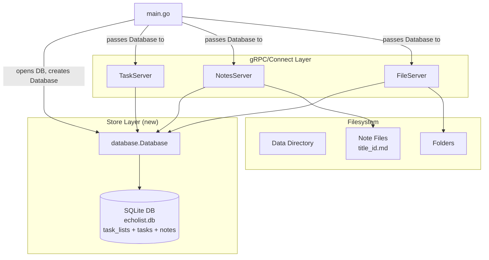
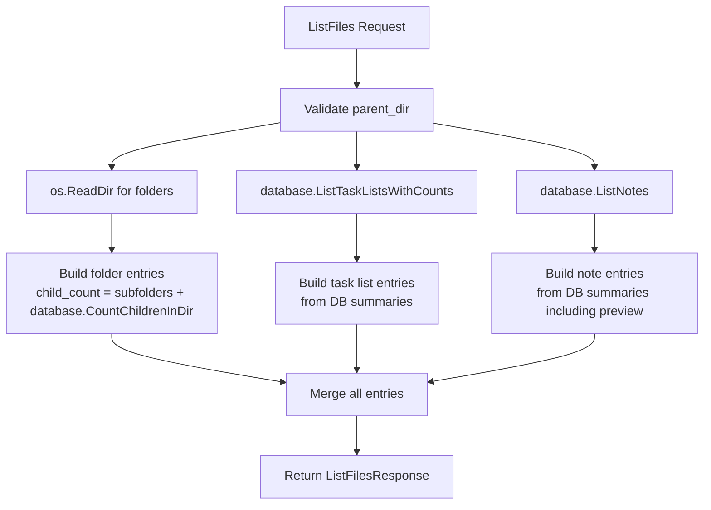

# Design Document: SQLite Storage Migration

## Overview

This design replaces the markdown-file + JSON-registry persistence layer with a single SQLite database for task lists, main tasks, subtasks, and note metadata. Note content remains on disk as markdown files, but note metadata moves into SQLite. The migration removes the task parser (`ParseTaskFile`), printer (`PrintTaskFile`), both JSON registries, and the `common.TaskListFileType` / `common.NoteFileType` constants. It introduces stable UUIDv4 identifiers on `MainTask` and `SubTask`, changes note filenames to `<title>_<id>.md`, and restructures `ListFiles` as a hybrid of filesystem walks (folders) and SQLite queries (notes, task lists).

The SQLite driver is `modernc.org/sqlite`, a pure-Go implementation compatible with `CGO_ENABLED=0` builds. It registers as `"sqlite"` with Go's `database/sql` package, so all database access uses the standard `*sql.DB` / `*sql.Tx` interfaces.

Since this is pre-release software, no backwards compatibility or data migration is required.

## Architecture

### High-Level Component Diagram



### Key Architectural Decisions

1. **Single `database` package**: A new `database` package owns the SQLite connection, schema initialization, and all query functions. Servers call `database` methods rather than writing raw SQL. This keeps SQL centralized and testable.

2. **`*sql.DB` passed via `database.Database` struct**: The `database.Database` struct wraps `*sql.DB` and exposes typed methods. Servers receive a `*database.Database` in their constructors. This avoids scattering `*sql.DB` references and makes it easy to swap implementations for testing.

3. **WAL mode replaces `common.Locker`**: SQLite WAL mode allows concurrent readers with a single writer. The per-path `common.Locker` is removed from `TaskServer` and from `NotesServer`'s registry operations. `NotesServer` may retain file-level locking for concurrent file I/O on note content files.

4. **Note content stays on disk**: Notes are hybrid — metadata in SQLite, content as `<title>_<id>.md` files. The file path is never stored in the database; it is computed by `NotePath(parentDir, title, id)`.

5. **Empty string `parent_dir`**: The empty string `""` represents the data-directory root across all layers (proto, Go, SQL). No conversion needed — the value flows through unchanged. Queries are uniform: `WHERE parent_dir = ?` works for both root and subdirectories.

6. **No unique constraints on `(parent_dir, title)`**: Duplicate titles are allowed. Each entity is identified by its UUIDv4 primary key.

## Components and Interfaces

### 1. `database` Package

New package at `database/database.go`.

```go
package database

import (
    "database/sql"
    _ "modernc.org/sqlite"
)

// Database wraps a SQLite database connection and provides typed query methods.
type Database struct {
    db *sql.DB
}

// New opens (or creates) the SQLite database at dbPath, enables WAL mode
// and foreign keys, runs idempotent schema creation, and returns a Database.
func New(dbPath string) (*Database, error)

// Close closes the underlying database connection.
func (d *Database) Close() error

// HealthCheck runs "SELECT 1" to verify the database is accessible.
func (d *Database) HealthCheck() error
```

#### Task List Operations

```go
// CreateTaskList inserts a task list with its tasks (main and sub)
// in a single transaction. Returns the populated TaskListRow and all TaskRows.
func (d *Database) CreateTaskList(params CreateTaskListParams) (TaskListRow, []TaskRow, error)

// GetTaskList retrieves a task list by ID with all tasks ordered by position.
// Main tasks have TaskListId set; subtasks have ParentTaskId set.
func (d *Database) GetTaskList(id string) (TaskListRow, []TaskRow, error)

// UpdateTaskList replaces all tasks for a task list within a single transaction:
// updates the task_lists row, deletes existing tasks, inserts new ones.
func (d *Database) UpdateTaskList(params UpdateTaskListParams) (TaskListRow, []TaskRow, error)

// DeleteTaskList deletes a task list by ID. Cascades delete all tasks.
// Returns false if the ID was not found.
func (d *Database) DeleteTaskList(id string) (bool, error)

// ListTaskLists returns all task lists in a given parent directory with their
// tasks. TaskListRow includes TotalTaskCount and DoneTaskCount.
func (d *Database) ListTaskLists(parentDir string) ([]TaskListRow, map[string][]TaskRow, error)

// ListTaskListsWithCounts returns task lists in a parent directory with
// aggregate task counts populated. Used by FileServer.ListFiles.
func (d *Database) ListTaskListsWithCounts(parentDir string) ([]TaskListRow, error)
```

#### Note Metadata Operations

```go
// InsertNote inserts a note metadata row. Called after the file is created on disk.
func (d *Database) InsertNote(params InsertNoteParams) error

// GetNote retrieves note metadata by ID.
func (d *Database) GetNote(id string) (NoteRow, error)

// UpdateNote updates note metadata (title, preview, updated_at). Called after the file
// is renamed/written on disk.
func (d *Database) UpdateNote(id string, title string, preview string, updatedAt int64) error

// DeleteNote deletes a note metadata row by ID. Returns false if not found.
func (d *Database) DeleteNote(id string) (bool, error)

// ListNotes returns all note metadata rows for a given parent directory.
// Used by both NoteService.ListNotes and FileServer.ListFiles.
func (d *Database) ListNotes(parentDir string) ([]NoteRow, error)
```

#### Child Count Query (for ListFiles)

```go
// CountChildrenInDir returns the number of notes + task lists in a given
// parent directory. Used by buildFolderEntry to compute child_count.
func (d *Database) CountChildrenInDir(parentDir string) (int, error)

// DeleteByParentDir deletes all notes and task_lists rows where parent_dir
// equals dirPath or starts with dirPath + "/". Used by DeleteFolder.
func (d *Database) DeleteByParentDir(dirPath string) error

// RenameParentDir updates parent_dir for all notes and task_lists rows where
// parent_dir equals oldPath or starts with oldPath + "/", replacing the old
// prefix with newPath. Used by UpdateFolder (rename).
func (d *Database) RenameParentDir(oldPath, newPath string) error
```

#### Store Row Types

```go
type TaskListRow struct {
    Id             string
    Title          string
    ParentDir      string // "" for root
    IsAutoDelete   bool
    CreatedAt      int64
    UpdatedAt      int64
    TotalTaskCount int     // populated by aggregate queries, zero otherwise
    DoneTaskCount  int     // populated by aggregate queries, zero otherwise
}

type TaskRow struct {
    Id            string
    TaskListId    *string // non-nil for main tasks, nil for subtasks
    ParentTaskId  *string // non-nil for subtasks, nil for main tasks
    Position      int
    Description   string
    IsDone        bool
    DueDate       *string // nil when no due date
    Recurrence    *string // nil when no recurrence
}

type NoteRow struct {
    Id        string
    Title     string
    ParentDir string // "" for root
    Preview   string
    CreatedAt int64
    UpdatedAt int64
}

type CreateTaskListParams struct {
    Id           string
    Title        string
    ParentDir    string // "" for root
    IsAutoDelete bool
    Tasks        []CreateTaskParams
}

type CreateTaskParams struct {
    Id          string
    Description string
    IsDone      bool
    DueDate     *string
    Recurrence  *string
    SubTasks    []CreateTaskParams // reuses same shape for subtasks
}

type UpdateTaskListParams struct {
    Id           string
    Title        string
    IsAutoDelete bool
    Tasks        []CreateTaskParams // reuses same shape
}

type InsertNoteParams struct {
    Id        string
    Title     string
    ParentDir string // "" for root
    Preview   string
    CreatedAt int64
    UpdatedAt int64
}
```

### 2. `NotePath` Helper

A standalone function in the `database` package (or a shared `common` location) that computes note file paths:

```go
// NotePath computes the relative file path for a note from its metadata.
// Returns "<parentDir>/<title>_<id>.md" or "<title>_<id>.md" when parentDir is "" (root).
func NotePath(parentDir, title, id string) string {
    filename := title + "_" + id + ".md"
    if parentDir == "" {
        return filename
    }
    return parentDir + "/" + filename
}
```

This replaces the old `note_<title>.md` convention and the stored `file_path` field. Every note file operation (create, read, rename, delete) derives the path from this function.

### 3. Restructured `TaskServer`

```go
type TaskServer struct {
    tasksv1connect.UnimplementedTaskListServiceHandler
    dataDir string
    db      *database.Database
    logger  *slog.Logger
}

func NewTaskServer(dataDir string, db *database.Database, logger *slog.Logger) *TaskServer
```

**Changes:**
- `locks common.Locker` field removed — SQLite WAL handles concurrency.
- `db *database.Database` field added.
- All RPC methods rewritten to use `database` methods instead of file I/O + registry.
- `protoToMainTasks` / `mainTasksToProto` updated to map the `Id` field.
- `buildTaskList` updated: `file_path` parameter replaced with `parent_dir`.

### 4. Restructured `NotesServer`

```go
type NotesServer struct {
    notesv1connect.UnimplementedNoteServiceHandler
    dataDir string
    db      *database.Database
    locks   common.Locker // retained for file I/O only
    logger  *slog.Logger
}

func NewNotesServer(dataDir string, db *database.Database, logger *slog.Logger) *NotesServer
```

**Changes:**
- `db *database.Database` field added for metadata operations.
- `locks` retained only for file-level I/O (creating, writing, deleting `.md` files on disk).
- Registry functions (`registryRead`, `registryWrite`, `registryLookup`, `registryAdd`, `registryRemove`, `registryPath`) removed.
- All RPC methods rewritten to use `database` for metadata and `NotePath` for file path computation.
- `ExtractNoteTitle` in `notes/title.go` removed — titles come from the database, not filenames.

### 5. Restructured `FileServer`

```go
type FileServer struct {
    filev1connect.UnimplementedFileServiceHandler
    dataDir string
    db      *database.Database
    locks   common.Locker
    logger  *slog.Logger
}

func NewFileServer(dataDir string, db *database.Database, logger *slog.Logger) *FileServer
```

**Changes:**
- `db *database.Database` field added.
- `ListFiles` rewritten as a hybrid: filesystem walk for folders, SQLite queries for notes and task lists.
- `DeleteFolder` updated to delete SQLite rows (notes and task lists) by parent_dir prefix before removing the folder from disk.
- `UpdateFolder` updated to rename parent_dir prefix in SQLite rows (notes and task lists) after renaming the folder on disk.
- `readRegistryReverse`, `noteRegistryPath`, `taskListRegistryPath` removed.
- `buildNoteEntry` and `buildTaskListEntry` rewritten to use database query results.
- `buildFolderEntry` updated to query SQLite for note/task list counts in subdirectories (in addition to counting subfolders on disk).

### 6. Protobuf Schema Changes

#### `tasks.proto`

```protobuf
message SubTask {
  string id = 1;           // NEW: stable UUIDv4
  string description = 2;  // was field 1
  bool is_done = 3;        // RENAMED: was "done" field 2
}

message MainTask {
  string id = 1;           // NEW: stable UUIDv4
  string description = 2;  // was field 1
  bool is_done = 3;        // RENAMED: was "done" field 2
  string due_date = 4;     // was field 3
  string recurrence = 5;   // was field 4
  repeated SubTask sub_tasks = 6; // was field 5
}

message TaskList {
  string id = 1;
  string parent_dir = 2;   // CHANGED: was file_path
  string title = 3;
  repeated MainTask tasks = 4;
  int64 updated_at = 5;
  bool is_auto_delete = 6;
}
```

#### `notes.proto`

The `Note` message SHALL remove the `file_path` field (field number 2). The file path is an internal implementation detail computed via `NotePath`. The updated message:

```protobuf
message Note {
  string id = 1;
  string title = 2;        // was field 3, renumbered after file_path removal
  string content = 3;      // was field 4
  int64 updated_at = 4;    // was field 5
}
```

### 7. Domain Type Changes

```go
// tasks/types.go
type MainTask struct {
    Id          string    // NEW: first field, UUIDv4
    Description string
    IsDone      bool
    DueDate     string
    Recurrence  string
    SubTasks    []SubTask
}

type SubTask struct {
    Id          string    // NEW: first field, UUIDv4
    Description string
    IsDone      bool
}
```

### 8. Files to Delete

| File | Reason |
|------|--------|
| `tasks/parser.go` | Task data comes from SQLite, not markdown |
| `tasks/printer.go` | Task data goes to SQLite, not markdown |
| `tasks/registry.go` | Task list ID mapping is in SQLite |
| `notes/registry.go` | Note ID mapping is in SQLite |
| `notes/title.go` | Titles come from DB, not filename parsing |

### 9. Constants/Functions to Remove

- `common.TaskListFileType` — task lists are no longer files with `tasks_` prefix
- `common.NoteFileType` — note filenames now use `<title>_<id>.md` convention
- `common.MatchesFileType` — no longer needed; `ListFiles` discovers notes and task lists via SQLite, not filename pattern matching
- `common.ExtractTitle` — no longer needed for note/task list title extraction from filenames
- `common.ValidateFileType` — no longer needed; note file paths are computed from DB metadata, task lists have no files
- `tasks.ExtractTaskListTitle` — titles stored in DB
- `file.readRegistryReverse` — JSON registries gone
- `file.noteRegistryPath` — JSON registries gone
- `file.taskListRegistryPath` — JSON registries gone

### 10. Consolidations

- `tasks/uuid.go` and `notes/uuid.go` both contain identical `validateUuidV4` functions. These SHALL be consolidated into a single exported `common.ValidateUuidV4` function. The duplicate files SHALL be removed.

## Data Models

### SQLite Schema

```sql
-- Idempotent schema creation (CREATE TABLE IF NOT EXISTS)

CREATE TABLE IF NOT EXISTS task_lists (
    id           TEXT PRIMARY KEY,
    title        TEXT NOT NULL,
    parent_dir   TEXT NOT NULL DEFAULT '',  -- empty string = data-directory root
    is_auto_delete INTEGER NOT NULL DEFAULT 0,
    created_at   INTEGER NOT NULL,  -- Unix milliseconds
    updated_at   INTEGER NOT NULL   -- Unix milliseconds
);

CREATE TABLE IF NOT EXISTS tasks (
    id             TEXT PRIMARY KEY,
    task_list_id   TEXT REFERENCES task_lists(id) ON DELETE CASCADE,   -- set for main tasks, NULL for subtasks
    parent_task_id TEXT REFERENCES tasks(id) ON DELETE CASCADE,        -- set for subtasks, NULL for main tasks
    position       INTEGER NOT NULL,
    description    TEXT NOT NULL,
    is_done        INTEGER NOT NULL DEFAULT 0,
    due_date       TEXT,              -- NULL when no due date (only meaningful for main tasks)
    recurrence     TEXT               -- NULL when no recurrence (only meaningful for main tasks)
);

CREATE TABLE IF NOT EXISTS notes (
    id           TEXT PRIMARY KEY,
    title        TEXT NOT NULL,
    parent_dir   TEXT NOT NULL DEFAULT '',  -- empty string = data-directory root
    preview      TEXT NOT NULL DEFAULT '',  -- first 100 characters of content (rune-safe)
    created_at   INTEGER NOT NULL,  -- Unix milliseconds
    updated_at   INTEGER NOT NULL   -- Unix milliseconds
);
```

**Design decisions:**
- `parent_dir` is `NOT NULL DEFAULT ''`: the empty string represents the data-directory root. This matches the proto convention and avoids NULL-handling complexity. Queries use `WHERE parent_dir = ?` uniformly for both root and subdirectories.
- No unique constraint on `(parent_dir, title)` for either `task_lists` or `notes`. Duplicates are allowed; entities are identified by their UUID primary key.
- No unique constraint on `position`. Position is used only for ordering (`ORDER BY position`). The application assigns sequential values starting from 0 on each write.
- `is_done` and `is_auto_delete` use `INTEGER` (0/1) since SQLite has no native boolean type.
- `due_date` and `recurrence` are nullable `TEXT` — `NULL` when not set, avoiding empty-string ambiguity. These columns exist on all task rows but are only meaningful for main tasks; subtasks have them set to `NULL`.
- The `tasks` table uses a self-referencing foreign key (`parent_task_id → tasks.id`) with `ON DELETE CASCADE`. A main task has `task_list_id` set and `parent_task_id` NULL; a subtask has `parent_task_id` set and `task_list_id` NULL. This design supports future nesting depth beyond two levels without schema changes.
- Foreign keys use `ON DELETE CASCADE` so deleting a task list automatically removes its main tasks, and deleting a main task automatically removes its subtasks.

### Parent Directory Convention

The empty string `""` represents the data-directory root across all layers: proto, Go, and SQL. No conversion is needed — the value flows through unchanged. Queries are uniform:

```sql
SELECT ... FROM task_lists WHERE parent_dir = ?
```

This works for both root (`""`) and subdirectories (`"Work/2026"`).

## Correctness Properties

*A property is a characteristic or behavior that should hold true across all valid executions of a system — essentially, a formal statement about what the system should do. Properties serve as the bridge between human-readable specifications and machine-verifiable correctness guarantees.*

### Property 1: Task list create-then-get round-trip

*For any* valid task list title, parent directory, and set of main tasks (each with valid descriptions, done statuses, due dates, recurrences, and subtasks), creating the task list via CreateTaskList and then retrieving it via GetTaskList SHALL produce a TaskList where every MainTask has the same ID, description, done status, due date, recurrence, and subtask count as returned in the CreateTaskList response, and every SubTask has the same ID, description, and done status. All IDs SHALL be valid lowercase hyphenated UUIDv4 strings. MainTasks SHALL be ordered by their original position, and SubTasks SHALL be ordered by their original position within each MainTask.

**Validates: Requirements 27.1, 27.2, 5.1, 5.2, 5.3, 7.2, 7.3, 8.2, 8.3, 4.3, 3.4**

### Property 2: Task list update-then-get round-trip with ID preservation

*For any* existing task list, when updated via UpdateTaskList with a mix of MainTasks carrying existing IDs (preserved) and MainTasks with empty IDs (new), then retrieving via GetTaskList SHALL produce MainTasks and SubTasks with the same IDs as returned in the UpdateTaskList response. Existing IDs SHALL be preserved unchanged, and new IDs SHALL be valid UUIDv4 strings distinct from all existing IDs.

**Validates: Requirements 27.3, 5.4, 5.5, 5.6, 5.7**

### Property 3: Note create-then-get round-trip

*For any* valid note title, parent directory, and content, creating the note via CreateNote and then retrieving it via GetNote SHALL produce a Note with the same Note_ID, title, and content as returned in the CreateNote response. The file on disk SHALL exist at the path `<parentDir>/<title>_<id>.md` (or `<title>_<id>.md` for root).

**Validates: Requirements 27.4, 16.1, 16.4, 20.3**

### Property 4: Note title rename preserves content and ID

*For any* existing note, when the title is updated via UpdateNote, the Note_ID SHALL remain unchanged, the file on disk SHALL be renamed from `<oldTitle>_<id>.md` to `<newTitle>_<id>.md`, and retrieving the note via GetNote SHALL return the updated title with the original Note_ID and the new content.

**Validates: Requirements 16.2, 22.1, 22.2, 22.3**

### Property 5: Invalid task and subtask ID rejection

*For any* non-empty string that is not a valid lowercase hyphenated UUIDv4, sending it as a MainTask ID or SubTask ID in an UpdateTaskList request SHALL result in an InvalidArgument error, and no database modifications SHALL occur.

**Validates: Requirements 6.1, 6.2, 6.3**

### Property 6: Auto-delete filters done non-recurring tasks

*For any* task list with `is_auto_delete` set to true, after an UpdateTaskList call, the persisted task list SHALL not contain any MainTask where `done` is true and `recurrence` is empty, and SHALL not contain any SubTask where `done` is true.

**Validates: Requirements 9.3**

### Property 7: Recurring task advancement resets done and computes next due date

*For any* MainTask with a valid RRULE recurrence string that is marked as done, when the task list is updated via UpdateTaskList, the resulting MainTask SHALL have `done` set to false and `due_date` set to a date strictly after the previous due date (or after today if no previous due date existed).

**Validates: Requirements 9.4, 7.5**

### Property 8: ListTaskLists returns only task lists matching the requested parent directory

*For any* set of task lists created across multiple parent directories, calling ListTaskLists with a specific parent directory SHALL return exactly the task lists whose `parent_dir` matches the requested directory, and no others.

**Validates: Requirements 11.1**

### Property 9: ListNotes returns only notes matching the requested parent directory

*For any* set of notes created across multiple parent directories, calling ListNotes with a specific parent directory SHALL return exactly the notes whose `parent_dir` matches the requested directory, and no others. Notes whose files are missing from disk SHALL be skipped without error.

**Validates: Requirements 24.1, 24.3**

### Property 10: Note_Path_Helper computes deterministic paths

*For any* valid parent directory, title, and UUIDv4 id, `NotePath(parentDir, title, id)` SHALL return `<title>_<id>.md` when parentDir is `""`, and `<parentDir>/<title>_<id>.md` otherwise. The function SHALL be a pure function with no side effects.

**Validates: Requirements 16.4, 2.9**

## Error Handling

### Task List Operations

| Operation | Condition | Error Code | Behavior |
|-----------|-----------|------------|----------|
| CreateTaskList | Invalid title | InvalidArgument | Reject before DB write |
| CreateTaskList | Parent dir doesn't exist on disk | NotFound | Reject before DB write |
| CreateTaskList | Task validation fails (limits, RRULE) | InvalidArgument | Reject before DB write |
| GetTaskList | ID not found in DB | NotFound | Return error |
| UpdateTaskList | ID not found in DB | NotFound | Return error |
| UpdateTaskList | Invalid MainTask/SubTask ID format | InvalidArgument | Reject before DB write |
| DeleteTaskList | ID not found in DB | NotFound | Return error |
| Any | DB transaction failure | Internal | Log and return error |

### Note Operations

| Operation | Condition | Error Code | Behavior |
|-----------|-----------|------------|----------|
| CreateNote | Invalid title or content too large | InvalidArgument | Reject before file/DB write |
| CreateNote | Parent dir doesn't exist on disk | NotFound | Reject before file/DB write |
| CreateNote | File creation fails | Internal | Return error, no DB row |
| CreateNote | DB insert fails after file created | Internal | Delete file (rollback), return error |
| GetNote | ID not found in DB | NotFound | Return error |
| GetNote | DB row exists but file missing | NotFound | Return error |
| UpdateNote | ID not found in DB | NotFound | Return error |
| UpdateNote | DB row exists but file missing | NotFound | Return error |
| UpdateNote | File rename fails | Internal | Return error, no DB update |
| UpdateNote | DB update fails after file rename | Internal | Rename file back (rollback), return error |
| DeleteNote | ID not found in DB | NotFound | Return error |
| DeleteNote | DB row exists but file missing | Success | Delete DB row, return success (cleanup orphan) |
| DeleteNote | File deleted but DB delete fails | Internal | Log error (orphaned DB row is acceptable) |
| ListNotes | DB row exists but file missing | Skip | Skip note in response, don't fail listing |

### Health Check

| Condition | HTTP Status | Body |
|-----------|-------------|------|
| DB accessible + data dir writable + users loaded | 200 | `ok` |
| DB `SELECT 1` fails | 503 | `unhealthy\n- db: <error>` |
| Data dir inaccessible | 503 | `unhealthy\n- data_dir: <error>` |

### Transaction Boundaries

Each write RPC uses a single SQLite transaction:

- **CreateTaskList**: `BEGIN` → insert `task_lists` → insert main `tasks` rows → insert sub `tasks` rows → `COMMIT`
- **UpdateTaskList**: `BEGIN` → update `task_lists` → delete existing `tasks` rows (main tasks cascade to subtasks) → insert new `tasks` rows → `COMMIT`
- **DeleteTaskList**: `BEGIN` → delete `task_lists` (cascades to all tasks) → `COMMIT`
- **CreateNote**: file write on disk → `BEGIN` → insert `notes` → `COMMIT` (rollback: delete file)
- **UpdateNote**: file rename/write on disk → `BEGIN` → update `notes` → `COMMIT` (rollback: rename file back)
- **DeleteNote**: file delete on disk → `BEGIN` → delete `notes` → `COMMIT` (log on failure)
- **DeleteFolder**: `BEGIN` → delete `notes` and `task_lists` rows by parent_dir prefix → `COMMIT` → `os.RemoveAll` (rollback DB on filesystem failure)
- **UpdateFolder (rename)**: `os.Rename` on disk → `BEGIN` → update `parent_dir` prefix in `notes` and `task_lists` → `COMMIT` (rollback: rename folder back)

### ListFiles Hybrid Merge



The filesystem walk only looks for directories. Notes and task lists are discovered exclusively via SQLite queries. Note previews come from the `preview` column in the database, so no file I/O is needed for note entries.

For `buildFolderEntry`, the `child_count` is computed as: (number of subdirectories from `os.ReadDir`) + (number of notes and task lists from `database.CountChildrenInDir`).

## Testing Strategy

Testing cleanup is deferred to a later phase. The design focuses on core implementation architecture. When tests are written, the approach should be:

**Unit tests** for:
- `database.New` schema initialization (idempotency, WAL mode, foreign keys)
- `NotePath` helper function
- Domain type ↔ proto conversion with `Id` fields
- Validation functions (existing tests adapted)
- Cascade delete behavior
- Duplicate `(parent_dir, title)` insertion

**Property-based tests** (using `pgregory.net/rapid`, already in the project) for:
- Task list create-then-get round-trip (Property 1)
- Task list update-then-get round-trip with ID preservation (Property 2)
- Note create-then-get round-trip (Property 3)
- Note title rename preserves content and ID (Property 4)
- Invalid task/subtask ID rejection (Property 5)
- Auto-delete filtering (Property 6)
- Recurring task advancement (Property 7)
- ListTaskLists parent_dir filtering (Property 8)
- ListNotes parent_dir filtering (Property 9)
- NotePath deterministic computation (Property 10)

Each property test should run a minimum of 100 iterations and be tagged with:
`Feature: sqlite-storage, Property {number}: {property_text}`

**Integration tests** for:
- Health check with DB accessible / inaccessible
- Disk-database consistency (file missing, rollback scenarios)
- ListFiles hybrid merge with folders, notes, and task lists

**Existing test files** that reference parser, printer, registry, or file-type constants will need updates or removal as part of the testing cleanup phase.
