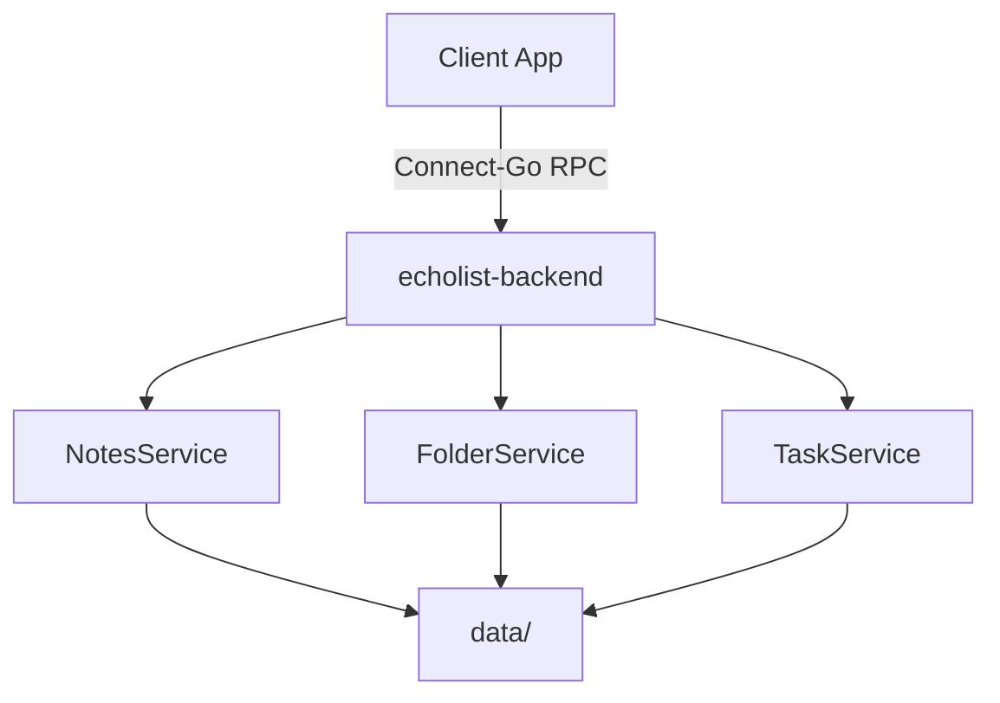
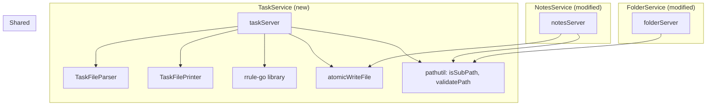

# Design Document: Task Management

## Overview

This design adds task management to the echolist-backend, a Go service using Connect-Go (protobuf RPC) with file-based storage. The feature introduces a new `TaskService` alongside the existing `NotesService` and `FolderService`, all sharing a single `data/` directory. Files are distinguished by filename prefix: `note_*.md` for notes, `tasks_*.md` for task lists.

The design also migrates the existing `FolderService` to remove domain-based path separation, and adapts the `NotesService` to use the `note_` prefix for file identification and creation.

Tasks support three modes:
- **Simple** — description + status only
- **Deadline** — description + status + user-provided due date
- **Recurring** — description + status + RRULE pattern (server-computed due date)

Subtasks are limited to one level of nesting, have no due date or recurrence, and carry only a description and status.

### Key Design Decisions

1. **File-based storage with prefix convention** — No database. Notes and tasks coexist in the same folders, distinguished by `note_` vs `tasks_` prefix. This keeps backups trivial (copy the data dir).
2. **Atomic writes** — Reuse the existing `atomicWriteFile` pattern (write to temp, rename) to prevent corruption.
3. **Parser/Printer separation** — A dedicated `TaskFileParser` and `TaskFilePrinter` handle serialization. This enables round-trip property testing.
4. **RRULE via teambition/rrule-go** — Use an existing Go library for RFC 5545 RRULE computation rather than implementing from scratch.
5. **Shared path validation** — Extract `isSubPath` into a shared utility so both `FolderServer`, `NotesServer`, and `TaskServer` use the same traversal prevention logic.

## Architecture

### System Context



### Component Architecture



### Changes to Existing Code

#### FolderService Migration (Requirement 1)

**Proto changes** (`proto/folder/v1/folder.proto`):
- Remove `domain` field from `CreateFolderRequest`, `RenameFolderRequest`, `DeleteFolderRequest`
- Field numbers remain but the field is deleted (breaking change, acceptable since this is pre-release)

**Server changes** (`folder/` package):
- `create_folder.go`: Replace `filepath.Join(s.dataDir, req.GetDomain(), req.GetParentPath())` with `filepath.Join(s.dataDir, req.GetParentPath())`. Validate against `s.dataDir` instead of `domainRoot`.
- `rename_folder.go`: Same pattern — remove domain from path resolution, validate against `s.dataDir`.
- `delete_folder.go`: Same pattern — remove domain from path resolution, validate against `s.dataDir`.
- `folder_server.go`: `isSubPath` moves to a shared `pathutil` package. Import it here.

#### NotesService Adaptation (Requirement 2)

**Server changes** (`server/` package):
- `createNote.go`: Change filename from `req.Title+".md"` to `"note_"+req.Title+".md"`. Strip `note_` prefix when returning the title in the response.
- `listNotes.go`: Filter entries to only include files with `note_` prefix and `.md` extension. Skip `tasks_*` files and any other non-note files. Strip `note_` prefix from title in returned `Note` objects.
- `getNote.go`: When reading, strip `note_` prefix from filename to derive title.
- `deleteNote.go`: No change needed (operates on `file_path` directly).
- `updateNote.go`: No change needed (operates on `file_path` directly).

### New Package Structure

```
echolist-backend/
├── pathutil/              # NEW: shared path validation
│   └── pathutil.go        # isSubPath, validatePath, sanitizePath
├── tasks/                 # NEW: task service
│   ├── task_server.go     # TaskServer struct, constructor
│   ├── create_task_list.go
│   ├── get_task_list.go
│   ├── list_task_lists.go
│   ├── update_task_list.go
│   ├── delete_task_list.go
│   ├── parser.go          # TaskFileParser
│   ├── printer.go         # TaskFilePrinter
│   └── rrule.go           # RRULE helpers (wraps rrule-go)
├── proto/tasks/v1/
│   └── tasks.proto        # NEW: protobuf definition
└── ...existing packages
```

## Components and Interfaces

### 1. TaskServer

The RPC handler, analogous to `NotesServer` and `FolderServer`.

```go
package tasks

type TaskServer struct {
    tasksv1connect.UnimplementedTasksServiceHandler
    dataDir string
}

func NewTaskServer(dataDir string) *TaskServer
```

**RPC Methods:**
- `CreateTaskList(ctx, *CreateTaskListRequest) (*CreateTaskListResponse, error)`
- `GetTaskList(ctx, *GetTaskListRequest) (*GetTaskListResponse, error)`
- `ListTaskLists(ctx, *ListTaskListsRequest) (*ListTaskListsResponse, error)`
- `UpdateTaskList(ctx, *UpdateTaskListRequest) (*UpdateTaskListResponse, error)`
- `DeleteTaskList(ctx, *DeleteTaskListRequest) (*DeleteTaskListResponse, error)`

### 2. TaskFileParser

Reads a task file's byte content and produces an in-memory `[]MainTask`.

```go
func ParseTaskFile(data []byte) ([]MainTask, error)
```

Parsing rules:
- Lines starting with `- [ ] ` or `- [x] ` at column 0 are main tasks
- Lines starting with `  - [ ] ` or `  - [x] ` (2-space indent) are subtasks of the preceding main task
- After the description, an optional `|` delimiter separates metadata fields
- Metadata fields: `due:YYYY-MM-DD`, `recurrence:RRULE_STRING`
- Blank lines are ignored
- Any other format produces a parse error with line number

### 3. TaskFilePrinter

Serializes an in-memory `[]MainTask` back to the file format.

```go
func PrintTaskFile(tasks []MainTask) []byte
```

Output rules:
- Main tasks: `- [ ] Description` or `- [x] Description`
- With deadline: `- [ ] Description | due:2025-01-15`
- With recurrence: `- [ ] Description | due:2025-01-15 | recurrence:FREQ=WEEKLY;BYDAY=MO`
- Subtasks: `  - [ ] Description` (2-space indent)
- No trailing newline after last task, single newline between tasks (no blank lines)

### 4. RRULE Helpers

Wraps the `teambition/rrule-go` library for computing due dates.

```go
// ComputeNextDueDate computes the next occurrence from an RRULE string after the given time.
func ComputeNextDueDate(rruleStr string, after time.Time) (time.Time, error)

// ValidateRRule checks if an RRULE string conforms to RFC 5545 syntax.
func ValidateRRule(rruleStr string) error
```

### 5. Path Validation (shared pathutil package)

Extracted from the existing `folder` package for reuse.

```go
package pathutil

// IsSubPath checks that resolved is a child of base (prevents path traversal).
func IsSubPath(base, resolved string) bool

// ValidatePath ensures a path doesn't escape the data directory root.
// Returns the cleaned absolute path or an error.
func ValidatePath(dataDir, relativePath string) (string, error)
```

## Data Models

### Protobuf Definition (`proto/tasks/v1/tasks.proto`)

```protobuf
syntax = "proto3";

package tasks.v1;

option go_package = "gen/tasks;tasks";

service TasksService {
  rpc CreateTaskList (CreateTaskListRequest) returns (CreateTaskListResponse);
  rpc GetTaskList (GetTaskListRequest) returns (GetTaskListResponse);
  rpc ListTaskLists (ListTaskListsRequest) returns (ListTaskListsResponse);
  rpc UpdateTaskList (UpdateTaskListRequest) returns (UpdateTaskListResponse);
  rpc DeleteTaskList (DeleteTaskListRequest) returns (DeleteTaskListResponse);
}

message Subtask {
  string description = 1;
  bool done = 2;
}

message MainTask {
  string description = 1;
  bool done = 2;
  string due_date = 3;       // "YYYY-MM-DD" or empty
  string recurrence = 4;     // RRULE string or empty
  repeated Subtask subtasks = 5;
}

message CreateTaskListRequest {
  string name = 1;           // list name (becomes tasks_<name>.md)
  string path = 2;           // folder path, empty = root
  repeated MainTask tasks = 3;
}

message CreateTaskListResponse {
  string file_path = 1;
  string name = 2;
  repeated MainTask tasks = 3;
  int64 updated_at = 4;
}

message GetTaskListRequest {
  string file_path = 1;
}

message GetTaskListResponse {
  string file_path = 1;
  string name = 2;
  repeated MainTask tasks = 3;
  int64 updated_at = 4;
}

message ListTaskListsRequest {
  string path = 1;           // folder path, empty = root
}

message TaskListEntry {
  string file_path = 1;
  string name = 2;
  int64 updated_at = 3;
}

message ListTaskListsResponse {
  repeated TaskListEntry task_lists = 1;
  repeated string entries = 2;  // folders end with "/"
}

message UpdateTaskListRequest {
  string file_path = 1;
  repeated MainTask tasks = 2;
}

message UpdateTaskListResponse {
  string file_path = 1;
  string name = 2;
  repeated MainTask tasks = 3;
  int64 updated_at = 4;
}

message DeleteTaskListRequest {
  string file_path = 1;
}

message DeleteTaskListResponse {}
```

### Go Domain Types (internal to `tasks` package)

```go
// MainTask is the in-memory representation of a top-level task.
type MainTask struct {
    Description string
    Done        bool
    DueDate     string     // "YYYY-MM-DD" or "" (empty for simple tasks)
    Recurrence  string     // RRULE string or "" (empty for non-recurring)
    Subtasks    []Subtask
}

// Subtask is a child task under a MainTask.
type Subtask struct {
    Description string
    Done        bool
}
```

### Task File Format Examples

**Simple tasks only:**
```
- [ ] Buy groceries
  - [ ] Whole milk 2L
  - [x] Bread
- [x] Clean kitchen
```

**Mixed modes:**
```
- [ ] Submit report | due:2025-02-28
- [ ] Buy milk | due:2025-07-21 | recurrence:FREQ=WEEKLY;BYDAY=MO
  - [ ] Whole milk
  - [ ] Oat milk
- [ ] Walk the dog
- [x] Pay rent | due:2025-07-01 | recurrence:FREQ=MONTHLY
```

### Updated Folder Proto (`proto/folder/v1/folder.proto`)

```protobuf
syntax = "proto3";

package folder.v1;

option go_package = "gen/folder;folder";

service FolderService {
  rpc CreateFolder (CreateFolderRequest) returns (CreateFolderResponse);
  rpc RenameFolder (RenameFolderRequest) returns (RenameFolderResponse);
  rpc DeleteFolder (DeleteFolderRequest) returns (DeleteFolderResponse);
}

message CreateFolderRequest {
  string parent_path = 1;
  string name = 2;
}

message FolderEntry {
  string path = 1;
}

message CreateFolderResponse {
  repeated FolderEntry entries = 1;
}

message RenameFolderRequest {
  string folder_path = 1;
  string new_name = 2;
}

message RenameFolderResponse {
  repeated FolderEntry entries = 1;
}

message DeleteFolderRequest {
  string folder_path = 1;
}

message DeleteFolderResponse {
  repeated FolderEntry entries = 1;
}
```

Note: The `domain` field is removed entirely. Field numbers are renumbered since this is a pre-release API. `parent_path` becomes field 1 in `CreateFolderRequest`, `name` becomes field 2.


## Correctness Properties

*A property is a characteristic or behavior that should hold true across all valid executions of a system — essentially, a formal statement about what the system should do. Properties serve as the bridge between human-readable specifications and machine-verifiable correctness guarantees.*

### Property 1: Task file parse/print round-trip

*For any* valid list of `MainTask` values (including all three modes and subtasks), printing the list to the task file format and then parsing the result back should produce an identical list of `MainTask` values. Additionally, printing the parsed result should produce byte-identical output to the first print.

**Validates: Requirements 7.2, 7.3, 7.4, 7.5, 7.7**

### Property 2: ListNotes excludes non-note files

*For any* directory containing a mix of `note_`-prefixed `.md` files, `tasks_`-prefixed `.md` files, other `.md` files, and non-`.md` files, `ListNotes` should return only the `note_`-prefixed `.md` files in its notes list, and entries should include those files plus subdirectories (but not `tasks_` files or other non-note files).

**Validates: Requirements 2.1, 2.2**

### Property 3: ListTaskLists excludes non-task files

*For any* directory containing a mix of `tasks_`-prefixed `.md` files, `note_`-prefixed `.md` files, other files, and subdirectories, `ListTaskLists` should return only the `tasks_`-prefixed `.md` files in its task lists, and entries should include subdirectories (but not `note_` files or other non-task files).

**Validates: Requirements 3.3**

### Property 4: Created notes use note_ prefix

*For any* valid note title and content, after `CreateNote` succeeds, the file on disk should be named `note_<title>.md` and the returned `file_path` should reflect this prefix.

**Validates: Requirements 2.3, 2.4**

### Property 5: Created task lists use tasks_ prefix

*For any* valid task list name, after `CreateTaskList` succeeds, the file on disk should be named `tasks_<name>.md` and the returned `file_path` should reflect this prefix.

**Validates: Requirements 3.1, 7.1**

### Property 6: Task list create-then-get round-trip

*For any* valid task list (name, path, and list of main tasks with subtasks), creating the task list via `CreateTaskList` and then retrieving it via `GetTaskList` should return the same tasks with identical descriptions, statuses, due dates, recurrence patterns, and subtasks.

**Validates: Requirements 3.2, 3.4**

### Property 7: Duplicate task list name returns already-exists

*For any* valid task list name and folder path, creating a task list and then attempting to create another task list with the same name in the same folder should fail with an "already exists" error.

**Validates: Requirements 3.6**

### Property 8: Operations on non-existent paths return not-found

*For any* file path that does not correspond to an existing task file, both `GetTaskList` and `DeleteTaskList` should return a "not found" error.

**Validates: Requirements 3.7, 3.8**

### Property 9: Mutual exclusion of due date and recurrence on main tasks

*For any* main task that has both a non-empty `due_date` and a non-empty `recurrence` field, the `CreateTaskList` and `UpdateTaskList` operations should reject the request with an "invalid argument" error.

**Validates: Requirements 4.5**

### Property 10: Valid RRULE produces a computed due date

*For any* valid RRULE string (from the supported subset: FREQ=DAILY, FREQ=WEEKLY, FREQ=MONTHLY, FREQ=YEARLY, with optional INTERVAL and BYDAY), creating a recurring task should result in a non-empty `due_date` field computed from the RRULE, and that date should be on or after the current date.

**Validates: Requirements 4.3, 6.1, 6.2**

### Property 11: Recurring task done-advance cycle

*For any* recurring task with a valid RRULE, when the task is marked as done via `UpdateTaskList`, the returned task should have `done=false` (reset to open) and a `due_date` strictly after the previous due date.

**Validates: Requirements 6.3, 6.4**

### Property 12: Invalid RRULE rejected

*For any* string that is not a valid RFC 5545 RRULE, attempting to create or update a task with that string as the recurrence field should return an "invalid argument" error.

**Validates: Requirements 6.5**

### Property 13: Path traversal prevention

*For any* file path containing `..` segments or that resolves outside the data directory, all task service operations (`CreateTaskList`, `GetTaskList`, `ListTaskLists`, `UpdateTaskList`, `DeleteTaskList`) should return an "invalid argument" error without performing any file system operation.

**Validates: Requirements 1.3, 9.1, 9.2, 9.3**

### Property 14: Malformed task file produces parse error with line number

*For any* byte sequence that is not a valid task file (e.g., lines that don't match the checkbox pattern, invalid metadata after `|`), `ParseTaskFile` should return an error whose message contains the line number where the problem was detected.

**Validates: Requirements 7.6**

### Property 15: Auto-create folders on task list creation

*For any* valid task list name and a folder path where intermediate directories do not exist, `CreateTaskList` should succeed and the intermediate directories should be created on disk.

**Validates: Requirements 8.2**

### Property 16: Delete removes task list from disk

*For any* existing task list, after `DeleteTaskList` succeeds, the file should no longer exist on disk and a subsequent `GetTaskList` for the same path should return "not found".

**Validates: Requirements 3.5**

## Error Handling

All errors use Connect-Go error codes for consistency with the existing services.

| Scenario | Connect Code | Message Pattern |
|---|---|---|
| Path traversal detected | `InvalidArgument` | "path escapes data directory" |
| Both due_date and recurrence set | `InvalidArgument` | "cannot set both due_date and recurrence" |
| Invalid RRULE syntax | `InvalidArgument` | "invalid recurrence rule: ..." |
| Empty task list name | `InvalidArgument` | "name must not be empty" |
| Name contains path separators | `InvalidArgument` | "name must not contain path separators" |
| Task list already exists | `AlreadyExists` | "task list already exists" |
| Task list not found (get/delete) | `NotFound` | "task list not found" |
| File read/write failure | `Internal` | "failed to read/write task file: ..." |
| Malformed task file on disk | `Internal` | "failed to parse task file: line N: ..." |
| Directory read failure | `Internal` | "failed to read directory: ..." |

### Error Propagation Strategy

- **Validation errors** are returned immediately before any file system operation.
- **Parse errors** from `TaskFileParser` are wrapped with `connect.CodeInternal` since they indicate corrupted data on disk.
- **RRULE errors** from the rrule-go library are wrapped with `connect.CodeInvalidArgument`.
- **File system errors** (permission denied, disk full) are wrapped with `connect.CodeInternal`.
- All errors include enough context for debugging (file path, line number where applicable).

### Validation Order

For each RPC method, validation happens in this order:
1. Path validation (traversal prevention)
2. Name validation (non-empty, no separators)
3. Business rule validation (mutual exclusion of due_date/recurrence, RRULE syntax)
4. File system operation

## Testing Strategy

### Property-Based Testing

Use `pgregory.net/rapid` (already in `go.mod`) for property-based testing. Each property test runs a minimum of 100 iterations.

**Generators needed:**

- `mainTaskGen()` — generates a random `MainTask` with valid mode (simple, deadline, or recurring), random description, random status, and 0-5 subtasks
- `subtaskGen()` — generates a random `Subtask` with random description and status
- `taskListGen()` — generates a `[]MainTask` of length 0-10
- `validNameGen()` — generates valid task list names (alphanumeric + hyphens/underscores, 1-30 chars)
- `validPathGen()` — generates valid relative folder paths (0-3 segments)
- `validRRuleGen()` — generates valid RRULE strings from the supported subset
- `invalidRRuleGen()` — generates strings that are not valid RRULEs
- `traversalPathGen()` — generates paths containing `..` or other traversal sequences
- `validDueDateGen()` — generates dates in `YYYY-MM-DD` format

**Test file organization:**

```
tasks/
├── parser_test.go              # Unit tests for parser edge cases
├── parser_property_test.go     # Property 1 (round-trip), Property 14 (parse errors)
├── task_server_test.go         # Unit tests for RPC methods
├── task_server_property_test.go # Properties 5-13, 15-16
server/
├── listNotes_property_test.go  # Property 2 (updated for note_ prefix filtering)
├── createNote_property_test.go # Property 4 (note_ prefix on creation)
```

**Property test tagging convention:**

Each test function is named after its property and includes a comment referencing the design property:

```go
// Feature: task-management, Property 1: Task file parse/print round-trip
func TestProperty1_TaskFileRoundTrip(t *testing.T) {
    rapid.Check(t, func(rt *rapid.T) {
        // ...
    })
}
```

### Unit Testing

Unit tests complement property tests by covering:

- **Specific examples**: Known task file content parsed correctly, known task lists printed to expected output
- **Edge cases**: Empty task list, task with empty description (should fail), maximum-length descriptions
- **Error conditions**: Malformed files with specific known errors, permission denied scenarios
- **Integration points**: `TaskServer` calling `atomicWriteFile`, folder auto-creation
- **RRULE computation**: Specific RRULE strings with known expected next dates (e.g., `FREQ=WEEKLY;BYDAY=MO` from a known date should produce the next Monday)

### Test Coverage Map

| Property | Test Type | File | Requirements |
|---|---|---|---|
| 1 | Property | `parser_property_test.go` | 7.2, 7.3, 7.4, 7.5, 7.7 |
| 2 | Property | `listNotes_property_test.go` | 2.1, 2.2 |
| 3 | Property | `task_server_property_test.go` | 3.3 |
| 4 | Property | `createNote_property_test.go` | 2.3, 2.4 |
| 5 | Property | `task_server_property_test.go` | 3.1, 7.1 |
| 6 | Property | `task_server_property_test.go` | 3.2, 3.4 |
| 7 | Property | `task_server_property_test.go` | 3.6 |
| 8 | Property | `task_server_property_test.go` | 3.7, 3.8 |
| 9 | Property | `task_server_property_test.go` | 4.5 |
| 10 | Property | `task_server_property_test.go` | 4.3, 6.1, 6.2 |
| 11 | Property | `task_server_property_test.go` | 6.3, 6.4 |
| 12 | Property | `task_server_property_test.go` | 6.5 |
| 13 | Property | `task_server_property_test.go` | 9.1, 9.2, 9.3, 1.3 |
| 14 | Property | `parser_property_test.go` | 7.6 |
| 15 | Property | `task_server_property_test.go` | 8.2 |
| 16 | Property | `task_server_property_test.go` | 3.5 |
