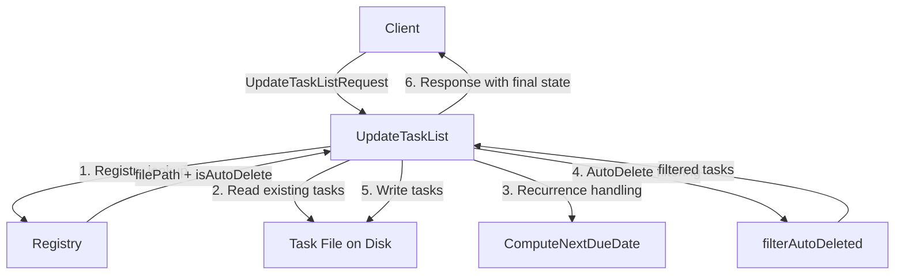

# Design Document: TaskList AutoDelete

## Overview

This feature adds a boolean `is_auto_delete` flag to each TaskList. When enabled, tasks marked as done during an `UpdateTaskList` RPC call are automatically removed from the persisted list instead of being retained in a done state. Recurring tasks are exempt from deletion — they advance their recurrence (reset to open with the next computed due date) instead. The flag is persisted in the existing registry JSON file alongside the id-to-filePath mapping, and is exposed on all relevant protobuf messages (TaskList, CreateTaskListRequest, UpdateTaskListRequest).

The feature modifies three layers:
1. **Proto layer** — new `is_auto_delete` fields on messages
2. **Registry layer** — structured entries replacing plain string values
3. **Update logic** — auto-removal of done tasks when the flag is enabled

No migration is needed (pre-release). The `is_auto_delete` field is mandatory on Create/Update with no server-side default.

## Architecture

The change is localized to the `tasks` package and the proto definition. No new services or packages are introduced.



### Key Design Decisions

1. **Registry stores the flag, not the markdown file.** The `is_auto_delete` flag is metadata about the task list, not task content. Storing it in the registry avoids changing the markdown file format (which is designed to be human-readable). The registry already maps `id → filePath`; we change the value from a plain string to a struct `{ "filePath": "...", "isAutoDelete": true }`.

2. **AutoDelete filtering happens after recurrence advancement.** The existing `UpdateTaskList` flow already handles recurrence (resetting done recurring tasks to open with the next due date). AutoDelete filtering runs after this step, so recurring tasks that were advanced are no longer `Done` and naturally survive the filter.

3. **Manual deletion (task omitted from request) is unchanged.** The existing behavior where a task absent from the update request is implicitly deleted continues to work regardless of the AutoDelete flag. AutoDelete only affects tasks that are *present* in the request with `done=true`.

## Components and Interfaces

### Proto Changes

Add `is_auto_delete` to three messages in `proto/tasks/v1/tasks.proto`:

```protobuf
message TaskList {
  string id = 1;
  string file_path = 2;
  string title = 3;
  repeated MainTask tasks = 4;
  int64 updated_at = 5;
  bool is_auto_delete = 6;  // NEW
}

message CreateTaskListRequest {
  string title = 1;
  string parent_dir = 2;
  repeated MainTask tasks = 3;
  bool is_auto_delete = 4;  // NEW
}

message UpdateTaskListRequest {
  string id = 1;
  string title = 2;
  repeated MainTask tasks = 3;
  bool is_auto_delete = 4;  // NEW
}
```

### Registry Changes (`tasks/registry.go`)

The registry value changes from a plain string to a struct:

```go
// registryEntry holds the metadata for a single task list in the registry.
type registryEntry struct {
    FilePath     string `json:"filePath"`
    IsAutoDelete bool   `json:"isAutoDelete"`
}
```

All registry functions (`registryRead`, `registryWrite`, `registryLookup`, `registryAdd`, `registryRemove`) change their signatures to work with `map[string]registryEntry` instead of `map[string]string`.

### AutoDelete Filter Function (`tasks/update_task_list.go`)

A new pure function handles the filtering logic:

```go
// filterAutoDeleted removes done tasks from the list when AutoDelete is enabled.
// Recurring tasks that have already been advanced (done=false) are not affected.
// Returns the filtered task list.
func filterAutoDeleted(tasks []MainTask) []MainTask
```

This function:
- Removes MainTasks where `Done == true` (and all their SubTasks)
- Removes SubTasks where `Done == true` from remaining MainTasks
- Is a pure function with no side effects — easy to test

### Modified RPC Handlers

| Handler | Change |
|---------|--------|
| `CreateTaskList` | Read `is_auto_delete` from request, pass to `registryAdd` |
| `GetTaskList` | Read `isAutoDelete` from registry entry, populate response |
| `ListTaskLists` | Read `isAutoDelete` from registry entries, populate responses |
| `UpdateTaskList` | Read `is_auto_delete` from request, apply `filterAutoDeleted` if enabled, update registry entry |
| `DeleteTaskList` | No logic change (registry entry removal already works) |
| `buildTaskList` | Accept `isAutoDelete` parameter, set on response |

## Data Models

### Registry JSON Format

**Before:**
```json
{
  "uuid-1": "folder/tasks_Groceries.md",
  "uuid-2": "tasks_Work.md"
}
```

**After:**
```json
{
  "uuid-1": { "filePath": "folder/tasks_Groceries.md", "isAutoDelete": false },
  "uuid-2": { "filePath": "tasks_Work.md", "isAutoDelete": true }
}
```

### Domain Model (unchanged)

The `MainTask` and `SubTask` structs in `tasks/types.go` are not modified. AutoDelete is a property of the TaskList, not of individual tasks. The filtering operates on `[]MainTask` slices.

### Proto Model

The `TaskList` message gains `is_auto_delete` (field 6). `CreateTaskListRequest` gains `is_auto_delete` (field 4). `UpdateTaskListRequest` gains `is_auto_delete` (field 4).


## Correctness Properties

*A property is a characteristic or behavior that should hold true across all valid executions of a system — essentially, a formal statement about what the system should do. Properties serve as the bridge between human-readable specifications and machine-verifiable correctness guarantees.*

### Property 1: AutoDelete flag round-trip

*For any* boolean value `v` and any valid task list, creating (or updating) the task list with `is_auto_delete = v` and then reading it back via GetTaskList (or ListTaskLists, or the UpdateTaskList response) should return `is_auto_delete == v`.

**Validates: Requirements 1.4, 2.1, 2.2, 2.3, 2.5, 7.3**

### Property 2: AutoDelete removes done non-recurring MainTasks

*For any* task list with AutoDelete enabled and *for any* set of MainTasks where some non-recurring MainTasks have `done = true`, after an UpdateTaskList call, the response and persisted task list should contain none of the done non-recurring MainTasks, and none of their SubTasks should be present.

**Validates: Requirements 3.1, 6.2, 7.1**

### Property 3: AutoDelete disabled retains all tasks

*For any* task list with AutoDelete disabled and *for any* set of MainTasks and SubTasks (regardless of their done status), after an UpdateTaskList call, the response and persisted task list should contain every MainTask and every SubTask that was sent in the request, with their done status preserved.

**Validates: Requirements 3.2, 4.2, 7.2**

### Property 4: AutoDelete advances recurring tasks instead of deleting

*For any* task list with AutoDelete enabled and *for any* recurring MainTask marked as `done = true`, after an UpdateTaskList call, the MainTask should still be present in the result with `done = false` and a due date strictly after the previous due date.

**Validates: Requirements 3.3, 6.1**

### Property 5: AutoDelete removes done SubTasks

*For any* task list with AutoDelete enabled and *for any* MainTask that is not itself removed (i.e., it is open or recurring), if any of its SubTasks have `done = true`, those SubTasks should be absent from the MainTask in the response and persisted task list, while SubTasks with `done = false` should be retained.

**Validates: Requirements 4.1**

### Property 6: Manual deletion cascades regardless of AutoDelete

*For any* task list (regardless of AutoDelete mode) and *for any* MainTask that exists in the persisted list but is omitted from the UpdateTaskList request, that MainTask and all of its SubTasks should be absent from the response and persisted task list. The result of omitting a task should be identical whether AutoDelete is enabled or disabled.

**Validates: Requirements 5.1, 5.2**

## Error Handling

No new error conditions are introduced by this feature. The `is_auto_delete` field is a `bool` in proto3, which defaults to `false` — there is no invalid value to reject. All existing error handling (path validation, registry errors, file I/O errors, recurrence computation errors) remains unchanged.

The registry format change (string → struct) could cause a JSON unmarshal error if the registry file contains old-format data, but since this is pre-release, no backward compatibility handling is needed.

## Testing Strategy

### Property-Based Testing

Use the `pgregory.net/rapid` library (already used in the project) for property-based testing. Each property test runs a minimum of 100 iterations.

Each correctness property maps to a single property-based test:

| Property | Test Name | Generator Strategy |
|----------|-----------|-------------------|
| P1: Flag round-trip | `TestProperty1_AutoDeleteFlagRoundTrip` | Generate random bool, create task list, read back, compare |
| P2: Done non-recurring removed | `TestProperty2_AutoDeleteRemovesDoneNonRecurring` | Generate random task lists with mix of done/open, recurring/non-recurring MainTasks. Apply filter. Assert no done non-recurring MainTasks remain. |
| P3: Disabled retains all | `TestProperty3_AutoDeleteDisabledRetainsAll` | Generate random task lists with random done states. Update with AutoDelete off. Assert all tasks present. |
| P4: Recurring advances | `TestProperty4_AutoDeleteAdvancesRecurring` | Generate recurring tasks marked done. Apply update. Assert task present, open, with advanced due date. |
| P5: Done subtasks removed | `TestProperty5_AutoDeleteRemovesDoneSubTasks` | Generate MainTasks with mix of done/open SubTasks. Apply filter. Assert no done SubTasks on surviving MainTasks. |
| P6: Manual deletion cascades | `TestProperty6_ManualDeletionCascades` | Generate two task lists (one AutoDelete on, one off), omit same tasks from both. Assert identical removal results. |

Tag format: `// Feature: tasklist-autodelete, Property N: <property text>`

### Unit Testing

Unit tests complement property tests for specific examples and edge cases:

- Empty task list with AutoDelete enabled — update returns empty list
- All tasks done with AutoDelete enabled — update returns empty list
- Mixed done/open tasks — verify only done non-recurring removed
- Recurring task done with AutoDelete — verify recurrence advanced, not deleted
- SubTask done on a MainTask that is also done (non-recurring) — entire MainTask removed (subtask filtering is moot)
- Registry round-trip with the new struct format
- `buildTaskList` includes `isAutoDelete` in response

### Testing Configuration

- Library: `pgregory.net/rapid` (existing project dependency)
- Minimum iterations: 100 per property test
- Each property test references its design document property via comment tag
- Each correctness property is implemented by a single property-based test
