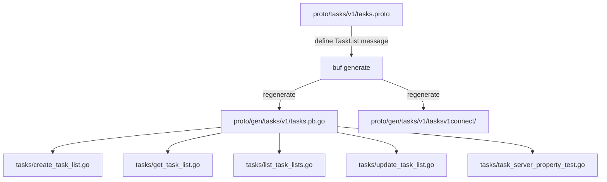

# Design Document: TaskList Message Unification

## Overview

This feature unifies the TaskListService protobuf API by introducing a single `TaskList` message that encapsulates all task list resource fields (`file_path`, `name`, `tasks`, `updated_at`). This mirrors the existing `Note` message pattern in `proto/notes/v1/notes.proto`, where a canonical resource message is embedded in all request/response types.

Currently, `CreateTaskListResponse`, `GetTaskListResponse`, and `UpdateTaskListResponse` each duplicate the same four fields at the top level, while `ListTaskListsResponse` uses a separate `TaskListEntry` message that omits the `tasks` field. The refactor:

1. Defines a new `TaskList` protobuf message with all four fields
2. Replaces the flat fields in Create/Get/Update responses with an embedded `TaskList task_list = 1`
3. Replaces `repeated TaskListEntry` in `ListTaskListsResponse` with `repeated TaskList`
4. Removes the `TaskListEntry` message entirely
5. Updates all Go handler implementations to construct and return `TaskList` messages

## Architecture

The change is a pure API refactoring with no new services, no new storage, and no behavioral changes. The architecture remains:

```
Client → Connect/gRPC → TaskListService handlers → File system (markdown files)
```

### Change Scope



The `DeleteTaskList` handler is unaffected since `DeleteTaskListRequest`/`DeleteTaskListResponse` don't carry task list resource fields.

## Components and Interfaces

### Proto Definition Changes

The `TaskList` message is added to `proto/tasks/v1/tasks.proto` alongside the existing `Subtask` and `MainTask` messages. It follows the exact same pattern as `Note` in `proto/notes/v1/notes.proto`:

```protobuf
// Note pattern (reference):
message Note {
  string file_path = 1;
  string title = 2;
  string content = 3;
  int64 updated_at = 4;
}
message CreateNoteResponse { Note note = 1; }

// TaskList pattern (target):
message TaskList {
  string file_path = 1;
  string name = 2;
  repeated MainTask tasks = 3;
  int64 updated_at = 4;
}
message CreateTaskListResponse { TaskList task_list = 1; }
```

### Response Message Changes

| Message | Before | After |
|---|---|---|
| `CreateTaskListResponse` | 4 flat fields | `TaskList task_list = 1` |
| `GetTaskListResponse` | 4 flat fields | `TaskList task_list = 1` |
| `UpdateTaskListResponse` | 4 flat fields | `TaskList task_list = 1` |
| `ListTaskListsResponse` | `repeated TaskListEntry task_lists = 1` | `repeated TaskList task_lists = 1` |

### Handler Changes

Each handler currently constructs a response by setting individual fields:

```go
// Before (e.g. create_task_list.go):
return &pb.CreateTaskListResponse{
    FilePath:  relPath,
    Name:      name,
    Tasks:     mainTasksToProto(domainTasks),
    UpdatedAt: nowMillis(),
}, nil
```

After the change, handlers construct a `TaskList` and wrap it:

```go
// After:
return &pb.CreateTaskListResponse{
    TaskList: &pb.TaskList{
        FilePath:  relPath,
        Name:      name,
        Tasks:     mainTasksToProto(domainTasks),
        UpdatedAt: nowMillis(),
    },
}, nil
```

### Helper Function

A `buildTaskList` helper in `task_server.go` can reduce duplication across handlers:

```go
func buildTaskList(filePath, name string, tasks []MainTask, updatedAt int64) *pb.TaskList {
    return &pb.TaskList{
        FilePath:  filePath,
        Name:      name,
        Tasks:     mainTasksToProto(tasks),
        UpdatedAt: updatedAt,
    }
}
```

### ListTaskLists Handler

The `ListTaskLists` handler currently skips reading file contents (it only returns metadata via `TaskListEntry`). After unification, it must read and parse each task file to populate the `tasks` field in the full `TaskList` message. This follows the same approach as `ListNotes` in `server/listNotes.go`, which reads file content for each note.

### Test Updates

Existing property tests in `task_server_property_test.go` access response fields directly (e.g., `resp.FilePath`, `resp.Tasks`). These must be updated to access through the embedded message (e.g., `resp.TaskList.FilePath`, `resp.TaskList.Tasks`). Tests referencing `TaskListEntry` fields on list responses must also be updated.

## Data Models

### New `TaskList` Protobuf Message

```protobuf
message TaskList {
  string file_path = 1;  // Relative path to the markdown file
  string name = 2;       // Task list name (derived from filename)
  repeated MainTask tasks = 3;  // All tasks in the list
  int64 updated_at = 4;  // Last modification time in Unix milliseconds
}
```

### Updated Response Messages

```protobuf
message CreateTaskListResponse {
  TaskList task_list = 1;
}

message GetTaskListResponse {
  TaskList task_list = 1;
}

message UpdateTaskListResponse {
  TaskList task_list = 1;
}

message ListTaskListsResponse {
  repeated TaskList task_lists = 1;
  repeated string entries = 2;
}
```

### Removed Messages

- `TaskListEntry` — fully replaced by `TaskList`

### Unchanged Messages

- `Subtask`, `MainTask` — no changes
- `CreateTaskListRequest`, `GetTaskListRequest`, `ListTaskListsRequest`, `UpdateTaskListRequest`, `DeleteTaskListRequest`, `DeleteTaskListResponse` — no changes


## Correctness Properties

*A property is a characteristic or behavior that should hold true across all valid executions of a system — essentially, a formal statement about what the system should do. Properties serve as the bridge between human-readable specifications and machine-verifiable correctness guarantees.*

Most acceptance criteria in this spec are structural (proto schema changes, code removal) and are enforced at compile time. The testable criteria focus on verifying that handlers correctly populate the new embedded `TaskList` message.

From the prework analysis:
- Requirements 1.x, 5.1, 5.3, 6.1, 6.6 are structural/compile-time — not testable as properties
- Requirements 6.2–6.5 are redundant with 2.2, 3.2, 4.2, 5.4
- The remaining testable criteria consolidate into 3 properties

### Property 1: Create-then-Get round trip through TaskList message

*For any* valid task list name and set of tasks, creating a task list and then getting it should return responses where both `CreateTaskListResponse.task_list` and `GetTaskListResponse.task_list` are non-nil, share the same `file_path` and `name`, contain the same tasks, and have a positive `updated_at`.

**Validates: Requirements 2.2, 3.2**

### Property 2: Update returns correct TaskList message

*For any* existing task list and any valid updated set of tasks, calling UpdateTaskList should return an `UpdateTaskListResponse` with a non-nil `task_list` whose `file_path` and `name` match the original, whose `tasks` reflect the update, and whose `updated_at` is positive.

**Validates: Requirements 4.2**

### Property 3: ListTaskLists returns full TaskList messages with tasks and entries

*For any* set of created task lists, calling ListTaskLists should return a `ListTaskListsResponse` where each element in `task_lists` is a `TaskList` with a non-empty `tasks` field matching the originally created tasks, and the `entries` field contains the expected file paths and folder paths.

**Validates: Requirements 5.2, 5.4**

## Error Handling

No new error conditions are introduced by this refactoring. All existing error handling (path validation, not-found, already-exists, invalid arguments) remains unchanged. The only behavioral change is that `ListTaskLists` now reads and parses task files, which introduces the possibility of parse errors for individual files during listing. These should be handled consistently with `GetTaskList`:

- If a task file cannot be read: return `connect.CodeInternal` with a descriptive message
- If a task file cannot be parsed: return `connect.CodeInternal` with a descriptive message

## Testing Strategy

### Property-Based Tests

Use the `pgregory.net/rapid` library (already used throughout the project) with a minimum of 100 iterations per property.

Each correctness property maps to a single property-based test:

1. **Property 1** → `TestProperty_CreateGetRoundTripTaskListMessage` — Generate random names and tasks, create via `CreateTaskList`, get via `GetTaskList`, verify both responses have non-nil `.TaskList` with matching fields.
   - Tag: `Feature: tasklist-message-unification, Property 1: Create-then-Get round trip through TaskList message`

2. **Property 2** → `TestProperty_UpdateReturnsTaskListMessage` — Create a task list, generate new random tasks, call `UpdateTaskList`, verify response has non-nil `.TaskList` with correct fields.
   - Tag: `Feature: tasklist-message-unification, Property 2: Update returns correct TaskList message`

3. **Property 3** → `TestProperty_ListReturnsFullTaskListMessages` — Create multiple task lists with known tasks, call `ListTaskLists`, verify each `TaskList` in the response has populated `tasks` and the `entries` field is correct.
   - Tag: `Feature: tasklist-message-unification, Property 3: ListTaskLists returns full TaskList messages with tasks and entries`

### Unit Tests

Unit tests should focus on:
- Verifying that existing tests still pass after updating field access patterns (e.g., `resp.TaskList.FilePath` instead of `resp.FilePath`)
- Edge case: `ListTaskLists` on an empty directory returns empty `task_lists` and `entries`

### Existing Test Updates

The existing property tests in `task_server_property_test.go` must be updated to access fields through the embedded `TaskList` message. For example:
- `resp.FilePath` → `resp.TaskList.FilePath`
- `resp.Tasks` → `resp.TaskList.Tasks`
- `resp.Name` → `resp.TaskList.Name`
- `*pb.TaskListEntry{...}` → `*pb.TaskList{...}` in list tests
