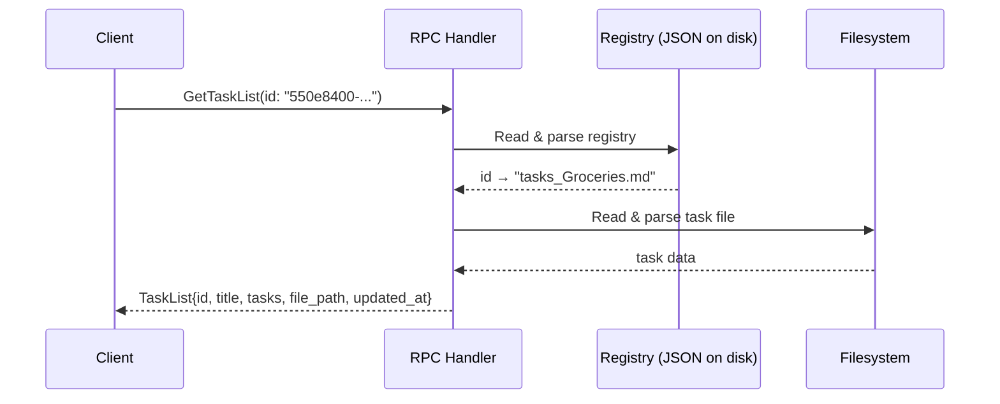
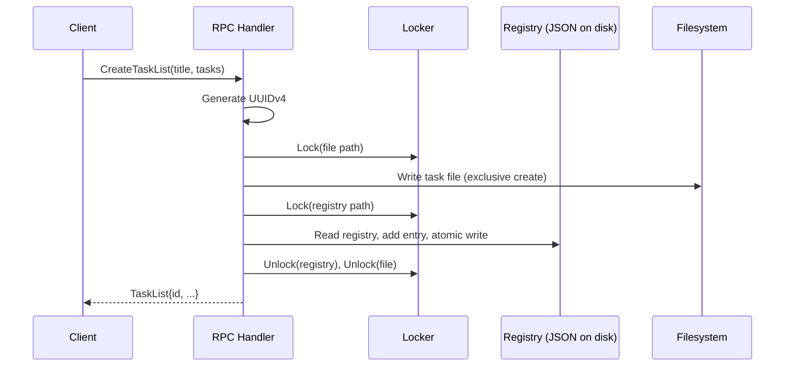

# Design Document: TaskList Stable IDs

## Overview

This feature introduces a stable synthetic identifier (TaskList_ID) for every task list in the system. Currently, task lists are addressed by their file path (`parent_dir + title`), which changes on rename or move. The TaskList_ID is a UUIDv4 assigned at creation time that remains constant for the lifetime of the task list, decoupling API lookups from the mutable filesystem path.

An on-disk JSON registry (`ID_Registry`) maps each TaskList_ID to its current file path. The `GetTaskList`, `UpdateTaskList`, and `DeleteTaskList` RPCs switch from `file_path`-based lookup to `id`-based lookup. Since this is pre-release, the `file_path` field is removed from those request messages entirely — no migration or backward compatibility is needed.

This mirrors the pattern established by `note-stable-ids`, adapted for the `tasks` package.

## Architecture

### Design Decision: Read-Per-Request Registry

Two approaches were considered:

1. **Load-once-and-cache**: Read the registry into memory at startup, serve lookups from the in-memory map, write-through on mutations.
2. **Read-per-request**: Read the JSON file from disk on every request that needs ID resolution.

**Decision: Read-per-request.**

Rationale:
- This is a personal task app with low request volume. The registry file will be small (hundreds of entries at most). Reading a few KB of JSON per request is negligible.
- No stale-state bugs. The on-disk file is always the source of truth.
- Simpler implementation — no startup initialization, no cache invalidation, no need to handle concurrent in-memory map access separately from disk persistence.
- The existing `common.Locker` already provides per-path mutual exclusion for write operations. A dedicated registry lock path (the registry file path itself) serializes concurrent mutations.
- Identical rationale to the notes implementation — consistency across the codebase.



### Mutation Flow (Create)



### Locking Strategy

- The existing `common.Locker` is used with the registry file's absolute path as the lock key for all registry mutations (Create, Delete).
- The per-task-list-file lock (existing pattern) continues to protect individual file writes.
- For Create: acquire the task list file lock first (for `CreateExclusive`), then acquire the registry lock to add the entry. This ordering prevents deadlocks since the file path and registry path are always distinct keys.
- For Delete: acquire the registry lock, read the registry to resolve the ID, acquire the file lock, delete the file, update the registry, release both locks.
- Read-only operations (Get, List) do not lock the registry — they read a consistent snapshot because writes are atomic (temp file + rename).

## Components and Interfaces

### 1. Registry (`tasks/registry.go`)

A new file containing the ID_Registry logic. Same pattern as `notes/registry.go` but in the `tasks` package with a different registry filename.

```go
// registryPath returns the absolute path to the registry JSON file.
// Convention: <dataDir>/.tasklist_id_registry.json
func registryPath(dataDir string) string

// registryRead reads and parses the registry from disk.
// Returns an empty map if the file is missing or empty.
func registryRead(path string) (map[string]string, error)

// registryWrite atomically writes the registry map to disk as JSON.
func registryWrite(path string, m map[string]string) error

// registryLookup reads the registry and returns the file_path for the given id.
// Returns ("", false, nil) if not found.
func registryLookup(regPath, id string) (string, bool, error)

// registryAdd reads the registry, adds the id→filePath entry, and writes it back atomically.
func registryAdd(regPath, id, filePath string) error

// registryRemove reads the registry, removes the entry for id, and writes it back atomically.
func registryRemove(regPath, id string) error
```

The registry file is stored at `<dataDir>/.tasklist_id_registry.json`. The leading dot keeps it hidden from `ListTaskLists` directory scans (it doesn't match the `tasks_*.md` pattern anyway, but the dot convention signals "metadata file").

### 2. UUID Validation (`tasks/uuid.go`)

A duplicate of `notes/uuid.go` in the `tasks` package to avoid a cross-package dependency between `tasks` and `notes`:

```go
// validateUuidV4 returns a connect InvalidArgument error if id is not a valid
// lowercase hyphenated UUIDv4 string.
func validateUuidV4(id string) error
```

Uses the same regex: `^[0-9a-f]{8}-[0-9a-f]{4}-4[0-9a-f]{3}-[89ab][0-9a-f]{3}-[0-9a-f]{12}$`.

Design decision: Duplicating this small function (~15 lines) in the `tasks` package is preferred over moving it to `common` or importing from `notes`. The `tasks` and `notes` packages are independent service domains — importing one from the other creates an undesirable coupling. Moving to `common` is an option but adds a connect dependency to the common package for a single validation function. Duplication is the simplest approach for now.

### 3. Modified RPC Handlers

Each handler is updated in-place:

- **CreateTaskList** (`create_task_list.go`): After writing the file, generate a UUIDv4 via `crypto/rand`, call `registryAdd`, populate `task_list.Id` via the updated `buildTaskList` helper.
- **GetTaskList** (`get_task_list.go`): Validate the `id` field with `validateUuidV4`, call `registryLookup` to resolve to a file path, then proceed with existing file-read and parse logic.
- **UpdateTaskList** (`update_task_list.go`): Same ID-resolution pattern as GetTaskList (validate, lookup), then existing update logic including recurring task handling. The `id` is passed through to the response via `buildTaskList`.
- **DeleteTaskList** (`delete_task_list.go`): Acquire registry lock, resolve ID via `registryLookup`, acquire file lock, delete the file, call `registryRemove`.
- **ListTaskLists** (`list_task_lists.go`): After building the task lists from the filesystem, read the registry once and attach IDs by building a reverse map (filePath → id). Task lists without a registry entry get an empty `id` field.

### 4. `buildTaskList` Helper Update

The existing `buildTaskList` function signature changes to accept an `id` parameter:

```go
// Before:
func buildTaskList(filePath, title string, tasks []MainTask, updatedAt int64) *pb.TaskList

// After:
func buildTaskList(id, filePath, title string, tasks []MainTask, updatedAt int64) *pb.TaskList
```

All existing callers are updated to pass the `id` (or empty string where appropriate).

### 5. Protobuf Changes (`proto/tasks/v1/tasks.proto`)

- `TaskList` message: add `string id = 1;` (renumber existing fields: `file_path = 2`, `title = 3`, `tasks = 4`, `updated_at = 5`)
- `GetTaskListRequest`: replace `string file_path = 1;` with `string id = 1;`
- `UpdateTaskListRequest`: replace `string file_path = 1;` with `string id = 1;`
- `DeleteTaskListRequest`: replace `string file_path = 1;` with `string id = 1;`
- `CreateTaskListRequest` and `ListTaskListsRequest`: unchanged.

### 6. `TaskServer` Struct

No new fields needed. `registryPath(s.dataDir)` is a pure function called on each request.

## Data Models

### ID_Registry JSON Format

```json
{
  "550e8400-e29b-41d4-a716-446655440000": "tasks_Groceries.md",
  "6ba7b810-9dad-11d1-80b4-00c04fd430c8": "subfolder/tasks_Design.md"
}
```

- Keys: UUIDv4 strings (lowercase, hyphenated)
- Values: relative file paths from the data directory root
- Stored at: `<dataDir>/.tasklist_id_registry.json`
- Written atomically via `common.File` (temp file + rename)

### Updated Protobuf Messages

```protobuf
message TaskList {
  string id = 1;
  string file_path = 2;
  string title = 3;
  repeated MainTask tasks = 4;
  int64 updated_at = 5;
}

message GetTaskListRequest {
  string id = 1;
}

message UpdateTaskListRequest {
  string id = 1;
  repeated MainTask tasks = 2;
}

message DeleteTaskListRequest {
  string id = 1;
}
```

`CreateTaskListRequest` and `ListTaskListsRequest` are unchanged. `SubTask` and `MainTask` are unchanged.

### UUIDv4 Format

Generated via `crypto/rand` (16 random bytes with version and variant bits set). Formatted as lowercase hyphenated: `xxxxxxxx-xxxx-4xxx-[89ab]xxx-xxxxxxxxxxxx`. Example: `550e8400-e29b-41d4-a716-446655440000`.

## Correctness Properties

*A property is a characteristic or behavior that should hold true across all valid executions of a system — essentially, a formal statement about what the system should do. Properties serve as the bridge between human-readable specifications and machine-verifiable correctness guarantees.*

### Property 1: Create-then-get round trip

*For any* valid title and tasks, creating a task list via CreateTaskList and then retrieving it via GetTaskList using the returned `id` shall produce a TaskList with the same `id`, `title`, `tasks`, and `file_path` fields.

**Validates: Requirements 1.1, 2.1, 4.1, 8.1, 8.2, 10.1**

### Property 2: Created ID is valid UUIDv4

*For any* valid title and tasks, the `id` field in the TaskList returned by CreateTaskList shall be a lowercase hyphenated UUIDv4 string matching the pattern `[0-9a-f]{8}-[0-9a-f]{4}-4[0-9a-f]{3}-[89ab][0-9a-f]{3}-[0-9a-f]{12}`.

**Validates: Requirements 1.2**

### Property 3: All created IDs are unique

*For any* sequence of N valid CreateTaskList calls (with distinct titles), all N returned `id` values shall be pairwise distinct.

**Validates: Requirements 1.3**

### Property 4: Update by ID preserves the TaskList_ID

*For any* created task list and any new valid tasks, calling UpdateTaskList with the task list's `id` shall return a TaskList whose `id` is identical to the original, and whose `tasks` match the new tasks.

**Validates: Requirements 1.4, 5.1**

### Property 5: Delete by ID removes file and registry entry

*For any* created task list, calling DeleteTaskList with the task list's `id` shall succeed, and a subsequent GetTaskList with the same `id` shall return NotFound.

**Validates: Requirements 2.2, 6.1**

### Property 6: Non-existent ID returns NotFound

*For any* valid UUIDv4 string that was never used in a CreateTaskList call, calling GetTaskList, UpdateTaskList, or DeleteTaskList with that ID shall return a NotFound error.

**Validates: Requirements 4.2, 5.2, 6.2**

### Property 7: Create then list includes the created task list's ID

*For any* valid title and tasks, creating a task list via CreateTaskList and then calling ListTaskLists shall return a list containing a TaskList whose `id` matches the one returned by CreateTaskList.

**Validates: Requirements 7.1, 10.2**

### Property 8: Invalid UUID returns InvalidArgument

*For any* string that is not a valid UUIDv4, calling GetTaskList, UpdateTaskList, or DeleteTaskList with that string as the `id` shall return an InvalidArgument error.

**Validates: Requirements 9.1, 9.2**

## Error Handling

| Scenario | gRPC/Connect Code | Trigger |
|---|---|---|
| `id` field is empty or not a valid UUIDv4 | `InvalidArgument` | GetTaskList, UpdateTaskList, DeleteTaskList with malformed ID |
| `id` not found in ID_Registry | `NotFound` | GetTaskList, UpdateTaskList, DeleteTaskList with unknown ID |
| Registry file on disk maps ID to a file path that no longer exists | `NotFound` | GetTaskList, UpdateTaskList, DeleteTaskList (stale registry entry) |
| Registry JSON is malformed / unreadable | `Internal` | Any RPC that reads the registry |
| File write fails (disk full, permissions) | `Internal` | CreateTaskList, UpdateTaskList |
| Task list with same title already exists | `AlreadyExists` | CreateTaskList |
| Title contains path separators or null bytes | `InvalidArgument` | CreateTaskList |
| Tasks fail validation (empty description, invalid recurrence) | `InvalidArgument` | CreateTaskList, UpdateTaskList |

Error handling follows the existing codebase pattern: validate inputs first (returning `InvalidArgument`), then attempt the operation, mapping OS-level errors to appropriate Connect codes.

For the registry specifically:
- If the registry file is missing or empty, treat it as an empty map (not an error).
- If the registry file contains invalid JSON, return `Internal` — this indicates corruption.
- All registry writes use `common.File` (atomic temp+rename) to prevent corruption from crashes.

## Testing Strategy

### Property-Based Testing

The project already uses `pgregory.net/rapid` for property-based testing. All new properties will follow the existing patterns in `tasks/task_server_property_test.go`.

Each property test:
- Runs with rapid's default iteration count (minimum 100)
- Is tagged with a comment referencing the design property: `Feature: tasklist-stable-ids, Property N: <title>`
- Uses the existing `validNameGen()` generator for titles and `simpleTaskListGen()` for tasks
- Creates a fresh `t.TempDir()` per test case for isolation

New generators needed:
- `uuidV4Gen()`: generates valid UUIDv4 strings for testing NotFound scenarios (Property 6)
- `invalidUuidGen()`: generates strings that are NOT valid UUIDv4 (for Property 8)

### Unit Tests

Unit tests complement property tests for specific examples and edge cases:

- **Missing registry file**: CreateTaskList succeeds when no registry file exists on disk (edge case from 2.3)
- **Empty registry file**: CreateTaskList succeeds when registry file is empty (edge case from 2.3)
- **Orphan task list file**: ListTaskLists returns a task list with empty `id` when the file exists on disk but has no registry entry (edge case from 7.2)
- **Stale registry entry**: GetTaskList returns NotFound when the registry maps an ID to a file path that no longer exists on disk

### Test Organization

- Property tests: `tasks/task_server_property_test.go` (extend existing file with new property tests)
- Unit tests: `tasks/task_server_test.go` (alongside existing test files)
- Registry unit tests: `tasks/registry_test.go` for isolated registry read/write/lookup tests
