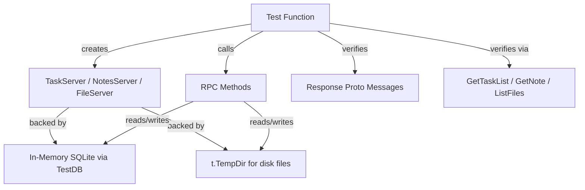
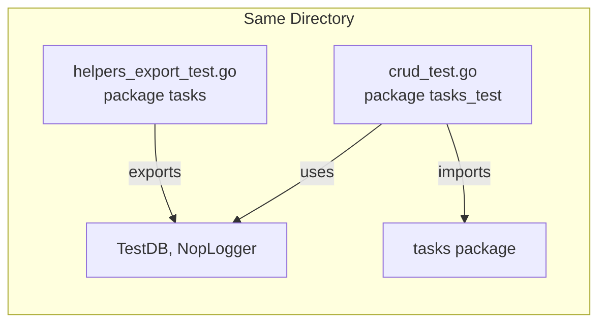
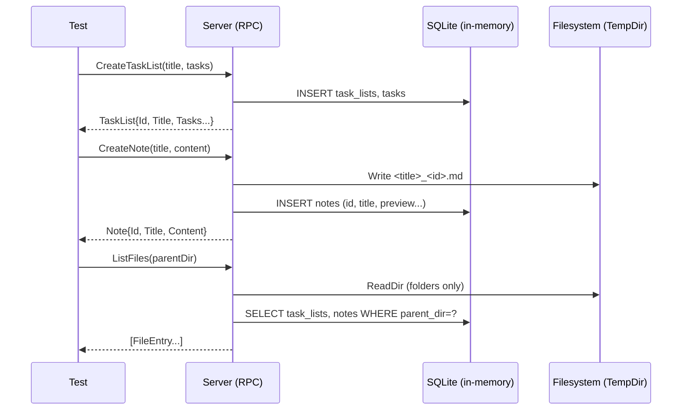

# Design Document: Test Suite SQLite Rewrite

## Overview

This design describes the rewrite of the echolist-backend test suite to align with the SQLite storage migration. The existing tests were written for a markdown-file + JSON-registry persistence model that no longer exists. The new tests exercise the SQLite-backed code paths through the public API using external test packages.

The rewrite follows three principles:
1. **Data creation through RPCs or database methods** — no direct file manipulation for test setup (except folders, which remain on disk)
2. **External test packages** — all tests use `package foo_test` to enforce black-box testing of the public API
3. **Consolidation** — fewer, well-named test files organized by concern

The scope covers the `tasks/`, `notes/`, `file/`, and `database/` packages. The `common/` and `auth/` packages are untouched.

## Architecture

### Test Package Structure

```
tasks/
├── helpers_export_test.go   (package tasks — exports TestDB, NopLogger)
├── crud_test.go             (package tasks_test — create/get/update/delete)
├── property_test.go         (package tasks_test — property-based tests)
└── validation_test.go       (package tasks_test — input validation)

notes/
├── helpers_export_test.go   (package notes — exports TestDB, NopLogger)
├── crud_test.go             (package notes_test — create/get/update/delete)
├── property_test.go         (package notes_test — property-based tests)
└── validation_test.go       (package notes_test — input validation)

file/
├── helpers_export_test.go   (package file — exports TestDB, NopLogger)
├── list_files_test.go       (package file_test — ListFiles integration tests)
├── folder_ops_test.go       (package file_test — create/delete/rename folder)
└── property_test.go         (package file_test — property-based tests)

database/
├── task_lists_test.go       (package database_test — task list CRUD)
├── notes_test.go            (package database_test — note CRUD)
├── schema_test.go           (package database_test — schema idempotency)
└── cascade_test.go          (package database_test — cascade delete, rename)
```

### Data Flow in Tests



### External Test Package Pattern



The `helpers_export_test.go` file uses the internal package declaration (`package tasks`) to access unexported symbols if needed, but primarily exports test helper functions (`TestDB`, `NopLogger`) that external test files can call via the package import.

## Components and Interfaces

### Test Helper Interface (per package)

Each package's `helpers_export_test.go` exports:

| Function | Signature | Purpose |
|----------|-----------|---------|
| `NewTestDB` | `func NewTestDB(t *testing.T) *database.Database` | Creates in-memory SQLite DB with full schema, registers cleanup |
| `NopLogger` | `func NopLogger() *slog.Logger` | Returns a discard logger for quiet test output |

### Server Construction Pattern

All test files construct servers identically:

```go
dataDir := t.TempDir()
db := tasks.NewTestDB(t)  // or notes.NewTestDB(t), file.NewTestDB(t)
logger := tasks.NopLogger()
srv := tasks.NewTaskServer(dataDir, db, logger)
```

For `file/` tests that need cross-package data:

```go
dataDir := t.TempDir()
db := file.NewTestDB(t)
logger := file.NopLogger()

taskSrv := tasks.NewTaskServer(dataDir, db, logger)
noteSrv := notes.NewNotesServer(dataDir, db, logger)
fileSrv := file.NewFileServer(dataDir, db, logger)
```

All three servers share the same `db` and `dataDir` so that data created via one server is visible to the others.

### Database Package Test Pattern

Database tests call `database.Database` methods directly without going through RPC servers:

```go
dbPath := filepath.Join(t.TempDir(), "test.db")
db, err := database.New(dbPath)
// ... use db.CreateTaskList, db.InsertNote, etc.
```

### Property Test Generators

Property tests use `pgregory.net/rapid` with these generator patterns:

| Generator | Produces | Used By |
|-----------|----------|---------|
| `validNameGen()` | Strings matching `[A-Za-z0-9 ]{1,40}` | All packages |
| `simpleTaskGen()` | `*pb.MainTask` with random description, done state | tasks |
| `validContentGen()` | Random string 0-500 chars | notes |
| `longContentGen()` | Random string 101-500 runes | notes (preview tests) |
| `parentDirGen()` | Valid relative paths (no traversal) | All packages |

## Data Models

### Test Data Lifecycle



### Key Data Relationships

| Entity | Storage | Discovery |
|--------|---------|-----------|
| Task List | SQLite `task_lists` + `tasks` tables | `ListTaskLists`, `GetTaskList` |
| Note metadata | SQLite `notes` table | `ListNotes`, `GetNote` |
| Note content | Disk at `<parentDir>/<title>_<id>.md` | `GetNote` reads file |
| Folder | Disk directory | `ListFiles` reads filesystem |

### Preview Computation

The preview is the first 100 runes of note content:
- Content ≤ 100 runes → preview = full content
- Content > 100 runes → preview = first 100 runes (may split a multi-byte character boundary at the rune level, but rune-safe)

### Note File Path Convention

```
database.NotePath(parentDir, title, id) → "<parentDir>/<title>_<id>.md"
database.NotePath("", title, id)        → "<title>_<id>.md"
```

## Correctness Properties

*A property is a characteristic or behavior that should hold true across all valid executions of a system — essentially, a formal statement about what the system should do. Properties serve as the bridge between human-readable specifications and machine-verifiable correctness guarantees.*

### Property 1: Task Create-Then-Get Round Trip

*For any* valid task list title and set of main tasks (with optional subtasks, due dates, and recurrence rules), creating a task list via `CreateTaskList` and then retrieving it via `GetTaskList` using the returned ID should produce a task list with the same title, same number of tasks, same descriptions, same done states, and same recurrence/due date values.

**Validates: Requirements 1.1, 8.1**

### Property 2: Note Create-Then-Get Round Trip

*For any* valid note title and content string, creating a note via `CreateNote` and then retrieving it via `GetNote` using the returned ID should produce a note with the same title and content.

**Validates: Requirements 2.1, 8.1**

### Property 3: All Generated IDs Are Valid UUIDv4

*For any* task list creation request containing main tasks and subtasks, every ID field in the response (task list ID, all main task IDs, all subtask IDs) should be a valid UUIDv4 string, and all IDs within a single response should be unique.

**Validates: Requirements 4.1, 4.2**

### Property 4: Task ID Stability on Update

*For any* existing task list, when updated with main tasks that carry existing IDs, those IDs are preserved unchanged in the response. When main tasks carry empty IDs, new valid UUIDv4 IDs are assigned.

**Validates: Requirements 4.3, 4.4, 8.2**

### Property 5: Auto-Delete Filtering of Done Non-Recurring Tasks

*For any* set of main tasks with mixed done/open states and mixed recurring/non-recurring configurations, the auto-delete filter removes exactly the done non-recurring main tasks and done subtasks, preserving all others in order.

**Validates: Requirements 8.3**

### Property 6: Recurring Task Advancement

*For any* recurring task (with a valid RRULE and due date) that is marked done, the system resets it to not-done and advances the due date to the next occurrence per the RRULE.

**Validates: Requirements 8.4**

### Property 7: Path Traversal Prevention

*For any* path string containing traversal sequences (`../`, `..\\`, or absolute paths), all RPCs (CreateTaskList, CreateNote, ListFiles, etc.) reject the request with an appropriate error code.

**Validates: Requirements 8.5**

### Property 8: Invalid UUID Rejection

*For any* string that is not a valid UUIDv4, RPCs that accept an ID parameter (GetTaskList, UpdateTaskList, DeleteTaskList, GetNote, UpdateNote, DeleteNote) reject the request with InvalidArgument.

**Validates: Requirements 8.6**

### Property 9: Note Preview Computation

*For any* valid note content string, the preview stored in SQLite and returned by ListNotes/ListFiles equals the first 100 runes of the content (or the full content if shorter than 100 runes). When content is updated, the preview is recomputed from the new content.

**Validates: Requirements 5.1, 5.2, 5.3, 5.4**

### Property 10: Note File Path Convention

*For any* created note with a given title and ID, the file on disk exists at exactly `database.NotePath(parentDir, title, id)`. When the title is updated, the old file is removed and a new file exists at the updated path. When the note is deleted, no file exists at the path.

**Validates: Requirements 2.4, 12.1, 12.2, 12.3**

### Property 11: Folder Cascade Delete Removes All DB Rows

*For any* folder containing notes and task lists (including nested subfolders), deleting the folder via `DeleteFolder` removes all notes and task lists in that folder and its subfolders from SQLite, such that `GetNote` and `GetTaskList` return NotFound for each.

**Validates: Requirements 6.1, 6.2, 6.3, 6.4, 14.3**

### Property 12: Folder Rename Updates Parent Dir

*For any* folder containing notes and task lists, renaming the folder via `UpdateFolder` updates the `parent_dir` of all contained items so that `ListNotes`/`ListTaskLists` with the new path returns them, and the old path returns empty results.

**Validates: Requirements 7.1, 7.2, 7.3, 7.4, 14.4**

### Property 13: ListFiles Hybrid Discovery

*For any* directory containing folders on disk and notes/task lists in SQLite, `ListFiles` returns all three types. Note entries include preview and use the `<title>_<id>.md` path format. Task list entries include `total_task_count` and `done_task_count`.

**Validates: Requirements 3.4, 3.5, 11.1, 11.2, 11.3, 11.6, 11.7**

### Property 14: Orphan Disk Files Excluded from ListFiles

*For any* file on disk matching old naming patterns (`note_<title>.md` or `tasks_<title>.md`) that has no corresponding row in SQLite, `ListFiles` does NOT include it in results.

**Validates: Requirements 11.4, 11.5**

### Property 15: Delete-Then-Get Returns NotFound

*For any* existing task list or note, after deletion via the respective Delete RPC, calling Get with the same ID returns a NotFound error.

**Validates: Requirements 1.4**

### Property 16: Duplicate Task List Name Returns AlreadyExists

*For any* valid task list title, creating two task lists with the same title in the same parent directory returns AlreadyExists on the second attempt.

**Validates: Requirements 8.1**

### Property 17: ListTaskLists/ListNotes Parent Dir Filtering

*For any* set of task lists and notes created across multiple parent directories, `ListTaskLists(dir)` returns only task lists in that directory, and `ListNotes(dir)` returns only notes in that directory.

**Validates: Requirements 8.1**

## Error Handling

### Test Error Patterns

| Scenario | Expected Error | Verification Method |
|----------|---------------|---------------------|
| Non-existent ID in Get/Update/Delete | `connect.CodeNotFound` | `errors.As(err, &connectErr)` |
| Invalid UUID format | `connect.CodeInvalidArgument` | Check error code |
| Path traversal attempt | `connect.CodeInvalidArgument` | Check error code |
| Duplicate task list name | `connect.CodeAlreadyExists` | Check error code |
| Non-existent parent directory | `connect.CodeNotFound` | Check error code |
| Empty title / null bytes | `connect.CodeInvalidArgument` | Check error code |
| Content exceeds limit | `connect.CodeInvalidArgument` | Check error code |
| Mutual exclusion (due_date + recurrence) | `connect.CodeInvalidArgument` | Check error code |
| Invalid RRULE | `connect.CodeInvalidArgument` | Check error code |

### Test Helper Error Assertions

```go
func assertConnectCode(t *testing.T, err error, expected connect.Code) {
    t.Helper()
    var connectErr *connect.Error
    if !errors.As(err, &connectErr) {
        t.Fatalf("expected connect.Error, got %T: %v", err, err)
    }
    if connectErr.Code() != expected {
        t.Fatalf("expected %v, got %v: %s", expected, connectErr.Code(), connectErr.Message())
    }
}
```

## Testing Strategy

### Dual Testing Approach

The test suite uses two complementary testing strategies:

1. **Property-based tests** (`pgregory.net/rapid`) — verify universal invariants across randomly generated inputs with minimum 100 iterations per property
2. **Example-based integration tests** — verify specific scenarios, edge cases, and error conditions with concrete inputs

### Property-Based Testing Configuration

- **Library**: `pgregory.net/rapid` (already a project dependency)
- **Minimum iterations**: 100 per property (rapid's default)
- **Tag format**: Comment above each test function:
  ```go
  // Feature: test-suite-sqlite-rewrite, Property N: <property text>
  // Validates: Requirements X.Y
  ```
- **Each correctness property maps to a single `rapid.Check` test function**

### Test File Organization

| Package | File | Contents |
|---------|------|----------|
| `tasks` | `crud_test.go` | Create, Get, Update, Delete integration tests |
| `tasks` | `property_test.go` | Properties 1, 3, 4, 5, 6, 7, 8, 15, 16, 17 |
| `tasks` | `validation_test.go` | Input validation (empty title, null bytes, content limits, mutual exclusion) |
| `tasks` | `helpers_export_test.go` | `TestDB(t)`, `NopLogger()` |
| `notes` | `crud_test.go` | Create, Get, Update, Delete integration tests |
| `notes` | `property_test.go` | Properties 2, 3, 7, 8, 9, 10, 15, 17 |
| `notes` | `validation_test.go` | Input validation (empty title, null bytes, content length, path traversal) |
| `notes` | `helpers_export_test.go` | `TestDB(t)`, `NopLogger()` |
| `file` | `list_files_test.go` | ListFiles integration tests, hybrid discovery |
| `file` | `folder_ops_test.go` | CreateFolder, DeleteFolder, UpdateFolder (rename) |
| `file` | `property_test.go` | Properties 11, 12, 13, 14 |
| `file` | `helpers_export_test.go` | `TestDB(t)`, `NopLogger()` |
| `database` | `task_lists_test.go` | CreateTaskList, GetTaskList, UpdateTaskList, DeleteTaskList, ListTaskLists |
| `database` | `notes_test.go` | InsertNote, GetNote, UpdateNote, DeleteNote, ListNotes |
| `database` | `schema_test.go` | Schema idempotency (New twice on same path) |
| `database` | `cascade_test.go` | DeleteByParentDir, RenameParentDir, FK cascade |

### Properties Removed (Obsolete)

| Old Test | Reason for Removal |
|----------|-------------------|
| `TestProperty5_CreatedTaskListsUseTasksPrefix` | `tasks_*.md` files no longer exist |
| `TestProperty16_DeleteRemovesTaskListFromDisk` | No disk files for tasks |
| `TestProperty4_CreatedNotesUseNotePrefix` | `note_*.md` format removed |
| `TestProperty_ReadRegistryReverseInverse` | Registries removed |
| `TestProperty3_ListTaskListsExcludesNonTaskFiles` | ListTaskLists reads from DB, not disk |

### Properties Preserved (Updated Data Creation)

| Property | Update Required |
|----------|----------------|
| Create-then-get round-trip (tasks, notes) | Use RPC instead of file creation |
| ID stability (TaskList ID preserved on update) | Same, just remove file assertions |
| Auto-delete filtering | No change (tests pure function) |
| Recurring task advancement | No change (tests pure function) |
| Path traversal prevention | Use RPC calls |
| Invalid UUID rejection | Use RPC calls |
| Duplicate name returns AlreadyExists | Use RPC calls |
| ListTaskLists/ListNotes parent_dir filtering | Use RPC data creation |

### Properties Added (New Coverage)

| Property | What It Tests |
|----------|--------------|
| Note preview computation | `computePreview` correctness via ListNotes |
| Note file path convention | `database.NotePath` format on disk |
| Folder cascade delete | `DeleteByParentDir` removes all rows |
| Folder rename parent_dir update | `RenameParentDir` updates all rows |
| ListFiles hybrid discovery | Folders from disk + notes/tasks from SQLite |
| Orphan disk files excluded | Old-format files without DB rows invisible |
| MainTask/SubTask ID generation | All IDs are valid UUIDv4 on create |
| ID stability on update | Existing IDs preserved, empty IDs get new UUIDs |

### Test Execution

All tests run via standard Go test commands:
```bash
go test ./tasks/...
go test ./notes/...
go test ./file/...
go test ./database/...
go test ./...  # full suite
```

No external services, Docker containers, or network access required. All tests use in-memory SQLite and `t.TempDir()` for isolation.
